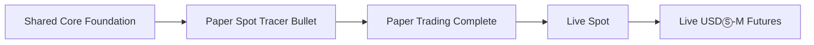

# TiewTrade Project Plan

## วัตถุประสงค์

เอกสารนี้กำหนดลำดับการส่งมอบ dependencies และ quality gates ของ TiewTrade
Internal Alpha โดยใช้ `PRODUCT.md` เป็นขอบเขตผลิตภัณฑ์, `CONTEXT.md` เป็นคำศัพท์และ
กฎโดเมน และ `ARCHITECTURE.md` เป็นเจ้าของ Module กับ dependency rules

หาก implementation plan ราย issue ขัดกับเอกสารทั้งสามชุด ต้องแก้แผนให้ตรงก่อนเริ่ม
production code

## Delivery Principles

- ส่งมอบแบบ Paper-first: พิสูจน์ flow ด้วย Paper Trading ก่อนเปิด Live
- Paper-first ไม่ใช่ Paper-only business logic; Strategy, capital, Basket, Entry Pair,
  risk policy และ PnL ใช้ implementation ร่วมกันทุก Trade Mode
- Paper, Live Spot และ Live Futures ใช้ execution adapters แยกกัน
- ค่าใน form ต้องผ่าน validation และกลายเป็น immutable Session configuration/policy
- `trading_capital_ratio`, `max_entries`, symbol และ timeframe ห้าม hard-code ใน
  business logic
- 80% และ 10 Entries เป็นค่าเริ่มต้นของ form เท่านั้น
- สร้าง Module หรือ seam เมื่อมีพฤติกรรมและ consumer จริง ไม่สร้างโครงว่างล่วงหน้า
- ระหว่างพัฒนาใช้ Paper และ fake adapters เท่านั้น ห้ามส่ง Live order

## Delivery Order



แต่ละ milestone ต้องผ่าน acceptance และ verification ของตนเองก่อนเริ่ม milestone
ถัดไป การผ่าน technical gate ไม่ได้เปิด Live อัตโนมัติ; Live ต้องผ่าน Preflight และ
การยืนยันจากผู้ใช้เสมอ

## Milestone 1 — Shared Core Foundation

Foundation ที่พร้อมใช้งานแล้วประกอบด้วย:

- shared immutable `SessionConfig` สำหรับ Paper และ Live
- `MarketDataConfig`, immutable Candle และ completed-candle continuity
- `EntryPolicy` และ `SpotTradingPolicy` ที่รับค่าจาก Session setup
- Spot capital allocation, symbol quantization และ minimum-notional check
- Basket weighted average, Take Profit, realized PnL และ atomic state transitions
- Entry Pair และ Cooldown Month lifecycle แบบ UTC

Foundation ไม่เลือก execution adapter และไม่มี side effect ไปยัง Binance

## Milestone 2 — Paper Spot Tracer Bullet

Tracer Bullet เป็น headless flow สำหรับพิสูจน์ shared core ผ่าน Paper Spot โดยใช้
BTCUSDT 5m เป็น acceptance scenario ที่ส่งผ่าน configuration ไม่ใช่ค่าคงที่ใน
business logic

ลำดับงานที่เหลือ:

1. DEV-78 — สร้าง RSI Step Grid Preset, Wilder RSI/ATR และ deterministic Entry Intent
2. DEV-79 — เชื่อม Strategy, Capital, Basket และ lifecycle ใน application
   orchestration กับ concrete Paper Spot execution adapter
3. DEV-80 — Replay CSV 40 Candles, สร้าง stable JSON summary และพิสูจน์ว่า
   replay ข้อมูลเดิมสองครั้งได้ output ตรงกันทุกตัวอักษร

Implementation details อยู่ใน
`docs/superpowers/plans/2026-07-20-paper-spot-core-tracer-bullet.md`

Tracer Bullet ยังไม่ถือว่า Paper Trading Complete เพราะยังไม่มี persistence,
Recovery, Paper Futures, public market-data runtime และ Desktop UI

## Milestone 3 — Paper Trading Complete

ส่งมอบ vertical slices ต่อจาก tracer ตามลำดับ dependency:

1. กำหนด Account Profile isolation, Session ownership และ Active Bot Session invariant
2. บันทึก ownership เดียวกันผ่าน SQLite schema, repositories, audit trail และ migrations
3. Public Binance market-data adapter, reconnect, backfill และ stale-data fail closed
4. Paper Futures: leverage, Cross Margin, Collateral Buffer และ funding replay
5. Desktop UI สำหรับ Session setup, Dashboard, Orders, Positions และ Notifications
6. Stop Session, startup Recovery และ deterministic reconciliation ด้วย fake adapters
7. Paper acceptance ครบทั้ง business rules, persistence, UI และ Recovery

## Milestone 4 — Live Spot

เริ่มได้เมื่อ Paper Trading Complete ผ่านทั้งหมด:

- เก็บ credentials ใน OS Keyring เท่านั้น
- เพิ่ม Live Spot adapter ที่ consumer Module ใช้งานจริง
- เพิ่ม execution interface ที่ consumer เป็นเจ้าของเมื่อมี Paper และ Live adapters
  อย่างน้อยสองแบบ
- บังคับ Preflight, explicit confirmation, idempotency, Reconciliation และ safe shutdown
- ทดสอบด้วย fake transport และ contract tests ก่อนเชื่อมบัญชีจริง

การทดสอบเงินจริงต้องได้รับคำสั่งจากผู้ใช้แยกต่างหาก

## Milestone 5 — Live USDⓈ-M Futures

เริ่มได้เมื่อ Live Spot gate ผ่าน:

- ใช้ Futures adapter แยกจาก Spot
- บังคับ Cross Margin, leverage cap, Futures capital policy และ Collateral Buffer
- รองรับ funding และ liquidation-related account facts
- ผ่าน Preflight, idempotency, Reconciliation และ Recovery สำหรับ Futures semantics

## Module Ownership

| Concern | Owner Module | หมายเหตุ |
| --- | --- | --- |
| Candle และ continuity | `market_data` | รับ symbol/timeframe จาก configuration |
| Session และ immutable policies | `trading` | ไม่เลือก adapter |
| RSI Step Grid | `strategies/rsi_step_grid` | ไม่รู้จัก Paper หรือ Live |
| Basket, capital และ Entry Pair | `trading` | ใช้ร่วมกันทุก Trade Mode |
| Session orchestration | `application` | จัดลำดับ shared rules กับ adapter |
| Paper execution | `execution` | จำลอง side effects โดยไม่เรียก Binance |
| Binance adapters | `integrations/binance` | เพิ่มตาม Live gates เท่านั้น |
| Persistence | `integrations/sqlite` | ไม่เก็บ secrets |
| Desktop UI | `ui` | ไม่ถือ business rules |

`execution` เป็นเจ้าของ deterministic simulation ภายในโปรแกรม ส่วน side effects ที่
ออกไปยังระบบภายนอกเป็นของ `integrations/<provider>` เสมอ

## Quality Gates

ทุก Issue ต้องรัน checks ที่เกี่ยวข้องกับขอบเขตงาน และ integration gate ของแต่ละ
milestone ต้องรัน checks ทั้งหมดต่อไปนี้:

```bash
.venv/bin/python -m pytest -q
.venv/bin/python -m ruff check src tests
.venv/bin/python -m ruff format --check src tests
.venv/bin/python -m mypy src
npm --prefix docs-site test
npm --prefix docs-site run check:content
git diff --check
```

Issue ที่กระทบ application flow ต้องเพิ่ม deterministic acceptance test Issue ที่กระทบ
docs-site ต้องผ่าน production build และ Issue ที่แตะ execution/recovery ต้องใช้ fake
adapter หรือ fake transport ระหว่าง verification

## Change Control

- เปลี่ยน business rule หรือ safety gate ต้องแก้ `PRODUCT.md` ก่อน
- เปลี่ยนคำศัพท์หรือ ownership ต้องแก้ `CONTEXT.md` หรือ `ARCHITECTURE.md`
- เปลี่ยน Strategy behavior ที่มีผลต่อ Session ต้องสร้าง Preset version ใหม่
- เปลี่ยนลำดับการส่งมอบหรือ dependency ต้องแก้เอกสารนี้และ implementation plan ที่เกี่ยวข้อง
- ห้ามเปลี่ยนผลของ Session เดิมโดยเงียบ ๆ
