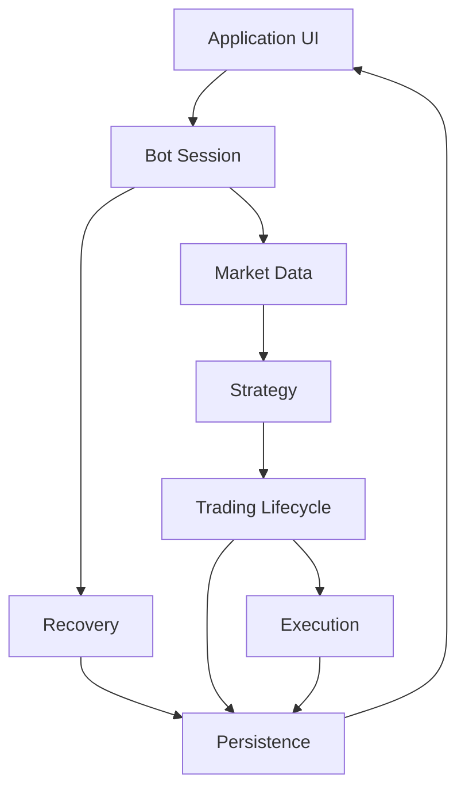
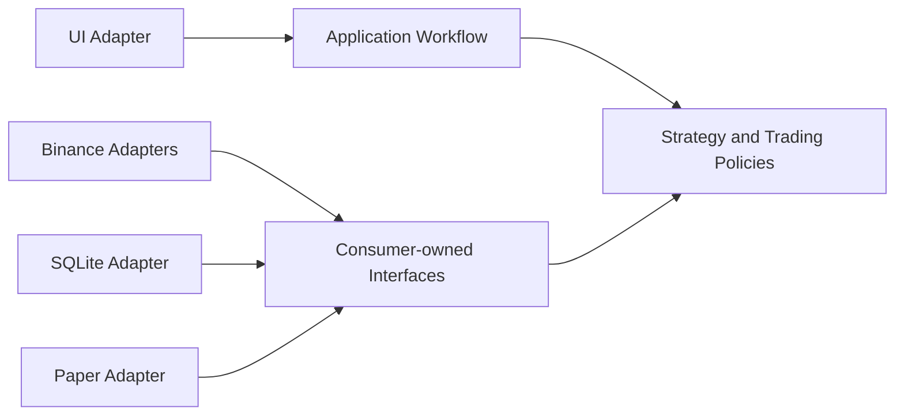
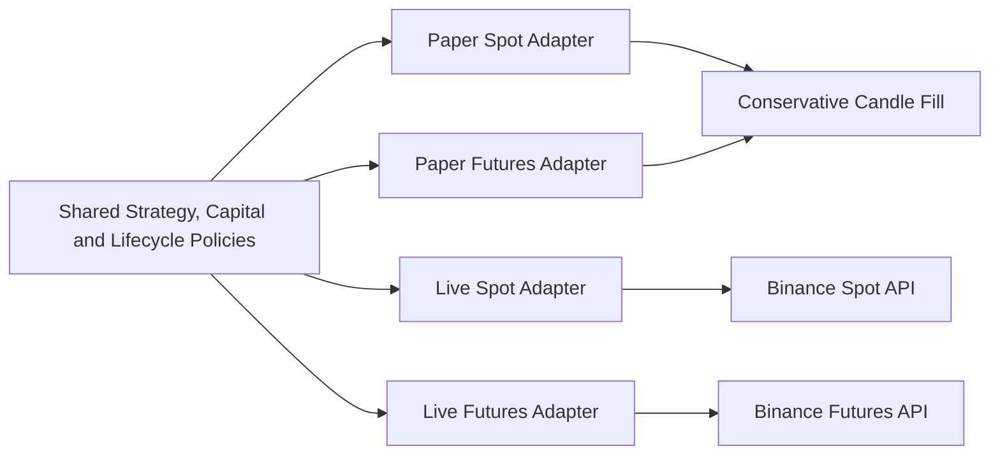

# Architecture

TiewTrade ใช้ feature-first modular monolith: deploy เป็น desktop application เดียว แต่แบ่ง module ตามความสามารถของผลิตภัณฑ์ แต่ละ module เป็นเจ้าของกฎและ state ของตนเองอย่างชัดเจน แนวทางนี้เหมาะกับ Internal Alpha ที่รองรับ Binance และกลยุทธ์เดียว เพราะลด distributed-system failure modes โดยยังรักษาขอบเขตสำหรับการทดสอบและเปลี่ยน adapter

## Module Ownership

แผนภาพ ownership แสดงว่าแต่ละ capability รับผิดชอบข้อมูลและการตัดสินใจส่วนใดใน flow หลัก

แผนภาพเน้น ownership ของ flow: Market Data รับผิดชอบความต่อเนื่องของ Candle, Strategy สร้าง Entry Intent, Trading Lifecycle บังคับ capital/Basket/Entry Pair, Execution จัดการ Order และ Fill, Persistence เก็บ audit trail และ Recovery ตัดสินเงื่อนไข Resume

Module ไม่ควรอ่าน table หรือแก้ state ของ module อื่นโดยตรง การสื่อสารข้ามขอบเขตใช้ API หรือ type ที่มีความหมายในโดเมน เช่น completed Candle, Entry Intent, execution request และ Fill

คำศัพท์ของ boundary เหล่านี้อ้างอิง [Domain Reference](/domain) และเหตุผลของการเลือก modular monolith อยู่ใน [Decisions](/decisions)

## Dependency Direction

Dependency ไหลเข้าหา business rules ไม่ไหลจาก policy ไปหา SDK หรือ UI โดยตรง Domain types และ policies จึงทดสอบได้โดยไม่ต้องเปิด network, database หรือ desktop window

แผนภาพแสดงว่า adapter เป็นฝ่ายพึ่ง interface ที่ consumer module กำหนด ส่วน policies อยู่ด้านในและไม่ import รายละเอียด Binance, SQLite หรือ UI ทำให้ fake adapter ใช้ contract เดียวกับ production adapter ได้

Interface ต้องอยู่ใน module ที่ใช้ความสามารถนั้น เพราะ consumer เป็นผู้รู้ว่าต้องการ operation และผลลัพธ์อะไร Integration เป็นผู้ implement interface ดังกล่าว ไม่สร้าง generic registry, factory หรือ base class จนกว่าจะมี adapter หรือ consumer จริงอย่างน้อยสองแบบ

## Paper and Live Boundaries

Strategy, capital allocation, Basket และ Entry Pair policies ใช้ร่วมกันทุก Mode จากนั้น Execution แยกเป็น Paper Spot, Paper Futures, Live Spot และ Live Futures adapters การแยกนี้ป้องกัน test double หรือ conservative fill หลุดไปเรียก API จริง และไม่ทำให้เงื่อนไข Live ปะปนกับ replay

แผนภาพต่อไปนี้วาง shared policies ไว้ก่อนเส้นแบ่ง adapter เพื่อให้เห็นขอบเขต Paper และ Live โดยตรง

แผนภาพแสดงว่า policies ไม่เปลี่ยนตาม Mode แต่ side effects แยกผ่าน adapter สี่ตัว โดย Paper จบที่ fill model ส่วน Live จบที่ API เฉพาะ Market Type

Live Spot กับ Live Futures แยก adapters เพราะ symbol rules, balance/position facts, margin mode, leverage และ reconciliation ต่างกัน Paper ไม่ใช่ Live adapter ที่สลับ endpoint และ Testnet ไม่ได้อยู่ในขอบเขต safety

## Persistence and UI

SQLite เก็บ non-secret state ได้แก่ configuration, Basket, Entry Pair, Entry Intent, Order, Fill, PnL, execution costs, Notification, Reconciliation และ operational audit events Credentials อยู่ใน OS Keyring เท่านั้น

Network, engine และ persistence ทำงานนอก UI thread UI อ่าน application state เพื่อแสดง Account Profile, Market Type, Mode, Preset Version, data freshness และ Bot Session state โดยไม่เป็นเจ้าของ business rules ดูเหตุผลสรุปของขอบเขตเหล่านี้ต่อได้ที่ [Decisions](/decisions)
