# Basket Lifecycle

Basket รวม Entries ของรอบการสะสม Position เดียวกันและมี Take Profit ร่วมกัน Basket หนึ่งมีได้สูงสุด 10 Entries ทุกการคำนวณอ้างอิง Fill ที่ยืนยันแล้ว ไม่ใช้เพียง Order หรือ Entry Intent

## Weighted Average

หลัง Entry Fill แต่ละครั้ง ระบบคำนวณราคาเฉลี่ยถ่วงน้ำหนักจากราคาและ quantity จริง:

```text
weighted_average_entry_price =
  sum(fill_price × filled_quantity) / sum(filled_quantity)
```

Quantity รวมของ Basket คือผลรวม filled quantity ที่ Bot เป็นเจ้าของ ราคาและ quantity ต้องสอดคล้องกับ tick size, step size และ minimum notional ของ BTCUSDT โดยใช้ Decimal เพื่อหลีกเลี่ยงความคลาดเคลื่อนแบบ floating point

## Take Profit

```text
take_profit_price = weighted_average_entry_price + (ATR(14) × 3)
```

ATR คือค่าล่าสุดจาก completed Candle ณ เวลาที่ Entry Fill ทุก Fill ทำให้ระบบคำนวณ weighted average และ Take Profit ใหม่ แล้วปัด target ตาม tick size ของ BTCUSDT จากนั้น place หรือ replace Take Profit Order สำหรับ quantity ทั้งหมดที่ Bot เป็นเจ้าของใน Basket สำหรับ Live Order นี้อยู่บน exchange และยัง active หลัง Stop Session

ค่าธรรมเนียมไม่ถูกบวกใน Take Profit price แต่ entry fees และ exit fees ต้องถูกหักเมื่อคำนวณ realized PnL สำหรับ Futures ต้องรวม funding ที่เกิดขึ้นตามข้อมูลที่บันทึกไว้ด้วย

## State Transitions

State diagram นี้แสดงช่วงที่ Basket ว่าง, มี Take Profit Order active และปิดสมบูรณ์

```mermaid
stateDiagram-v2
    [*] --> Empty
    Empty --> TargetActive: first Entry Fill; place Take Profit Order
    TargetActive --> TargetActive: additional Entry Fill; recalculate and replace Order
    TargetActive --> Closed: Take Profit Order Fill
    Closed --> Empty: start new Basket immediately
```



แผนภาพแสดง lifecycle จาก Basket ว่างไปยัง active Take Profit Order ทุก Entry Fill ทำให้ target ถูกวางหรือแทนที่ทันที เมื่อ Order Fill หลังราคาแตะ target แล้ว Entries ทั้งหมดปิด, realized PnL ถูกบันทึก และ Basket ใหม่เริ่มได้ทันทีโดยไม่ต้องรอเปลี่ยนเดือน UTC

ตราบใดที่ Take Profit Order ยังไม่ Fill Basket ยังคงเปิดและติดตาม Order identity เดิม การ replace target ต้อง idempotent ระบบไม่สร้าง Basket ใหม่หรือปิด Entries ใน local state ก่อน Fill ยืนยัน

## After Basket Closure

การปิด Basket reset Entry Pair และ Cooldown Month สำหรับ Basket ใหม่ รวมถึงล้าง active Take Profit และ Entry count ของ Basket เดิม แต่ประวัติ Order, Fill, fee, PnL และ lifecycle events ยังคงอยู่ใน audit trail

Stop Session ไม่บังคับปิด Basket และต้องคง Take Profit ที่มีอยู่ Recovery จึงโหลด Basket พร้อม Order/Fill แล้วตรวจความสอดคล้องก่อน Resume ดูรายละเอียดที่ [Recovery](/recovery)
