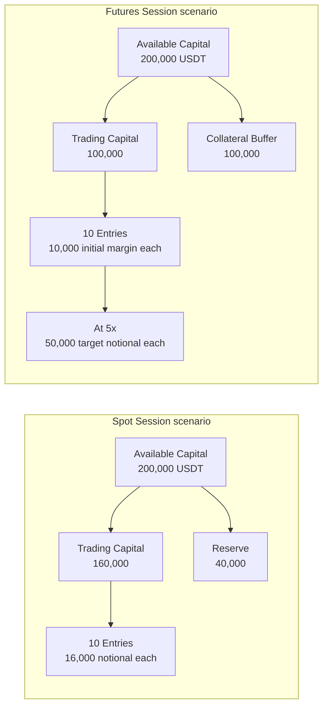

# Capital Allocation

ผู้ใช้กำหนด Available Capital, Trading Capital Ratio และจำนวน Entries ต่อ Bot Session ก่อนเริ่มทำงาน ค่าเหล่านี้ผ่าน validation แล้วถูกตรึงเป็น immutable policy ที่ Paper และ Live ใช้ร่วมกัน Reserve หรือ Collateral Buffer ไม่ถูกนำมาสร้าง Entry ใหม่

## Spot 80/20

Spot ใช้ Trading Capital 80% และ Reserve 20% เป็นค่าเริ่มต้น ผู้ใช้เปลี่ยน Trading Capital Ratio ใน form ได้ก่อนเริ่ม Session และระบบ derive Reserve Ratio จากส่วนที่เหลือให้รวมเป็น 100% Quote notional ต่อ Entry เท่ากับ Trading Capital หาร `max_entries`

`max_entries` ต้องเป็นเลขคู่ตั้งแต่ 2–20 เพื่อให้ Entry Pair ครบทุกคู่ เมื่อ Session เริ่มแล้ว allocation และจำนวน Entries จะเปลี่ยนไม่ได้

## Futures 50/50

Futures แบ่ง Available Capital เป็น Trading Capital 50% และ Collateral Buffer 50% Initial margin budget ต่อ Entry เท่ากับ Trading Capital หาร `max_entries` ส่วน target notional เท่ากับ initial margin budget คูณ leverage ของ Bot Session

Futures ใช้ Cross Margin และ leverage ไม่เกิน 5x Collateral Buffer ไม่ใช้สร้าง Entry ใหม่ แต่เป็นเงินที่ผู้ใช้ยอมเสี่ยงทั้งหมดเพื่อเลื่อน liquidation จึงไม่ใช่เงินที่ปลอดความเสี่ยง

## Example: 200,000 USDT

ตัวอย่างต่อไปนี้เป็นสอง Session scenarios ที่เลือกใช้แยกกัน ไม่ใช่การแบ่งทุนก้อนเดียวไปทำ Spot และ Futures พร้อมกัน แต่ละ scenario จึงเริ่มจาก Available Capital สมมติ 200,000 USDT ของตัวเอง

แผนภาพเปรียบเทียบผลลัพธ์เมื่อสร้าง Spot Session หรือ Futures Session แยกกันด้วยทุนตั้งต้นสมมติเท่ากัน: Spot ใช้ 160,000 สำหรับ Entries และกัน 40,000 เป็น Reserve ส่วน Futures ใช้ initial margin รวม 100,000, กัน Collateral Buffer 100,000 และที่ 5x มี target notional สูงสุด 50,000 ต่อ Entry

ตัวเลขนี้เป็นตัวอย่างการคำนวณ policy ไม่ใช่คำแนะนำการลงทุนและไม่ใช่ยอดเงินจริง ราคา, quantity, fee, margin facts และ symbol rules ยังต้องผ่าน execution checks ของ Mode นั้น

| Policy | Spot Session | Futures Session |
| --- | --- | --- |
| Allocation ratio | Trading Capital 80% | Trading Capital 50% |
| Reserve / buffer | Reserve 20% | Collateral Buffer 50% |
| Budget ต่อค่าเริ่มต้น 10 Entries | 16,000 USDT quote notional ต่อ Entry | 10,000 USDT initial margin ต่อ Entry; target notional เท่ากับ budget คูณ leverage |
| Cross Margin | ไม่ใช้ | บังคับใช้ |
| Leverage cap | ไม่ใช้ | ไม่เกิน 5x |

## Policy Checks

ก่อนส่ง execution request ระบบตรวจ Available Capital เป็นบวก, Trading Capital Ratio อยู่ระหว่าง 0–1, `max_entries` เป็นเลขคู่ 2–20, allocation ถูก Mode, Futures leverage อยู่ในช่วงที่อนุญาต และผลการปัดยังผ่าน minimum notional ค่าธรรมเนียม, slippage และ funding ไม่เปลี่ยนสัดส่วน allocation แต่ถูกบันทึกเพื่อคำนวณผลลัพธ์จริง

Capital policy ใช้ร่วมกันระหว่าง Paper กับ Live เพื่อให้ผลการทดสอบสะท้อนข้อจำกัดเดียวกัน ความต่างของ execution อธิบายที่ [Paper Trading](/paper-trading) และ [Live Safety](/live-safety)
