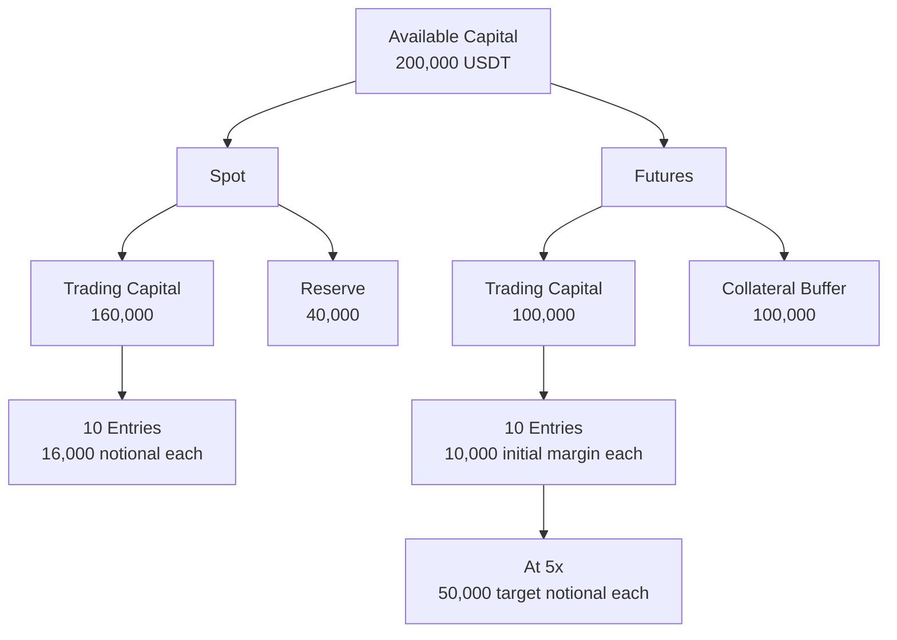

# Capital Allocation

ผู้ใช้กำหนด Available Capital ต่อ Bot Session จากนั้น policy เดียวกันบังคับสัดส่วนทุน, จำนวน 10 Entries และ leverage cap ทั้ง Paper และ Live Reserve หรือ Collateral Buffer ไม่ถูกนำมาสร้าง Entry ใหม่

## Spot 80/20

Spot แบ่ง Available Capital เป็น Trading Capital 80% และ Reserve 20% Quote notional ต่อ Entry เท่ากับ Trading Capital หาร 10 จึงแบ่งขนาดเป้าหมายเท่ากันทุก Entry ก่อนปัด quantity ตาม step size และตรวจ minimum notional

Reserve เป็นส่วนที่กันออกจาก sizing policy ไม่ได้เพิ่มกลับเข้า Entry เมื่อราคาเปลี่ยน และไม่ทำให้ขีดจำกัด 10 Entries สูงขึ้น

## Futures 50/50

Futures แบ่ง Available Capital เป็น Trading Capital 50% และ Collateral Buffer 50% Initial margin budget ต่อ Entry เท่ากับ Trading Capital หาร 10 ส่วน target notional เท่ากับ initial margin budget คูณ leverage ของ Bot Session

Futures ใช้ Cross Margin และ leverage ไม่เกิน 5x Collateral Buffer ไม่ใช้สร้าง Entry ใหม่ แต่เป็นเงินที่ผู้ใช้ยอมเสี่ยงทั้งหมดเพื่อเลื่อน liquidation จึงไม่ใช่เงินที่ปลอดความเสี่ยง

## ตัวอย่าง 200,000 USDT

แผนภาพเปรียบเทียบ Session สมมติที่ตั้ง Available Capital 200,000 USDT: Spot ใช้ 160,000 สำหรับ Entries และกัน 40,000 เป็น Reserve ส่วน Futures ใช้ initial margin รวม 100,000, กัน Collateral Buffer 100,000 และที่ 5x มี target notional สูงสุด 50,000 ต่อ Entry

ตัวเลขนี้เป็นตัวอย่างการคำนวณ policy ไม่ใช่คำแนะนำการลงทุนและไม่ใช่ยอดเงินจริง ราคา, quantity, fee, margin facts และ symbol rules ยังต้องผ่าน execution checks ของ Mode นั้น

## Policy Checks

ก่อนส่ง execution request ระบบตรวจ Available Capital เป็นบวก, allocation ถูก Mode, Entry number ไม่เกิน 10, Futures leverage อยู่ในช่วงที่อนุญาต และผลการปัดยังผ่าน minimum notional ค่าธรรมเนียม, slippage และ funding ไม่เปลี่ยนสัดส่วน allocation แต่ถูกบันทึกเพื่อคำนวณผลลัพธ์จริง

Capital policy ใช้ร่วมกันระหว่าง Paper กับ Live เพื่อให้ผลการทดสอบสะท้อนข้อจำกัดเดียวกัน ความต่างของ execution อธิบายที่ [Paper Trading](/paper-trading) และ [Live Safety](/live-safety)
