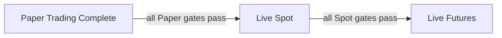

# Delivery

การส่งมอบใช้ vertical slice ที่เชื่อม market data, Strategy, Basket, execution, persistence, UI และ Recovery ในแต่ละ milestone แนวทางนี้ทำให้ quality gate วัดพฤติกรรมปลายทางจริง และหลีกเลี่ยง module หรือ abstraction ที่ยังไม่มี consumer

ลำดับนี้ใช้ ownership จาก [Architecture](/architecture) และขอบเขตผลิตภัณฑ์จาก [Product](/product) เป็นกรอบอ้างอิงร่วมกัน

## Delivery Order

แผนภาพ delivery แสดง gate สามระดับที่ต้องผ่านตามลำดับและไม่ promote Mode อัตโนมัติ

แผนภาพแสดงลำดับสะสมที่ข้ามไม่ได้: Paper ต้องครบก่อน Live Spot และ Live Spot ต้องครบก่อน Live Futures การผ่าน technical checks ไม่ได้เปิด Live เอง ยังต้องมีการอนุมัติจากผู้ใช้อย่างชัดแจ้งในแต่ละขั้น

## Paper Trading Complete

Paper เริ่มจาก vertical slice ของ BTCUSDT Spot: รับ completed Candles ที่ต่อเนื่อง, คำนวณ Wilder RSI/ATR, สร้าง deterministic Entry Intent, บังคับ immutable Spot allocation และ Entry Policy จาก Session, Fill ที่ Candle ถัดไป, ปิด Basket ด้วย Take Profit และ replay ผลเดิม

จาก tracer slice นี้จึงเติม Paper Futures, public market-data runtime, SQLite persistence, Account Profile isolation, desktop UI และ restart Recovery จนครบ flow ใช้งานจริง ไม่ถือว่าการ replay ชุดเดียวสำเร็จเท่ากับ Paper Trading Complete

Quality gate ครอบคลุม automated tests ของ business rules, persistence, Recovery และ execution boundaries รวมทั้ง fee, slippage, funding, data freshness, PnL, Drawdown และ audit events

## Live Spot

Live Spot reuse Strategy และ policies ที่พิสูจน์ใน Paper แต่เพิ่ม adapter จริง, OS Keyring, Preflight, idempotency, stale-data fail closed, Reconciliation และ safe shutdown ทุก behavior ที่แตะ exchange ต้องผ่าน fake adapter และ contract tests ก่อน

เมื่อ acceptance ผ่านแล้ว การเริ่มทดสอบ Live Spot ยังต้องได้รับการอนุมัติจากผู้ใช้ ไม่มี automated promotion จาก Paper และไม่มี Testnet เป็นทางลัดของ safety gate

## Live Futures

Live Futures เริ่มหลัง Live Spot ผ่าน เพิ่ม Cross Margin, leverage ไม่เกิน 5x, Futures 50/50 allocation, Collateral Buffer, funding และ liquidation-related account facts Live Futures มี execution adapter แยกจาก Spot เพื่อไม่ให้ semantics ของ balance, Position และ margin ปะปนกัน

## Vertical-slice Quality Gates

แต่ละ slice ต้องผ่าน unit tests และ integration/contract tests ที่เกี่ยวข้อง, deterministic acceptance flow, static checks, content หรือ build checks ของ package และ whitespace validation ก่อนรายงานว่าเสร็จ Recovery และ safety ใช้ fake adapters ระหว่างพัฒนาโดยไม่เชื่อมบัญชีจริง

เมื่อเปลี่ยน business rule หรือ Strategy parameter ต้องอัปเดตขอบเขตอย่างเปิดเผยและสร้าง Preset version ใหม่ถ้ากระทบ Session ห้ามเปลี่ยนผลของ Session เดิมโดยเงียบ ๆ
