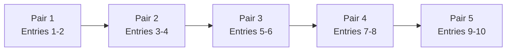
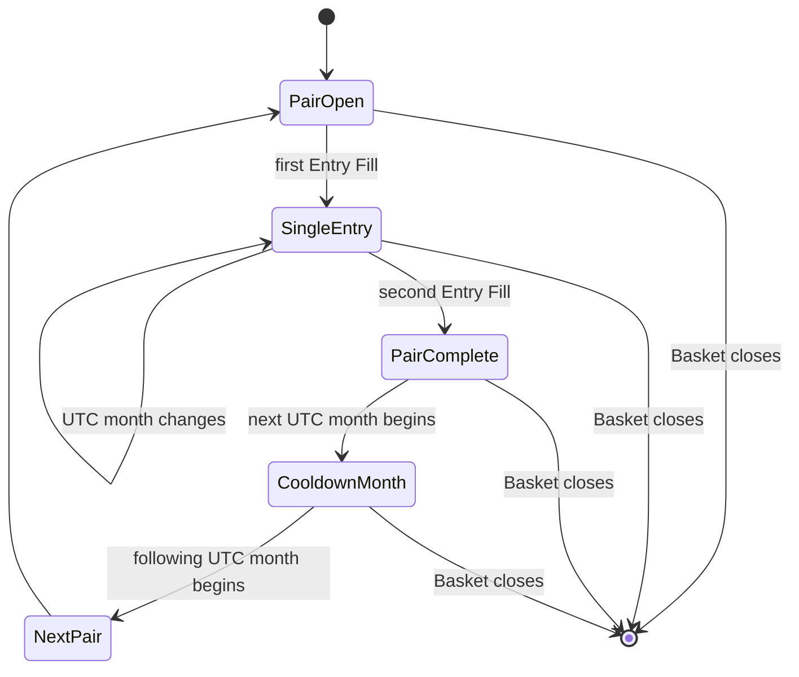

# Entry Pair & Cooldown

Entries ใน Basket ถูกจัดเป็นคู่เพื่อเว้นจังหวะการเพิ่ม Position ตามเดือน UTC กฎนี้จำกัดการสะสมโดยไม่หยุด Take Profit และไม่เปลี่ยนขีดจำกัดสูงสุด 10 Entries

## Pair Sequence

แผนภาพแสดง Pair ทั้งห้าตามลำดับ ระบบเริ่ม Pair ถัดไปได้เมื่อ Pair ปัจจุบันครบสอง Entries, ผ่าน Cooldown Month ที่เกี่ยวข้อง และ Basket ยังเปิดอยู่

แต่ละ Entry ยังต้องมี reset และ confirmation ของ Strategy ใหม่ การอนุญาตจาก lifecycle ไม่ได้สร้าง Entry เอง และ maximum 10 Entries ยังคงเป็นเพดานสุดท้าย

## UTC Month Boundary

แผนภาพแยกข้อยกเว้นสำคัญ: Entry เดี่ยวสามารถรอ Entry คู่ของตนข้ามสิ้นเดือน UTC ได้ แต่เมื่อ Pair ครบและ Basket ยังไม่ปิด เดือน UTC ถัดไปทั้งเดือนจะเป็น Cooldown Month ก่อนเปิด Pair ถัดไป

ตัวอย่าง: Entry 1 Fill วันที่ 31 มกราคม และ Entry 2 Fill วันที่ 2 กุมภาพันธ์ ถือว่า Pair 1 ครบในเดือนกุมภาพันธ์ เดือนมีนาคมเป็น Cooldown Month และ Pair 2 เริ่มได้ตั้งแต่เดือนเมษายน หาก Basket ยังไม่ปิด

## ระหว่าง Cooldown Month

ระบบห้ามสร้าง Entry ใหม่ แต่ยังติดตาม market data, อัปเดต UI และรักษา Basket Take Profit ตามปกติ Cooldown ไม่ยกเลิก Order, ไม่ปิด Position และไม่หยุด Recovery

เมื่อ Basket ปิดเมื่อใด lifecycle ของ Basket นั้นสิ้นสุดทันที Pair และ Cooldown state ถูก reset ทำให้ Basket ใหม่เริ่ม Pair 1 ในเดือน UTC เดียวกันได้ ไม่ต้องรอ Cooldown เดิม

## การประเมินสิทธิ์ Entry

ก่อนอนุมัติ Entry Intent ระบบตรวจตามลำดับว่า Bot Session รับ Entry ใหม่ได้, Basket ยังไม่ครบ 10 Entries, ไม่มี Intent รอ Fill, Pair ปัจจุบันรับ Entry ได้ และเวลาปัจจุบันไม่อยู่ใน Cooldown Month หลังจากนั้นจึงคำนวณขนาดจาก [Capital Allocation](/capital-allocation)
