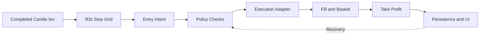

# TiewTrade

TiewTrade คือ Desktop Binance Trading Bot สำหรับ Internal Alpha ที่เน้นความถูกต้อง การตรวจสอบย้อนหลัง การกู้คืน และการป้องกันคำสั่งซ้ำ ระบบรองรับ BTCUSDT จาก completed candle 5 นาทีแบบ UTC และเริ่มพิสูจน์พฤติกรรมทั้งหมดใน Paper ก่อนเปิด Live ตามลำดับที่ควบคุมได้

## System Overview

แผนภาพนี้สรุปลำดับข้อมูลและ state หลักที่ผู้อ่านจะพบในเอกสารทุกหน้า

แผนภาพแสดงเส้นทางหลักตั้งแต่รับ Candle ที่ปิดสมบูรณ์ ไปจนถึงการสร้าง Entry, อัปเดต Basket และแสดงผล โดย state ที่บันทึกไว้จะถูกนำกลับมาตรวจสอบก่อน Resume หลังเปิดโปรแกรมใหม่

ข้อมูลตลาดต้องต่อเนื่องและไม่ซ้ำก่อนถึง Strategy เมื่อเกิดสัญญาณ ระบบยังต้องผ่าน capital, Entry Pair, Cooldown Month และ safety policies ก่อนเรียก execution adapter ทุกผลลัพธ์สำคัญผูกกับ Account Profile และ Bot Session เพื่ออธิบายย้อนหลังได้

## Reading Path

- เริ่มจาก [Product](/product) เพื่อเข้าใจขอบเขตและ Delivery Gates
- อ่าน [Domain](/domain) ก่อนเอกสารเชิงเทคนิคเพื่อใช้คำศัพท์ชุดเดียวกัน
- อ่าน [Architecture](/architecture) และ [Trading Process](/trading-process) เพื่อเห็น ownership และลำดับการทำงานครบเส้นทาง
- เจาะ business rules ที่ [Strategy](/strategy), [Basket Lifecycle](/basket-lifecycle), [Entry Pair & Cooldown](/entry-pair-cooldown) และ [Capital Allocation](/capital-allocation)
- เปรียบเทียบ execution และ safety ที่ [Paper Trading](/paper-trading), [Live Safety](/live-safety) และ [Recovery](/recovery)
- ปิดท้ายด้วย [Delivery](/delivery) และ [Decisions](/decisions) เพื่อเข้าใจลำดับส่งมอบและเหตุผลของข้อกำหนดสำคัญ

ถ้าต้องการตามรอยคำสั่งซื้อขายหนึ่งรายการ ให้อ่าน Trading Process แล้วตามลิงก์ไปยัง Strategy, Basket และ execution mode ที่เกี่ยวข้อง ถ้าต้องการประเมินความพร้อมก่อนเปิด Live ให้เริ่มที่ Product, Live Safety, Recovery และ Delivery

## Safety Principles

Paper และ Live ใช้ strategy, capital และ lifecycle policies ชุดเดียวกัน แต่แยก execution adapters ออกจากกันอย่างชัดเจน ไม่มีการเปลี่ยนเป็น Live อัตโนมัติ และไม่มีการใช้ Testnet แทนการพิสูจน์ safety

เมื่อข้อมูลไม่สดหรือ state ระหว่างเครื่องกับ exchange ไม่ตรงกัน ระบบหยุดสร้าง Entry ใหม่แบบ fail closed แต่ไม่ยกเลิก Take Profit หรือแก้ state เอง การ Resume เกิดขึ้นได้หลังข้อมูลต่อเนื่องและ Reconciliation ผ่านเท่านั้น
