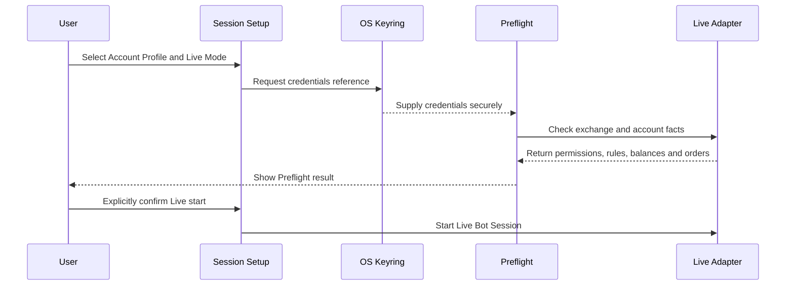
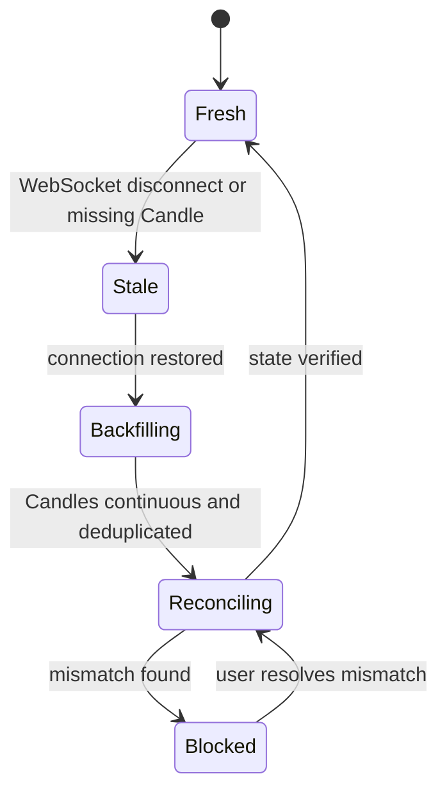

# Live Safety

Live ไม่ใช่ Mode ที่ระบบเปลี่ยนจาก Paper ให้อัตโนมัติ ทุก Live Bot Session ต้องผ่าน Delivery Gate, Preflight และการยืนยันที่ชัดแจ้งจากผู้ใช้ Credentials อยู่ใน OS Keyring เท่านั้น และห้ามปรากฏใน SQLite, logs หรือ source control

## Live Activation

Sequence การเปิด Live แสดงว่า Preflight เกิดก่อนการยืนยันครั้งสุดท้ายของผู้ใช้เสมอ

แผนภาพแสดงว่าการยืนยันอยู่หลังผล Preflight ผู้ใช้ต้องเห็น Account Profile, Market Type, Mode และข้อเท็จจริงที่ตรวจแล้วก่อนเริ่ม Live ไม่มี credential value ถูกส่งไปเก็บใน application database

Preflight ตรวจ API credentials และ permissions, Account Profile, BTCUSDT symbol rules, balance, open orders, positions, margin mode และ leverage Spot กับ Futures ใช้ checklist ที่เหมาะกับ account facts ของตนเอง

## Execution Boundaries

Live Spot และ Live Futures ใช้ execution adapters แยกกัน แต่ implement consumer-owned contract เดียวกัน ทุก request มี idempotency key ที่คงที่และตรวจย้อนหลังได้ Retry ต้องตรวจผลเดิมก่อนส่งซ้ำเพื่อไม่สร้าง Order ซ้ำจาก timeout

ระบบไม่ใช้ Master Account API และไม่ใช้ Binance Testnet การพัฒนาและ verification ใช้ Paper, fake transport และ contract tests ก่อนขออนุมัติทดสอบ Live ด้วยบัญชีที่ผู้ใช้กำหนด

## Stale Data Fail Closed

State diagram นี้แสดงเส้นทางจากข้อมูลสดไปยัง backfill, Reconciliation และการ Resume หรือ Block

แผนภาพแสดง recovery path ของ market data เมื่อข้อมูลไม่สดระบบห้าม Entry ใหม่ แต่คง Take Profit ที่ส่งไว้ แจ้งเตือน และ retry แบบจำกัด หลัง reconnect ต้อง backfill และ deduplicate ก่อน Reconciliation จึงจะ Resume ได้

Blocked state ไม่ยกเลิก Order, ไม่เปิด Basket ใหม่ และไม่ rewrite local state ผู้ใช้ต้องเห็นรายละเอียด mismatch และเป็นผู้ตัดสินใจแก้ไขตามข้อมูลจริง

## Operational Guardrails

Internal Alpha ไม่มี automatic Stop Loss หรือ loss limits ระบบแสดง PnL, Drawdown และ notification แต่ยังบังคับ capital allocation, `max_entries` ของ Session และ Futures leverage cap เสมอ Stop Session หยุด Entry ใหม่และบันทึก state โดยไม่บังคับปิด Basket

Live Spot เปิดได้หลัง Paper Trading Complete เท่านั้น Live Futures เปิดได้หลัง Live Spot ผ่านและต้องตรวจ Cross Margin, leverage, Collateral Buffer, funding และ liquidation-related account facts เพิ่มเติม
