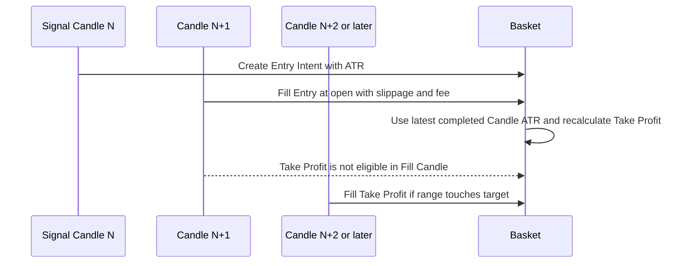

# Paper Trading

Paper Trading ใช้ conservative candle fill เพื่อให้ผลลัพธ์ทำซ้ำได้และไม่สมมติลำดับราคาภายใน Candle ที่ข้อมูล OHLC ไม่ได้บอก Session ตรึง Preset version, fee และ slippage configuration ไว้ตลอดรอบ

## Candle Timing

Sequence นี้แสดงจุดตัดสินใจและ Fill ตั้งแต่ signal Candle N ไปจนถึง Candle แรกที่ Take Profit มีสิทธิ์ทำงาน

แผนภาพแสดง timing ที่ตัด look-ahead bias: สัญญาณเกิดหลัง Candle N ปิด, Entry Fill ที่ราคาเปิด Candle N+1 และ Take Profit เริ่มมีสิทธิ์ Fill ตั้งแต่ Candle ถัดจาก Entry Fill แม้ช่วงราคาของ Candle N+1 จะคร่อม target ก็ตาม

Buy Fill รวม slippage ตาม configuration แล้วปัด quantity ตาม step size ตรวจ minimum notional และคำนวณ fee ด้วย Decimal ณ ราคาเปิด N+1 completed Candle ล่าสุดคือ Candle N ระบบจึงอ่าน ATR(14) ล่าสุด ณ Fill และใช้สร้าง Take Profit หลัง Fill โดยไม่ผูก target กับ ATR snapshot ใน Entry Intent

## Execution Costs

Spot บันทึก entry fee, exit fee และ slippage Paper Futures Phase แรกบันทึก Funding Fee เป็น `0.00` และยังไม่จำลอง funding จาก Binance

Fee rate และ slippage เป็นส่วนของ immutable Bot Session configuration และต้องไม่ติดลบ การแก้ fee หรือ slippage configuration ต้องเริ่ม Session ใหม่เพื่อไม่ให้ผลลัพธ์ช่วงเดียวกันเปลี่ยนกลางทาง

## Deterministic Replay

Replay รับ completed Candles ที่เรียงต่อเนื่องแบบ UTC ผ่าน loader ที่แปลงราคาและจำนวนเป็น Decimal Input market data, Preset version และ Session configuration เดิมต้องให้ Entry Intents, Fills, closed Baskets, realized PnL และ JSON summary เดิมทุกครั้ง

Determinism อาศัย stable ordering, deterministic identifiers, การไม่ประมวลผล Candle ซ้ำ และการไม่อ่านเวลาปัจจุบันหรือ network state ระหว่าง replay หากพบ gap ต้องหยุดแทนการเดาข้อมูลที่หาย

## Boundaries

Paper adapter ไม่มี credentials และไม่ส่ง Live Order. Strategy, capital, Basket และ Entry Pair policies เป็นชุดเดียวกับ Live แต่ Fill model แยกจาก Live execution อย่างชัดเจน Paper Futures Phase แรกใช้ Funding Fee `0.00` และไม่ใช้ Testnet เป็นตัวแทน safety

Replay ที่ปิด Basket ได้เป็นหลักฐานของ vertical slice ด้าน Strategy และ execution timing แต่ Paper Trading Complete ยังรวม persistence, Recovery, one Active Bot Session, Paper Futures และ UI ด้วย
