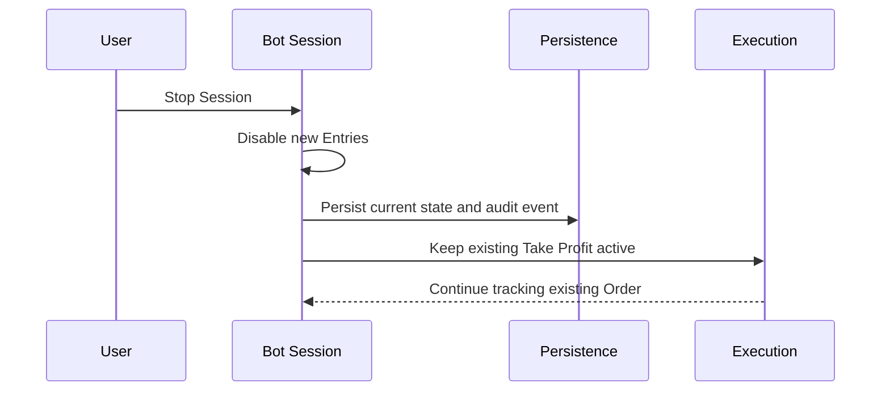
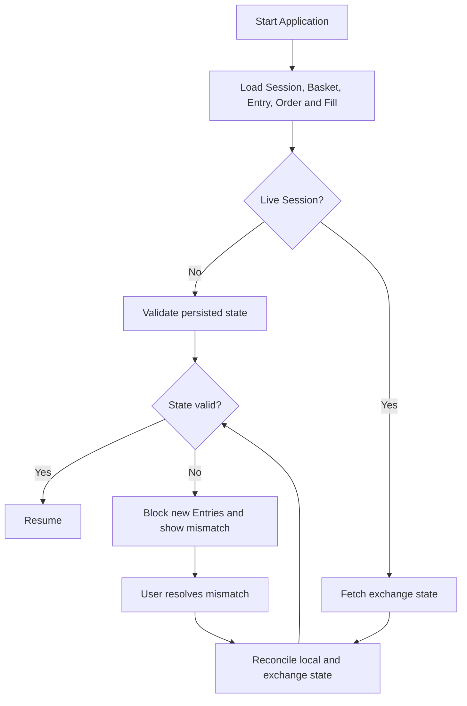

# Recovery

Recovery ป้องกันการกลับมาทำงานจาก state ที่ไม่ครบหรือไม่ตรงกับ exchange เป้าหมายไม่ใช่ทำให้ Bot เริ่มเร็วที่สุด แต่คือพิสูจน์ว่า Session เดิมดำเนินต่อได้โดยไม่สร้าง Entry, Order หรือ Basket ซ้ำ

## Stop Session

แผนภาพอธิบาย safe shutdown: Stop Session หยุดการสร้าง Entry ใหม่และบันทึก state แต่ไม่บังคับปิด Basket และไม่ยกเลิก Take Profit ที่ปกป้อง Position อยู่

UI ต้องแสดงว่า Bot Session หยุดรับ Entry ใหม่แล้ว พร้อม Basket และ Order ที่ยังเปิดอยู่ งาน persistence ต้องเสร็จแบบตรวจสอบได้ก่อน application ปิด

## Startup Recovery

แผนภาพแสดงลำดับ startup ที่โหลด durable state ก่อน สำหรับ Live จะดึง exchange facts มาเปรียบเทียบ แล้ว Resume เฉพาะเมื่อ state ตรงกัน หากไม่ตรง ระบบเข้าสู่ Blocked และรอผู้ใช้แก้ไข

ข้อมูลที่โหลดรวม Bot Session configuration, Basket, Entry Pair, Entry Intent, Order, Fill, PnL และ operational audit events ทุก record ต้องผูก Account Profile กับ Bot Session ถูกต้อง

## Mismatch Handling

Mismatch อาจเป็น Order ที่ local คิดว่าเปิดแต่ exchange ไม่พบ, Fill ที่ exchange มีแต่ local ยังไม่บันทึก, quantity ไม่ตรง, Position ต่างกัน หรือ symbol/margin facts เปลี่ยน ระบบแสดงรายละเอียดที่ตรวจพบโดยไม่เลือกความจริงให้เอง

ระหว่าง Recovery ห้ามยกเลิก Order, เปิด Basket ใหม่ หรือ rewrite state อัตโนมัติ การแก้ไขต้องเป็น action ที่ผู้ใช้รับรู้และทิ้ง audit trail หลังแก้ไขแล้วต้อง Reconcile ใหม่ตั้งแต่ต้น

## Resume Conditions

Resume Entry generation ได้เมื่อ persisted state ผ่าน validation, completed Candles ต่อเนื่องหลัง backfill และ deduplication, ไม่มี stale data, local state ตรงกับ exchange สำหรับ Live และ idempotency state พร้อมติดตาม request เดิม

Take Profit ที่มีอยู่ยังถูกติดตามระหว่าง blocked recovery เพราะการหยุด Entry ใหม่ไม่ควรลบการป้องกันทางออกของ Basket ดู connection path ที่ [Live Safety](/live-safety)
