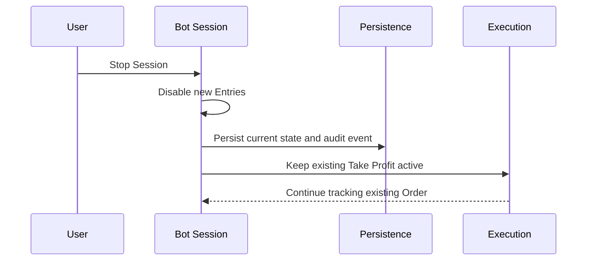
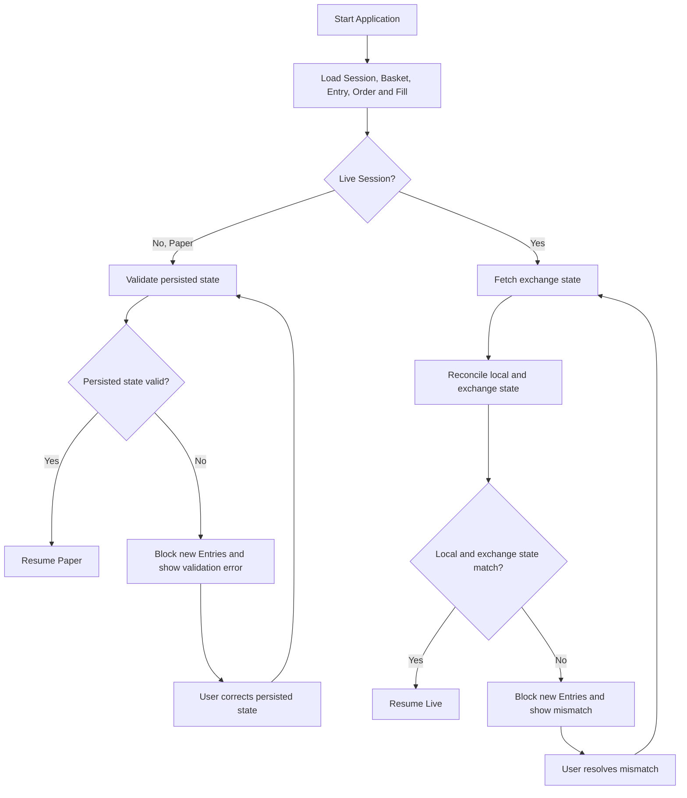

# Recovery

Recovery ป้องกันการกลับมาทำงานจาก state ที่ไม่ครบหรือไม่ตรงกับ exchange เป้าหมายไม่ใช่ทำให้ Bot เริ่มเร็วที่สุด แต่คือพิสูจน์ว่า Session เดิมดำเนินต่อได้โดยไม่สร้าง Entry, Order หรือ Basket ซ้ำ

## Stop Session

Sequence นี้แสดงผลของ Stop Session ต่อการสร้าง Entry, persistence และ Take Profit Order ที่มีอยู่

แผนภาพอธิบาย safe shutdown: Stop Session หยุดการสร้าง Entry ใหม่และบันทึก state แต่ไม่บังคับปิด Basket และไม่ยกเลิก Take Profit ซึ่งยังคง active เพื่อปิด Basket ที่ target

UI ต้องแสดงว่า Bot Session หยุดรับ Entry ใหม่แล้ว พร้อม Basket และ Order ที่ยังเปิดอยู่ งาน persistence ต้องเสร็จแบบตรวจสอบได้ก่อน application ปิด

## Startup Recovery

Flowchart นี้แยกเส้นทาง Paper validation ออกจาก Live Reconciliation ตั้งแต่หลังโหลด durable state

แผนภาพแยก Recovery ตาม Mode หลังโหลด durable state: Paper ตรวจ persisted state และวนกลับมาตรวจใหม่หลังผู้ใช้แก้ validation error โดยไม่ดึง exchange state ส่วน Live ดึง exchange facts, Reconcile และวนกลับไปดึงข้อมูลใหม่หลังผู้ใช้แก้ mismatch ทั้งสองเส้นทาง Resume เมื่อ validation ของตนผ่านเท่านั้น

ข้อมูลที่โหลดรวม Bot Session configuration, Basket, Entry Pair, Entry Intent, Order, Fill, PnL และ operational audit events ทุก record ต้องผูกกับ `session_id` ของ Bot Session โดยตรง

## Mismatch Handling

Paper validation error อาจเป็น record ที่อ้าง Bot Session ไม่ตรงกัน, lifecycle state ไม่ครบ หรือความสัมพันธ์ระหว่าง Basket, Entry, Order และ Fill ไม่ถูกต้อง ระบบแสดงรายละเอียดและรอผู้ใช้แก้ persisted state ก่อนตรวจซ้ำ โดยไม่เรียก exchange

Live mismatch อาจเป็น Order ที่ local คิดว่าเปิดแต่ exchange ไม่พบ, Fill ที่ exchange มีแต่ local ยังไม่บันทึก, quantity ไม่ตรง, Position ต่างกัน หรือ symbol/margin facts เปลี่ยน ระบบแสดงรายละเอียดที่ตรวจพบโดยไม่เลือกความจริงให้เอง

ระหว่าง Recovery ห้ามยกเลิก Order, เปิด Basket ใหม่ หรือ rewrite state อัตโนมัติ การแก้ไขต้องเป็น action ที่ผู้ใช้รับรู้และทิ้ง audit trail หลังแก้ Paper state ต้อง Validate ใหม่ ส่วน Live ต้องดึง exchange state และ Reconcile ใหม่

## Resume Conditions

Resume Entry generation ได้เมื่อ persisted state ผ่าน validation, completed Candles ต่อเนื่องหลัง backfill และ deduplication, ไม่มี stale data, local state ตรงกับ exchange สำหรับ Live และ idempotency state พร้อมติดตาม request เดิม

Take Profit ที่มีอยู่ยังถูกติดตามระหว่าง blocked recovery และยังคง active เพื่อปิด Basket ที่ target ขณะที่ Entry ใหม่ถูกระงับ ดู connection path ที่ [Live Safety](/live-safety)
