# Strategy

RSI Step Grid เป็นกลยุทธ์ Long-only หนึ่งเดียวใน Internal Alpha ทุกการประเมินใช้ completed Candle 5 นาทีของ BTCUSDT แบบ UTC เท่านั้น และ Session อ้างถึง Preset version ที่ immutable เพื่อให้ replay อธิบายและทำซ้ำได้

## Versioned Preset

| Parameter | ค่าเริ่มต้น |
| --- | ---: |
| RSI period | 14 |
| RSI reset threshold | ต่ำกว่า 30 |
| RSI entry threshold | สูงกว่า 50 |
| ATR period | 14 |
| Take Profit ATR multiplier | 3 |
| Maximum Entries per Basket | 10 |
| Candle interval | 5 นาที |

RSI และ ATR ใช้ Wilder smoothing และไม่ส่ง indicator snapshot ก่อน warm-up ครบ การเปลี่ยนพารามิเตอร์ต้องสร้าง Preset version ใหม่ Session ที่เริ่มแล้วคงใช้ version เดิม

## Signal Lifecycle

```mermaid
stateDiagram-v2
    [*] --> WaitingForWarmup
    WaitingForWarmup --> WaitingForReset: 14 periods ready
    WaitingForReset --> Armed: RSI below 30; store reset close
    Armed --> Armed: confirmation not complete
    Armed --> PendingFill: RSI above 50 and bullish and close above reset close
    PendingFill --> PendingFill: ignore duplicate opportunity
    PendingFill --> WaitingForReset: Entry Fill uses latest completed Candle ATR and consumes reset
```

แผนภาพแสดงว่า reset ใต้ 30 เป็นเงื่อนไขเริ่มต้น ไม่ใช่คำสั่งซื้อ หลัง reset ระบบรอ Candle ที่ผ่าน confirmation ครบทุกข้อ สร้าง Intent ได้หนึ่งรายการ แล้วรอ Fill ก่อนกลับไปหา reset ใหม่

Confirmation ต้องเกิดใน completed Candle เดียวกันและผ่านทุกเงื่อนไข: RSI สูงกว่า 50, `close > open`, `close > reset close`, Basket ยังไม่ครบ 10 Entries และ Bot Session กับ lifecycle อนุญาต Entry ใหม่

## Deterministic Entry Intent

Entry Intent บันทึก Entry number, signal Candle, ATR snapshot สำหรับ audit และ deterministic idempotency key Input เดิมต้องสร้าง identity เดิม เพื่อให้ retry และ replay ไม่กลายเป็นการตัดสินใจใหม่ ATR snapshot ใน Intent ไม่ได้กำหนด Take Profit ล่วงหน้า

เมื่อมี Intent รอ Fill ระบบไม่สร้าง Intent ซ้ำ แม้ Candle ถัดมาจะยังผ่าน confirmation เมื่อ Fill สำเร็จ reset signal ถูกใช้แล้วและต้องรอ RSI ต่ำกว่า 30 ใหม่ก่อน Entry ถัดไป หาก execution ไม่สำเร็จ workflow ต้องแก้สถานะ pending อย่างชัดเจน ไม่ถือว่า Entry เกิดขึ้นแล้ว

## Completed Candle Contract

Candle ที่ยังไม่ปิด, ซ้ำ, เก่ากว่า state ล่าสุด หรืออยู่หลัง gap จะไม่ถึง Strategy หลัง reconnect ระบบ backfill completed Candles ที่หาย เรียงตาม UTC และ deduplicate ก่อน Resume ทำให้ indicators และ Entry Intent ไม่ขึ้นกับ timing ของ WebSocket

เมื่อ Entry Fill ระบบใช้ ATR(14) จาก completed Candle 5 นาทีล่าสุดที่มีอยู่ ณ เวลา Fill เพื่อคำนวณ Take Profit ใน Paper Fill ที่ราคาเปิด Candle ถัดไปจึงใช้ ATR ของ Candle ที่เพิ่งปิด ส่วน Live Fill ที่มาถึงภายหลังต้องอ่าน indicator state ล่าสุด ณ Fill แทน ATR snapshot ใน Intent ดูลำดับ execution ต่อได้ที่ [Paper Trading](/paper-trading) และข้อจำกัดจำนวน Entry ที่ [Entry Pair & Cooldown](/entry-pair-cooldown)
