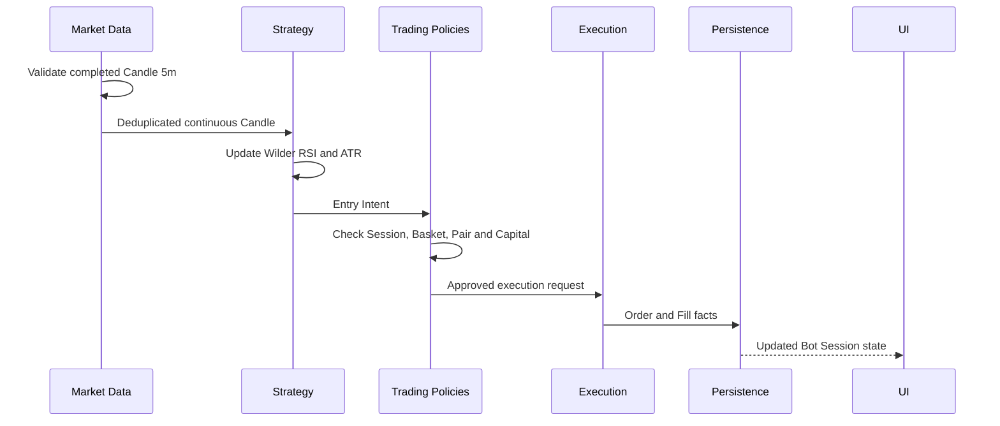
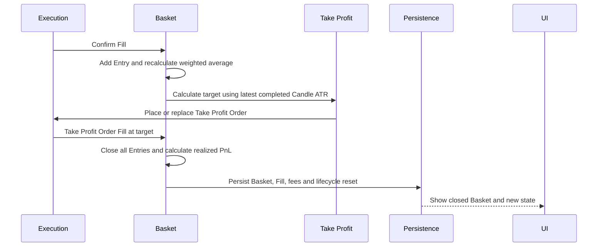

# Trading Process

Trading Process เชื่อมข้อมูลตลาด Strategy, policies, execution, persistence และ UI เป็นลำดับเดียว การแยกแต่ละขั้นทำให้ระบบบอกได้ว่าการตัดสินใจหยุดอยู่ที่ไหน และป้องกัน side effect ก่อนผ่านข้อกำหนดทั้งหมด

## จาก Candle ถึง Entry Intent

แผนภาพแสดง request path สำหรับ Entry ใหม่: Candle ต้องปิดและต่อเนื่องก่อน Strategy, Entry Intent ต้องผ่าน lifecycle และ capital policies ก่อน Execution และ UI ได้รับ state ที่บันทึกแล้วแทนการคาดเดาจากคำสั่งที่เพิ่งส่ง

Market Data รับเฉพาะ BTCUSDT ที่เปิดตรงขอบ 5 นาที UTC และมี OHLC/volume ถูกต้อง Candle ที่ยังไม่ปิดจะไม่ถูกส่งต่อ Candle เดิมหรือเก่ากว่าจะถูกตัดออก หากพบ gap ระบบหยุดเพื่อ backfill และระบุ Candle แรกที่หาย

Strategy อัปเดต Wilder RSI(14) และ ATR(14) หลัง warm-up ครบ จาก reset ใต้ 30 จะสร้าง Entry Intent เมื่อ RSI สูงกว่า 50, Candle เป็น bullish และ close สูงกว่า reset close การรอ Fill ป้องกัน Intent ซ้ำ และ Intent มี deterministic idempotency key

## จาก Fill ถึง Basket Take Profit

แผนภาพแสดงว่า Basket เปลี่ยนหลังได้รับ Fill จริงเท่านั้น ทุก Entry Fill ทำให้ weighted average และ Take Profit ถูกคำนวณใหม่ แล้ววางหรือแทนที่ Take Profit Order เมื่อ Order นั้น Fill ที่ target Entries ทั้งหมดปิดพร้อมกันและ Basket ใหม่เริ่มได้ทันที

Take Profit ใช้ `weighted_average_entry_price + ATR(14) × 3` จาก ATR ล่าสุด ณ Fill แล้วปัดตาม tick size ของ BTCUSDT Target ครอบคลุม quantity ที่ Bot เป็นเจ้าของทั้งหมด ค่าธรรมเนียมไม่เพิ่มเข้า target แต่ถูกหักใน realized PnL

## Persistence และ Audit Trail

ทุก decision และ side effect ที่สำคัญถูกบันทึกพร้อม Account Profile และ Bot Session ได้แก่ signal Candle, Preset version, Entry Intent, Order, Fill, fee, slippage, funding, Basket state และ notification Audit trail ต้องตอบได้ว่า Bot ตัดสินใจอะไร เมื่อใด ใช้ข้อมูลใด และ execution ให้ผลอย่างไร

UI แสดง state ที่ยืนยันแล้ว เช่น pending Entry, Entry count, active Take Profit, closed Baskets, PnL, Drawdown และ data freshness งาน network, engine และ persistence ต้องไม่บล็อก UI thread

## Fail-closed Paths

เมื่อ input ไม่ปลอดภัย ระบบหยุด Entry ใหม่ รักษา Take Profit ที่มีอยู่ แล้ว Resume เฉพาะเมื่อ backfill, deduplication และ state verification สำเร็จ หากพบ mismatch ต้องรอผู้ใช้แก้ไข เส้นทาง state โดยละเอียดอยู่ที่ [Live Safety](/live-safety) และ [Recovery](/recovery)
