# Architecture

## Document Purpose

This document defines the Version 1 software architecture for TiewTrade, a desktop trading bot application for non-technical Binance traders.

It translates the product scope, screen list, and user flows into a layered modular architecture suitable for later implementation planning. It does not define source code, database schemas, or UI mockups.

## Source Documents

- `/docs/project-overview.md`
- `/docs/screen-list.md`
- `/docs/user-flow.md`

## Technology Stack

- Python 3.13
- PySide6
- SQLite
- Binance API

## Architectural Constraints

The application must use a layered modular architecture.

The application must not use:

- Microservices.
- Distributed systems.
- Event sourcing.
- CQRS.

The application must support:

- Binance Spot.
- Binance Futures.
- Binance Main Account.
- Binance Sub Account.
- Multiple bot instances.
- Recovery after restart.
- License management.
- Trade history.
- Risk management.

## Finalized Architecture Decisions

The following decisions resolve the gaps identified in `/docs/architecture-review.md` and should be treated as Version 1 architecture rules unless the product owner explicitly changes them before implementation.

### Trading And Bot Operation Decisions

- Version 1 uses one built-in proprietary strategy only.
- Version 1 runtime supports multiple bot instances, even if the initial UI exposes a simplified single-bot setup.
- A bot instance is the ownership boundary for configuration, risk settings, orders, positions or exposure, trade history, logs, and recovery.
- Two running bots must not use the same account, market mode, and trading pair at the same time.
- Multiple bots may use the same account only when each bot has an explicit capital allocation and the account-level risk checks pass.
- Spot and Futures bots may coexist only when they use separate market contexts and pass account-level exposure checks.
- Bot startup must be idempotent: repeated Start Bot clicks or repeated startup requests must not create duplicate runtime workers or duplicate order activity.

### Stop Bot Policy

Stop Bot means "stop automated bot activity"; it does not mean "close all positions."

When Stop Bot is confirmed:

- The affected bot immediately stops evaluating new strategy signals.
- The affected bot immediately stops submitting new entry, DCA, or take-profit orders.
- App-owned unfilled entry and DCA orders should be canceled where Binance allows cancellation.
- App-owned protective take-profit or reduce-only exit orders may remain active if canceling them would leave an existing position without an exit order.
- Existing Spot holdings or Futures positions are not automatically closed by Version 1.
- The app must clearly show whether any position, holding, or app-owned exchange order remains after the bot stops.
- If the app is disconnected when Stop Bot is requested, the stop request is persisted locally as `Stop Requested`; no new local strategy actions may run, and exchange reconciliation must complete after reconnection.

### Futures Support Decisions

Version 1 Futures support is intentionally conservative:

- One-way Futures position mode is supported.
- Hedge mode is not supported in Version 1.
- Long-side strategy behavior is supported; short-side strategy behavior is not included unless separately approved.
- Isolated margin is the default supported margin mode.
- Cross margin must be blocked unless the product owner explicitly approves it before implementation.
- The app does not change Futures leverage automatically in Version 1.
- The app reads current Futures leverage and validates it against risk policy before bot start and before order placement.
- Reduce-only handling is required for take-profit or position-reducing Futures orders.
- Futures risk validation must include available margin, liquidation-risk visibility, position mode, margin mode, and leverage guardrails.

### Order Safety And Idempotency Decisions

- Every bot-generated order must begin as a local order intent before submission to Binance.
- Every submitted order must carry a stable client-side reference where Binance supports it.
- The app must correlate local order intent, client-side reference, and Binance order identifiers.
- The app must not blindly retry order placement after a timeout or unknown response.
- Unknown order status must trigger order synchronization before another order is submitted for the same bot action.
- Partial fills are in scope for Version 1 order handling.
- Rejected, failed, canceled, partially filled, filled, and unknown order outcomes must be visible in trade history or recovery status.

### License Enforcement Decisions

- A valid lifetime license is required for product access and bot startup.
- License activation may produce a local device-bound entitlement used for startup decisions.
- Temporary license validation network failure must not abruptly submit new stop or close orders while a bot is running.
- If license validation is temporarily unavailable during an active session, the bot may continue only within the configured local grace policy and must show a warning state.
- Explicit invalid, revoked, or expired license status blocks new bot starts and stops new strategy actions after safe synchronization.
- License failures must be logged with redacted identifiers only.

### Secure Storage Decisions

- Production credential storage must use platform secure storage where available.
- Expected providers are macOS Keychain, Windows Credential Manager, and Linux Secret Service or an equivalent OS-backed secure storage provider.
- Plain SQLite must never store raw API secrets.
- Encrypted local fallback is allowed only if approved for a supported platform and the encryption key is protected outside the SQLite database.
- If secure storage is unavailable and no approved fallback exists, account connection must be blocked with a clear user-facing message.
- Removing an account must remove its credential material from secure storage and invalidate affected bot configurations.

## 1. Architecture Overview

TiewTrade is a local desktop application built as a modular monolith. The user interface, application orchestration, domain logic, exchange access, persistence, security, licensing, logging, and bot runtime all run inside one desktop application process.

The architecture is layered to keep responsibilities clear:

- PySide6 presentation layer owns screens, navigation, user feedback, and UI state.
- Application layer coordinates user actions and bot use cases.
- Domain layer owns trading concepts, bot state, strategy rules, risk rules, and lifecycle decisions.
- Infrastructure layer integrates with Binance, licensing services, local security storage, and operating system capabilities.
- Persistence layer stores durable local state in SQLite.

The bot runtime must never block the UI thread. Long-running market monitoring, exchange calls, synchronization, and trading execution run through background workers coordinated by the application layer. UI screens receive status updates through a controlled application state model rather than directly calling exchange or persistence components.

### High-Level Architecture Diagram

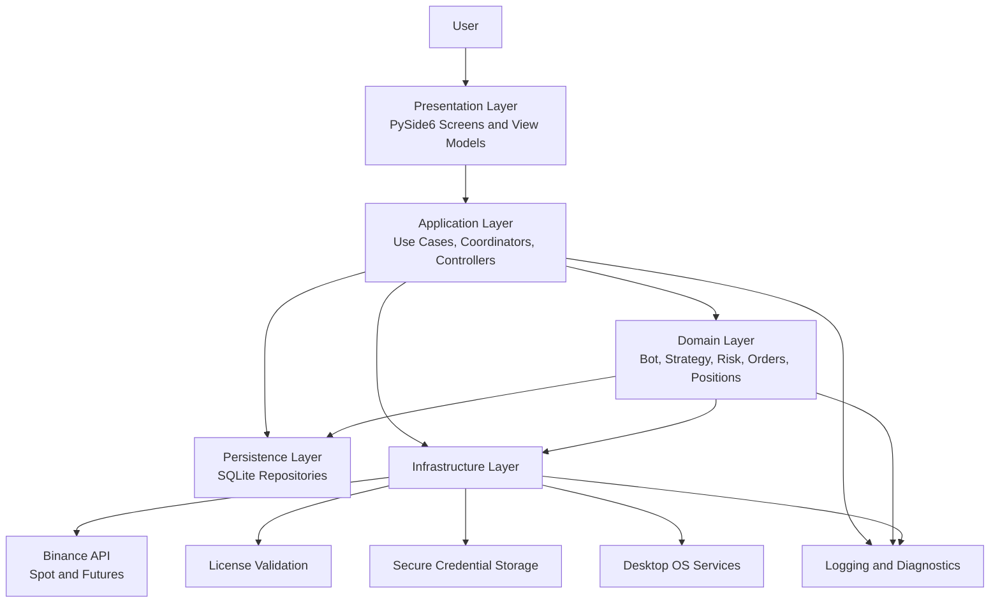
```mermaid
flowchart TB
    User["User"] --> UI["Presentation Layer<br/>PySide6 Screens and View Models"]

    UI --> App["Application Layer<br/>Use Cases, Coordinators, Controllers"]
    App --> Domain["Domain Layer<br/>Bot, Strategy, Risk, Orders, Positions"]

    App --> Persist["Persistence Layer<br/>SQLite Repositories"]
    Domain --> Persist

    App --> Infra["Infrastructure Layer"]
    Domain --> Infra

    Infra --> Binance["Binance API<br/>Spot and Futures"]
    Infra --> License["License Validation"]
    Infra --> SecureStore["Secure Credential Storage"]
    Infra --> OS["Desktop OS Services"]

    App --> Logging["Logging and Diagnostics"]
    Domain --> Logging
    Infra --> Logging
```

### Runtime Model Diagram

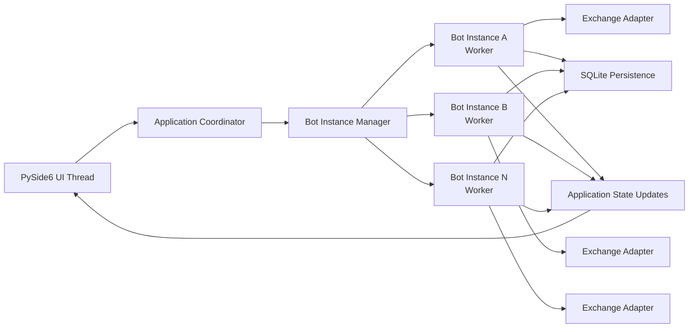
```mermaid
flowchart LR
    UIThread["PySide6 UI Thread"] --> AppCoordinator["Application Coordinator"]
    AppCoordinator --> BotManager["Bot Instance Manager"]

    BotManager --> BotA["Bot Instance A<br/>Worker"]
    BotManager --> BotB["Bot Instance B<br/>Worker"]
    BotManager --> BotN["Bot Instance N<br/>Worker"]

    BotA --> ExchangeA["Exchange Adapter"]
    BotB --> ExchangeB["Exchange Adapter"]
    BotN --> ExchangeN["Exchange Adapter"]

    BotA --> SQLite["SQLite Persistence"]
    BotB --> SQLite
    BotN --> SQLite

    BotA --> StateBus["Application State Updates"]
    BotB --> StateBus
    BotN --> StateBus
    StateBus --> UIThread
```

## 2. Design Principles

### Local Desktop First

The product is a desktop application, not a web app or hosted service. Core operation, configuration, and trade history are local to the user's machine, with Binance and license validation as external integrations.

### Layered Dependency Direction

Dependencies must flow through stable boundaries. UI components must not call Binance directly. Domain services must not depend on PySide6 widgets. Persistence details must not leak into screens.

Domain modules may define interfaces for exchange access, persistence, time, and policy services, but they must not depend on concrete Binance adapters, SQLite implementations, PySide6 widgets, or secure-storage providers. Infrastructure and persistence modules implement those interfaces.

### Safety Before Automation

Bot startup must be blocked unless license, account, permissions, market mode, trading pair, capital, and risk settings are valid. Recovery and synchronization must complete before a bot resumes normal running behavior after restart or crash.

### Strategy Encapsulation

Version 1 supports one built-in proprietary strategy. The strategy module exposes configuration inputs and execution decisions, but users cannot create, edit, import, or inspect strategy internals.

### Exchange Mode Abstraction

Spot and Futures share the same core bot lifecycle and strategy logic, but exchange-specific behavior must be isolated behind exchange adapters and market-mode services.

Spot holdings and Futures positions must be represented distinctly in the domain model. The UI may show both through a unified "exposure" concept, but architecture and persistence must not treat Spot inventory and Futures position state as identical.

### Account Context Explicitness

Every bot instance must know which account context it uses: Main Account or Sub Account, Spot or Futures, and selected trading pair. This prevents cross-account confusion.

### Recovery Is A First-Class Concern

Restart, crash recovery, exchange reconnection, open position synchronization, and order synchronization are core architecture responsibilities, not afterthoughts.

### UI Responsiveness

No exchange calls, license calls, synchronization tasks, or bot loops may block the PySide6 UI thread.

### Secure By Default

API credentials, license data, and sensitive exchange responses must be protected, masked, and excluded from logs.

### Modular Growth Without Distributed Complexity

The architecture may allow future modules, more exchange adapters, or more built-in strategies, but it remains a local layered desktop application for Version 1.

## 3. Layer Definitions

### Presentation Layer

Technology: PySide6.

Responsibilities:

- Display all Version 1 screens.
- Manage screen navigation.
- Collect user input.
- Show validation messages and bot status.
- Render dashboard, account, risk, position, trade history, license, and error states.
- Translate application state into user-readable UI.
- Keep bot status visible across primary screens.

The presentation layer must not:

- Call Binance directly.
- Read or write SQLite directly.
- Execute trading strategy logic.
- Store secrets directly.
- Decide whether an order should be placed.

### Application Layer

Responsibilities:

- Coordinate use cases from user actions.
- Validate preconditions before delegating to domain services.
- Manage application startup and routing.
- Coordinate wizard setup flow.
- Coordinate account lifecycle operations.
- Coordinate bot lifecycle operations.
- Coordinate recovery flows.
- Coordinate persistence writes through repositories.
- Convert domain and infrastructure errors into user-facing application states.

Example application services:

- Startup Coordinator.
- Navigation Coordinator.
- Setup Wizard Service.
- Account Application Service.
- Bot Control Service.
- Recovery Coordinator.
- License Application Service.
- Settings Application Service.
- Dashboard Query Service.

### Domain Layer

Responsibilities:

- Represent core trading concepts.
- Enforce bot lifecycle rules.
- Encapsulate the built-in strategy.
- Enforce risk rules.
- Maintain bot instance state.
- Decide whether a candidate trading action is allowed.
- Represent order, position, trade, account, and configuration concepts in implementation-neutral terms.
- Determine recovery decisions such as whether synchronization is required.

Example domain components:

- Bot Instance.
- Bot Instance Manager.
- Bot State Machine.
- Strategy Engine.
- Risk Engine.
- Bot Resource Coordinator.
- Order Idempotency Policy.
- Position Manager.
- Order Manager.
- Trade History Service.
- Account Context.
- Market Context.
- Exchange Capability Model.
- Configuration Validator.

### Infrastructure Layer

Responsibilities:

- Integrate with external systems and operating system capabilities.
- Communicate with Binance Spot and Futures APIs.
- Validate API credentials and permissions.
- Perform license validation using the selected licensing mechanism.
- Protect secrets using secure storage.
- Provide time, networking, and environment services.
- Translate external API failures into application-level error types.

Example infrastructure components:

- Binance Spot Adapter.
- Binance Futures Adapter.
- Binance Account Adapter.
- Binance Market Data Adapter.
- Binance Order Adapter.
- Binance Exchange Capability Adapter.
- Binance Rate Limit Coordinator.
- License Provider.
- Secure Storage Provider.
- Network Status Provider.
- Clock Provider.

### Persistence Layer

Technology: SQLite.

Responsibilities:

- Persist license state needed for startup decisions.
- Persist non-secret account metadata.
- Persist bot configurations.
- Persist risk settings.
- Persist bot lifecycle state.
- Persist capital allocation and reservation state.
- Persist trade history.
- Persist order intents and exchange order correlation.
- Persist order and position state required for recovery.
- Persist synchronization markers and recovery state.

The persistence layer must expose repositories or data access services to the application and domain layers. This document intentionally does not define SQLite schemas.

### Cross-Cutting Layer

Responsibilities:

- Logging.
- Diagnostics.
- Error classification.
- Data redaction.
- Configuration version handling.
- Application health status.
- Background task supervision.
- Runtime worker supervision.
- SQLite write coordination.
- Binance rate-limit coordination.

## 4. Module Definitions

### Module Dependency Diagram

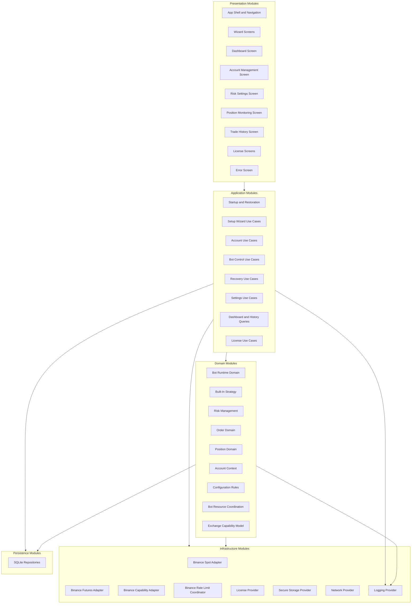
```mermaid
flowchart TB
    subgraph Presentation["Presentation Modules"]
        Shell["App Shell and Navigation"]
        WizardUI["Wizard Screens"]
        DashboardUI["Dashboard Screen"]
        AccountUI["Account Management Screen"]
        RiskUI["Risk Settings Screen"]
        PositionUI["Position Monitoring Screen"]
        HistoryUI["Trade History Screen"]
        LicenseUI["License Screens"]
        ErrorUI["Error Screen"]
    end

    subgraph Application["Application Modules"]
        Startup["Startup and Restoration"]
        Setup["Setup Wizard Use Cases"]
        AccountApp["Account Use Cases"]
        BotControl["Bot Control Use Cases"]
        Recovery["Recovery Use Cases"]
        Settings["Settings Use Cases"]
        Queries["Dashboard and History Queries"]
        LicenseApp["License Use Cases"]
    end

    subgraph Domain["Domain Modules"]
        BotDomain["Bot Runtime Domain"]
        Strategy["Built-In Strategy"]
        Risk["Risk Management"]
        Orders["Order Domain"]
        Positions["Position Domain"]
        Accounts["Account Context"]
        Config["Configuration Rules"]
        Resources["Bot Resource Coordination"]
        Capability["Exchange Capability Model"]
    end

    subgraph Infrastructure["Infrastructure Modules"]
        BinanceSpot["Binance Spot Adapter"]
        BinanceFutures["Binance Futures Adapter"]
        BinanceCapability["Binance Capability Adapter"]
        RateLimit["Binance Rate Limit Coordinator"]
        LicenseProvider["License Provider"]
        SecretStore["Secure Storage Provider"]
        Network["Network Provider"]
        Logging["Logging Provider"]
    end

    subgraph Persistence["Persistence Modules"]
        Repos["SQLite Repositories"]
    end

    Presentation --> Application
    Application --> Domain
    Application --> Persistence
    Domain --> Persistence
    Application --> Infrastructure
    Domain --> Infrastructure
    Infrastructure --> Logging
    Application --> Logging
    Domain --> Logging
```

### Presentation Modules

#### App Shell And Navigation

Owns application frame, startup routing, global bot status display, primary navigation, and screen transitions.

#### Setup Wizard Screens

Own first-run setup screens:

- Connect Binance Account.
- Select Spot or Futures.
- Select Trading Pair.
- Configure Capital.
- Configure Risk Settings.
- Review Configuration.
- Start Bot.

#### Dashboard Screen

Shows bot status, account state, market mode, selected pair, capital, current position summary, recent trades, and Start / Stop controls.

#### Account Management Screen

Shows connected account status, account type, permission status, and account replacement or removal actions.

#### Risk Settings Screen

Shows and edits risk settings when the bot is stopped.

#### Position Monitoring Screen

Shows active position state, multi-entry / DCA progress, take profit progress, exposure, and current bot status.

#### Trade History Screen

Shows completed, failed, canceled, and rejected bot activity.

#### License Screens

Support license activation, license status, recheck, and license replacement.

#### Error Screen

Shows recoverable and blocking errors with user-safe language and recovery actions.

### Application Modules

#### Startup And Restoration Module

Coordinates application launch, license validation, configuration loading, bot state restoration, and recovery routing.

#### Setup Wizard Module

Coordinates the first-run setup flow and ensures each step is valid before moving forward.

#### Account Use Cases Module

Coordinates add, edit, test, validate, and remove account flows for Main Account and Sub Account.

#### Bot Control Module

Coordinates start and stop requests, lifecycle transitions, pre-flight checks, and user-facing bot status updates.

#### Recovery Module

Coordinates application restart recovery, crash recovery, exchange reconnection, open position synchronization, and order synchronization.

#### Settings Module

Coordinates application settings and risk settings changes, including blocked edits while the bot is running.

#### Query Module

Provides read-oriented data for Dashboard, Position Monitoring, Trade History, Account, Risk, and License screens.

This is not CQRS. The query module is a simple read service within the same layered application.

#### License Use Cases Module

Coordinates activation, validation, recheck, and license-invalid routing.

### Domain Modules

#### Bot Runtime Domain

Owns bot instance state, lifecycle transitions, worker coordination rules, and runtime decisions.

#### Built-In Strategy Module

Encapsulates the proprietary strategy:

- RSI Entry.
- ATR Take Profit.
- Multi-Entry / DCA Position Management.

The strategy module is not user-editable.

#### Risk Management Module

Validates risk settings, capital allocation, balance constraints, market-mode risk, and whether a trading action is allowed.

Risk Management is responsible for:

- Pre-start validation.
- Pre-order validation.
- Runtime exposure monitoring.
- DCA limit enforcement.
- Account-level exposure checks across multiple bot instances.
- Futures leverage, margin mode, position mode, and liquidation-risk checks.
- Blocking bot startup or order submission when risk state is invalid.

Version 1 does not assume a user-configurable strategy, but it does require user-configurable risk parameters. The exact fields are defined later by product and database design.

#### Bot Resource Coordination Module

Coordinates shared resources across bot instances.

Responsibilities:

- Enforce one running bot per account, market mode, and trading pair.
- Track per-bot capital allocation.
- Coordinate account-level available balance and margin checks.
- Prevent overlapping capital allocations from exceeding available account resources.
- Coordinate Binance API usage through the Rate Limit Coordinator.
- Identify affected bots when an account is removed, replaced, disconnected, or invalidated.

#### Account Context Module

Represents selected Binance account context:

- Main Account or Sub Account.
- Spot or Futures capability.
- Permission state.
- Credential reference.

#### Market Context Module

Represents selected exchange mode and trading pair:

- Binance Spot.
- Binance Futures.
- Supported trading pair.
- Pair availability status.

#### Exchange Capability Model

Represents Binance exchange rules needed for validation and safe order construction:

- Symbol availability.
- Spot vs Futures symbol support.
- Minimum order size.
- Minimum notional value.
- Quantity precision.
- Price precision.
- Step size.
- Supported order types.
- Trading status such as active, suspended, or delisted.
- Futures-only capability requirements such as reduce-only support and margin constraints.

The capability model is used by setup validation, start-bot validation, risk checks, and order submission. It is an architecture-level model only and does not define a database schema.

#### Order Domain Module

Owns order intent, order status interpretation, rejection handling, unknown order state handling, idempotency decisions, and order synchronization decisions.

Order lifecycle states must include:

- `Intent Created`
- `Pending Submission`
- `Submitted`
- `Partially Filled`
- `Filled`
- `Cancel Requested`
- `Canceled`
- `Rejected`
- `Failed`
- `Unknown`
- `Reconciled`

The Order Domain must prevent blind retries after unknown submission results.

#### Position Domain Module

Owns current exposure state, DCA progress, take profit progress, and synchronization decisions after restart or reconnect.

The domain must distinguish:

- Spot holdings or Spot inventory.
- Futures positions.
- Unified exposure summary for user-facing monitoring.

#### Trade History Domain Module

Owns durable trade event meaning for user review, including successful, failed, canceled, rejected, partially filled, unknown, blocked-by-risk, and recovery-corrected bot activity.

### Infrastructure Modules

#### Binance Spot Adapter

Implements Spot-specific account, market data, balance, order, Spot holdings, and trade access.

#### Binance Futures Adapter

Implements Futures-specific account, market data, balance, order, position, leverage-related state, margin mode, position mode, reduce-only handling, and trade access.

#### Binance Adapter Factory

Selects the correct adapter using market mode and account context. Application and domain modules should depend on exchange gateway interfaces, not directly on Spot or Futures implementation details.

#### Binance Capability Adapter

Fetches and normalizes Binance Spot and Futures exchange capability information for the Exchange Capability Model.

#### Binance Rate Limit Coordinator

Coordinates Binance API usage across account validation, market data polling, order submission, recovery synchronization, and multiple bot instances. The coordinator prevents independent workers from overwhelming Binance API limits.

#### License Provider

Validates the one-time purchase lifetime license using the selected license mechanism.

#### Secure Storage Provider

Stores sensitive Binance credentials and other secrets using platform secure storage when available, with an approved encrypted fallback if required.

#### Network Provider

Reports connectivity state and supports retry behavior for license, Binance, and synchronization operations.

#### Logging Provider

Writes structured local logs with redaction and rotation.

### Persistence Modules

#### SQLite Repository Module

Provides repository access for durable local state. Repository boundaries should align with product concepts such as configuration, account metadata, bot state, trades, orders, positions, license state, and recovery state. This document intentionally does not define database tables, columns, or relationships.

#### Migration And Version Module

Handles persistence format versioning as the product evolves. This module must preserve user data and support safe upgrades.

## 5. Component Responsibilities

| Component | Primary Responsibility | Must Not Do |
|---|---|---|
| PySide6 Screens | Display screens, capture user intent, show state | Call Binance, run trading logic, persist directly |
| View Models | Prepare screen state and commands for UI | Own domain rules or secrets |
| Navigation Coordinator | Route between screens based on app state | Make trading decisions |
| Startup Coordinator | Validate license and restore state on launch | Place orders |
| Setup Wizard Service | Validate setup progression | Execute strategy logic |
| Account Service | Add, edit, test, and remove account connections | Store raw secrets outside secure storage |
| License Service | Activate and validate license state | Manage Binance credentials |
| Bot Control Service | Start, stop, and supervise bot instances | Render UI widgets |
| Bot Instance Manager | Track and coordinate multiple bot instances | Know PySide6 widget details |
| Bot Instance | Run one configured bot lifecycle | Directly show UI messages |
| Bot Resource Coordinator | Enforce account, pair, capital, and rate-limit coordination across bot instances | Place orders directly |
| Strategy Engine | Evaluate built-in strategy signals | Accept user-defined strategies |
| Risk Engine | Approve or block trading actions | Place orders directly |
| Exchange Gateway | Provide exchange-neutral trading operations | Decide product UI behavior |
| Exchange Capability Model | Represent Binance symbol, precision, order, permission, and market-mode constraints | Store raw exchange credentials |
| Rate Limit Coordinator | Coordinate Binance API usage across bot instances | Decide strategy signals |
| Binance Adapters | Implement Binance Spot and Futures calls | Store long-term app state |
| Order Manager | Track order intent, status, and synchronization | Hide rejected or unknown orders |
| Order Idempotency Policy | Prevent duplicate submissions and correlate local intents with Binance orders | Retry unknown orders blindly |
| Position Manager | Track positions and DCA / take profit progress | Modify user settings |
| Trade History Service | Record and expose bot trading activity | Store secrets |
| Recovery Coordinator | Restore and synchronize state after disruptions | Resume blindly without validation |
| SQLite Repositories | Persist durable local state | Enforce UI navigation |
| Persistence Coordinator | Serialize SQLite writes and protect transaction boundaries | Perform exchange calls |
| Secure Storage Provider | Protect credentials and sensitive values | Log raw secrets |
| Logging Provider | Record diagnostics safely | Include API secrets or license keys |

## 6. Data Flow

### First-Run Setup Data Flow

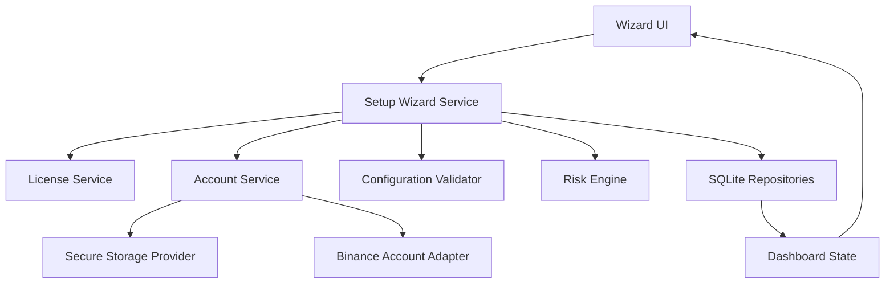
```mermaid
flowchart TD
    UI["Wizard UI"] --> SetupApp["Setup Wizard Service"]
    SetupApp --> LicenseApp["License Service"]
    SetupApp --> AccountApp["Account Service"]
    AccountApp --> SecretStore["Secure Storage Provider"]
    AccountApp --> Binance["Binance Account Adapter"]
    SetupApp --> ConfigRules["Configuration Validator"]
    SetupApp --> Risk["Risk Engine"]
    SetupApp --> Repos["SQLite Repositories"]
    Repos --> DashboardState["Dashboard State"]
    DashboardState --> UI
```

### Trading Data Flow

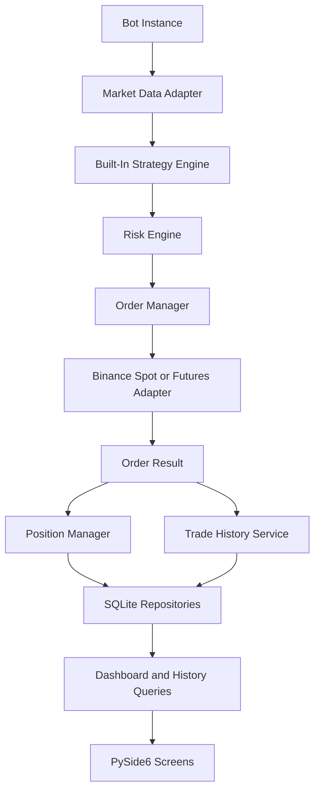
```mermaid
flowchart TD
    Bot["Bot Instance"] --> MarketData["Market Data Adapter"]
    MarketData --> Strategy["Built-In Strategy Engine"]
    Strategy --> Risk["Risk Engine"]
    Risk --> OrderManager["Order Manager"]
    OrderManager --> Exchange["Binance Spot or Futures Adapter"]
    Exchange --> OrderResult["Order Result"]
    OrderResult --> Position["Position Manager"]
    OrderResult --> History["Trade History Service"]
    Position --> Repos["SQLite Repositories"]
    History --> Repos
    Repos --> Query["Dashboard and History Queries"]
    Query --> UI["PySide6 Screens"]
```

### Recovery Data Flow

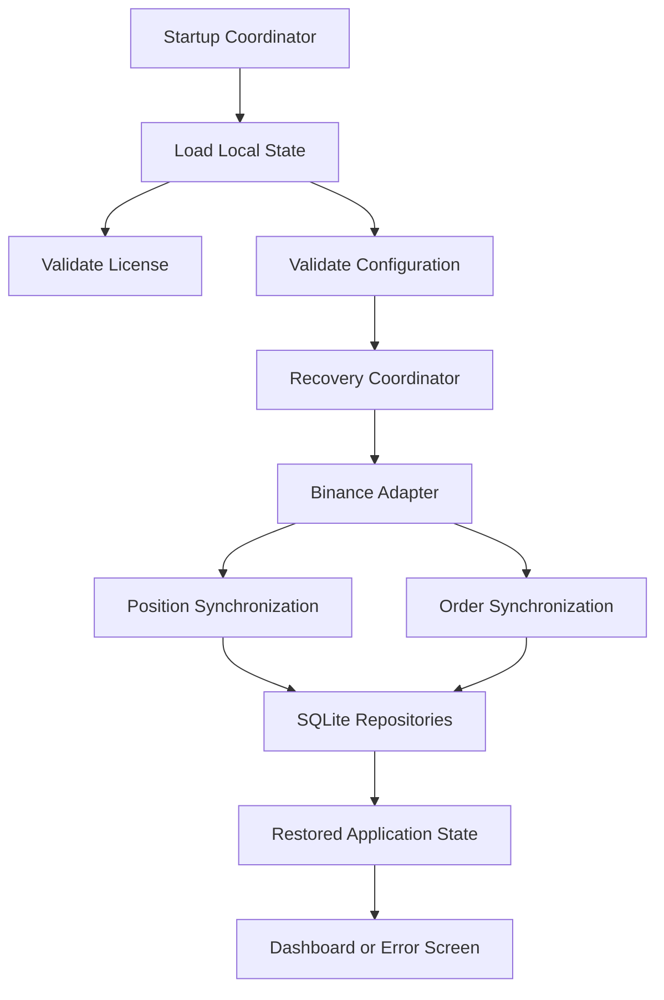
```mermaid
flowchart TD
    Startup["Startup Coordinator"] --> LocalState["Load Local State"]
    LocalState --> License["Validate License"]
    LocalState --> Config["Validate Configuration"]
    Config --> Recovery["Recovery Coordinator"]
    Recovery --> Exchange["Binance Adapter"]
    Exchange --> PositionSync["Position Synchronization"]
    Exchange --> OrderSync["Order Synchronization"]
    PositionSync --> Repos["SQLite Repositories"]
    OrderSync --> Repos
    Repos --> AppState["Restored Application State"]
    AppState --> UI["Dashboard or Error Screen"]
```

### State Update Rules

- UI state is derived from application state, not direct exchange responses.
- Exchange responses are interpreted by infrastructure and domain components before reaching the UI.
- Bot status updates must be persisted at meaningful lifecycle points.
- Order and position updates must be persisted before being treated as restored state.
- Rejected, failed, canceled, and unknown order states must be visible in trade history or recovery status.

### Runtime Worker Model

The application uses a PySide6-compatible background worker model:

- The PySide6 UI thread owns widgets, navigation, and rendering only.
- Each running bot instance is supervised by the Bot Instance Manager.
- Long-running bot monitoring runs in dedicated Qt-compatible workers.
- Exchange calls, market polling, synchronization, and order status checks run outside the UI thread.
- Worker state updates must return to the UI through Qt-safe signals or an equivalent application state dispatcher.
- Worker cancellation must be cooperative: a stop request prevents new strategy work, then allows the worker to finish required synchronization or enter a recoverable disconnected state.
- Worker crashes must be captured by the supervisor, logged with redaction, and reflected as `Error`, `Disconnected`, or `Sync Required` depending on severity.
- SQLite writes from workers must be routed through a Persistence Coordinator so write operations remain serialized and transaction boundaries are controlled.

### SQLite Consistency Boundaries

The following operations must be treated as atomic architecture-level persistence units. This list does not define schemas, tables, or columns.

- Save completed setup configuration.
- Save partial setup draft, if partial setup persistence is enabled.
- Replace account metadata and secure credential reference.
- Remove account metadata, delete credential reference, and invalidate affected bot configurations.
- Start bot state transition from `Stopped` to `Starting`.
- Complete bot start transition from `Starting` to `Running`.
- Stop bot state transition from `Running` or `Disconnected` to `Stopping`.
- Complete bot stop transition to `Stopped`.
- Create order intent before exchange submission.
- Save exchange order correlation after submission.
- Record order result and trade history update together.
- Update position or exposure state and related trade history together.
- Complete recovery reconciliation for orders, positions, and bot state.
- Save license activation or license validation state.

### Order Lifecycle And Idempotency Flow

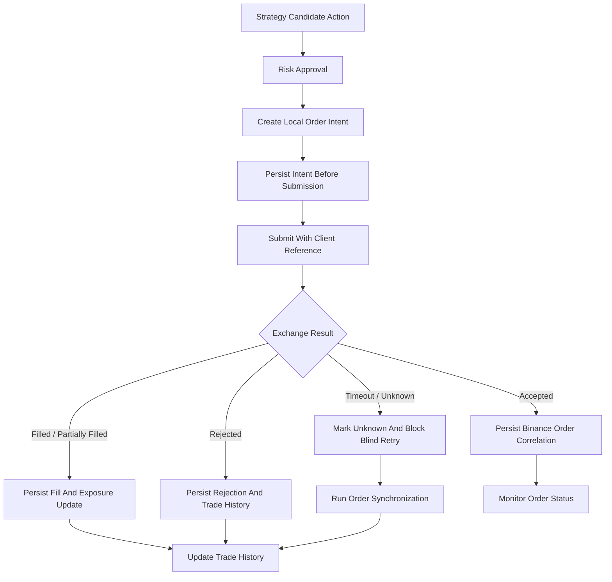
```mermaid
flowchart TD
    Signal["Strategy Candidate Action"] --> Risk["Risk Approval"]
    Risk --> Intent["Create Local Order Intent"]
    Intent --> PersistIntent["Persist Intent Before Submission"]
    PersistIntent --> Submit["Submit With Client Reference"]
    Submit --> Result{"Exchange Result"}
    Result -- "Accepted" --> Correlate["Persist Binance Order Correlation"]
    Result -- "Filled / Partially Filled" --> Fill["Persist Fill And Exposure Update"]
    Result -- "Rejected" --> Reject["Persist Rejection And Trade History"]
    Result -- "Timeout / Unknown" --> Unknown["Mark Unknown And Block Blind Retry"]
    Unknown --> Sync["Run Order Synchronization"]
    Correlate --> Monitor["Monitor Order Status"]
    Fill --> History["Update Trade History"]
    Reject --> History
    Sync --> History
```

Idempotency rules:

- A bot action may have only one active local order intent at a time.
- The local order intent must exist before exchange submission.
- The exchange client reference should include enough context to correlate the order to the bot instance and action without exposing sensitive data.
- If the app cannot determine whether Binance accepted an order, the order state becomes `Unknown`.
- Unknown orders block another order for the same bot action until synchronization completes.
- Retrying a rejected order is allowed only after a new strategy decision and risk check.
- Retrying after network timeout is not allowed until order synchronization confirms no accepted order exists.

## 7. Bot Lifecycle

### Bot Lifecycle States

The architecture must support these bot states:

- `Not Configured`
- `Stopped`
- `Starting`
- `Running`
- `Stopping`
- `Disconnected`
- `Sync Required`
- `Error`

### Bot Lifecycle Diagram

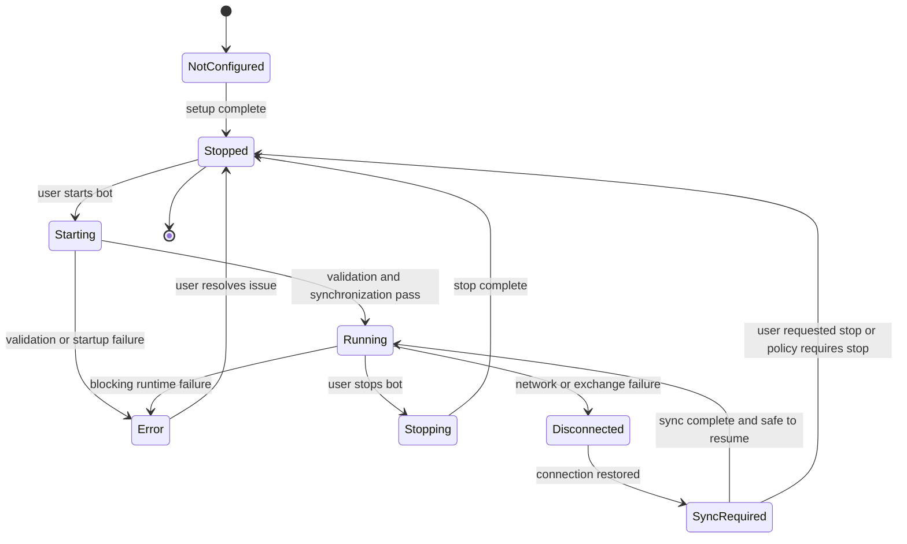
```mermaid
stateDiagram-v2
    [*] --> NotConfigured
    NotConfigured --> Stopped: setup complete
    Stopped --> Starting: user starts bot
    Starting --> Running: validation and synchronization pass
    Starting --> Error: validation or startup failure
    Running --> Stopping: user stops bot
    Running --> Disconnected: network or exchange failure
    Running --> Error: blocking runtime failure
    Disconnected --> SyncRequired: connection restored
    SyncRequired --> Running: sync complete and safe to resume
    SyncRequired --> Stopped: user requested stop or policy requires stop
    Stopping --> Stopped: stop complete
    Error --> Stopped: user resolves issue
    Stopped --> [*]
```

### Multiple Bot Instance Support

Version 1 architecture must support multiple bot instances even if the first UI release exposes a simplified single-bot experience.

Each bot instance should have:

- Unique local identity.
- Account context.
- Market mode.
- Trading pair.
- Capital allocation.
- Risk settings.
- Runtime status.
- Last known position state.
- Last known order state.
- Trade history association.
- Recovery state.
- Capital reservation state.
- Exchange capability snapshot or validation reference.

### Bot Instance Isolation Rules

- One bot instance must not share mutable runtime state with another instance.
- One bot instance must only trade against its configured account context and market mode.
- One account, market mode, and trading pair combination may have only one running bot instance.
- Multiple bots sharing one account must have non-overlapping capital allocations.
- Account-level exposure checks must pass before any bot sharing that account can start or place an order.
- Bot instance workers must have independent lifecycle state and cancellation handling.
- Account removal or credential replacement must stop or invalidate affected bot instances.
- Risk setting changes must apply only to the intended bot instance or explicitly selected shared configuration.
- Trade history must identify which bot instance produced each activity.
- Recovery must run per bot instance and then reconcile account-level exposure.

### Bot Resource Coordination Rules

The Bot Resource Coordinator is responsible for preventing multi-bot conflicts:

- Block duplicate running bots for the same account, market mode, and trading pair.
- Block startup if configured capital would exceed available account balance or margin after existing bot allocations.
- Block startup if account-level exposure limits would be exceeded.
- Coordinate Binance API rate-limit usage across all running bot instances.
- Invalidate affected bots when account credentials, permissions, or market capability rules change.
- Ensure bot start and stop requests are idempotent.

### Bot Start Preconditions

The Bot Control Service must confirm:

- License is valid.
- Account credentials are available and valid.
- Account permissions match selected market mode.
- Trading pair is supported.
- Capital allocation is valid.
- Risk settings are valid.
- Balance is sufficient.
- No unresolved synchronization conflict exists.
- Bot is not already running.
- No duplicate bot is running for the same account, market mode, and trading pair.
- Capital reservation can be made without violating account-level risk.
- Required exchange capability rules are available and valid.

### Bot Stop Rules

Stopping a bot must:

- Stop new strategy actions.
- Stop new order submissions.
- Cancel app-owned unfilled entry and DCA orders where supported.
- Preserve app-owned protective take-profit or reduce-only exit orders when canceling them would leave an open position without a protective exit.
- Preserve trade history.
- Synchronize open orders and position state when possible.
- Leave existing Spot holdings and Futures positions open.
- Persist `Stop Requested` when the app is disconnected and complete exchange-side reconciliation after reconnect.
- Show the user whether a position remains open.
- Show the user whether any app-owned exchange orders remain active after stop.

## 8. Account Lifecycle

### Account Lifecycle States

- `Missing`
- `Entered`
- `Validating`
- `Connected`
- `Invalid`
- `Permission Missing`
- `Disconnected`
- `Removed`

### Account Lifecycle Diagram

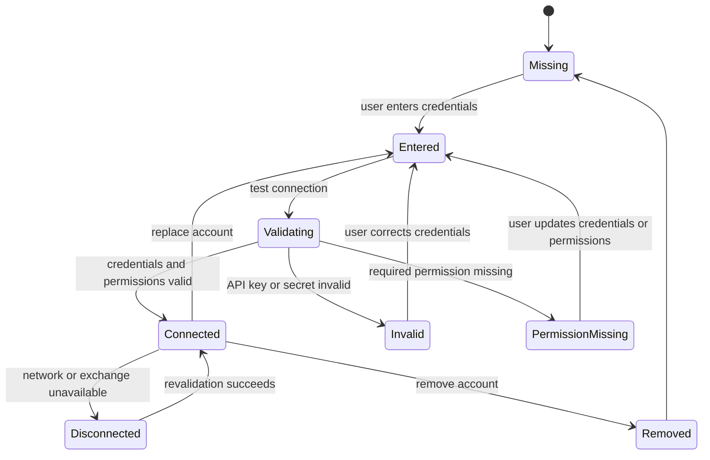
```mermaid
stateDiagram-v2
    [*] --> Missing
    Missing --> Entered: user enters credentials
    Entered --> Validating: test connection
    Validating --> Connected: credentials and permissions valid
    Validating --> Invalid: API key or secret invalid
    Validating --> PermissionMissing: required permission missing
    Connected --> Disconnected: network or exchange unavailable
    Disconnected --> Connected: revalidation succeeds
    Connected --> Entered: replace account
    Connected --> Removed: remove account
    Invalid --> Entered: user corrects credentials
    PermissionMissing --> Entered: user updates credentials or permissions
    Removed --> Missing
```

### Account Context Rules

The account architecture must distinguish:

- Main Account.
- Sub Account.
- Account identity returned by Binance validation.
- User-facing account label or alias if product later supports it.
- Spot permissions.
- Futures permissions.
- Credential validity.
- Withdrawal permission risk.
- Current connectivity state.

### Main Account Flow Support

Main Account credentials are validated through the Account Service and the Binance adapter. Once validated, the account context can be used by one or more bot instances according to product rules.

### Sub Account Flow Support

Sub Account credentials are treated as a distinct account context. The UI, bot configuration, dashboard, trade history, and logs must make the Sub Account context clear enough to prevent user confusion.

Sub Account validation must confirm that the credential context matches the selected Sub Account mode. If the returned account context is ambiguous, the app must block continuation and ask the user to verify credentials.

### Account Change Rules

- Account credentials cannot be changed while an affected bot is running.
- Removing an account invalidates bot startup for affected configurations.
- Replacing an account requires permission revalidation.
- Switching account type requires explicit confirmation and revalidation.
- Secret values must be masked in all UI and log surfaces.

## Market And Exchange Architecture

### Spot Architecture

Spot support must model:

- Spot account permission state.
- Spot available balance for the base and quote assets relevant to the selected pair.
- Spot trading pair status.
- Spot order precision and minimum order constraints.
- Spot holdings as inventory, not as Futures positions.
- Spot exposure summary for Dashboard and Position Monitoring.

### Futures Architecture

Futures support must model:

- Futures account permission state.
- Available margin and Futures balance.
- One-way position mode validation.
- Isolated margin validation.
- Current leverage read from Binance.
- Maximum allowed leverage according to product risk policy.
- Liquidation-risk visibility for user-facing monitoring.
- Reduce-only behavior for position-reducing or take-profit orders.
- Futures order rejection classification.
- Futures exposure summary for Dashboard and Position Monitoring.

### Exchange Capability Validation

Exchange capability validation must run:

- During trading pair selection.
- During bot startup.
- Before each order intent is submitted.
- During recovery if a previously supported pair becomes unavailable.

Capability validation must block bot startup or order submission when symbol rules are missing, stale, unsupported, suspended, delisted, or incompatible with the selected market mode.

### Exchange Capability Diagram

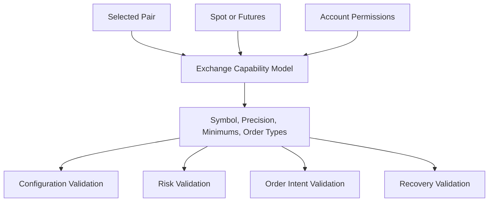
```mermaid
flowchart TD
    Pair["Selected Pair"] --> Capability["Exchange Capability Model"]
    Market["Spot or Futures"] --> Capability
    Account["Account Permissions"] --> Capability
    Capability --> Rules["Symbol, Precision, Minimums, Order Types"]
    Rules --> Config["Configuration Validation"]
    Rules --> Risk["Risk Validation"]
    Rules --> Order["Order Intent Validation"]
    Rules --> Recovery["Recovery Validation"]
```

## 9. Error Handling Strategy

### Error Classification

Errors should be classified into stable categories:

- License error.
- Invalid API key.
- Invalid secret key.
- Missing exchange permission.
- Network connection failure.
- Binance API failure.
- Trading pair not supported.
- Invalid configuration.
- Insufficient balance.
- Order rejected.
- Order status unknown.
- Position synchronization conflict.
- Persistence error.
- Unexpected application error.

### Error Handling Diagram

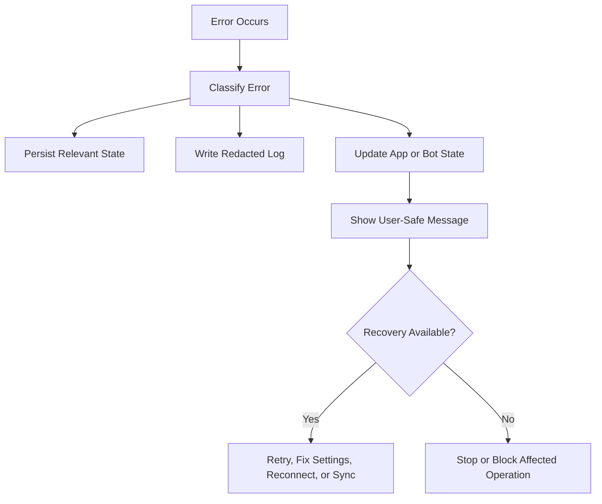
```mermaid
flowchart TD
    Error["Error Occurs"] --> Classify["Classify Error"]
    Classify --> Persist["Persist Relevant State"]
    Classify --> Log["Write Redacted Log"]
    Classify --> State["Update App or Bot State"]
    State --> UserMessage["Show User-Safe Message"]
    UserMessage --> Recovery{"Recovery Available?"}
    Recovery -- "Yes" --> Action["Retry, Fix Settings, Reconnect, or Sync"]
    Recovery -- "No" --> Stop["Stop or Block Affected Operation"]
```

### User-Facing Error Rules

- Use plain language before technical details.
- Never expose raw API secrets, license keys, or sensitive payloads.
- Provide a next action whenever possible.
- Preserve navigation when an error is non-blocking.
- Route account-related errors to Account Management.
- Route configuration errors to the relevant setup or settings screen.
- Route synchronization errors to Dashboard with `Sync Required`, `Disconnected`, or `Error` state.

### Bot Error Rules

- Network failures should move affected bots to `Disconnected` or `Sync Required`.
- Order rejections must be recorded in trade history.
- Unknown order state must trigger order synchronization.
- Position mismatch must trigger open position synchronization.
- Repeated unclassified trading errors should stop or pause the affected bot according to product risk policy.
- A bot must not continue trading from stale local state.

### Retry Strategy

Retries should be applied cautiously:

- Account validation: user-triggered retry.
- License validation: user-triggered or startup retry according to license policy.
- Market data: controlled automatic retry while bot is running.
- Order placement: no blind retry unless risk policy explicitly allows it.
- Synchronization: retry with user-visible status.
- Binance rate limits: wait and retry only when safe.

### Error Severity And State Transition Matrix

| Error Class | Bot State Impact | Retry Policy | Trading Blocked | Recovery Required | Trade History |
|---|---|---|---|---|---|
| License invalid | Stop new strategy actions after safe sync | Manual license action | Yes | Maybe | No, unless bot was active |
| License validation network failure | Warning or grace state | Automatic or manual according to license policy | New starts blocked after grace | No unless active bot affected | No |
| Invalid API key | Account invalid | Manual correction | Yes | No | No |
| Invalid secret key | Account invalid | Manual correction | Yes | No | No |
| Missing exchange permission | Account permission missing | Manual correction | Yes | No | No |
| Network connection failure | `Disconnected` or `Sync Required` | Controlled retry | New orders blocked | Yes if bot active | Only if order state affected |
| Binance API failure | `Disconnected`, `Sync Required`, or `Error` | Controlled retry | Depends on operation | Yes if order or position uncertain | Yes when order activity affected |
| Trading pair not supported | `Stopped` or setup blocked | Manual pair selection | Yes | No unless active bot affected | No |
| Invalid configuration | `Stopped` or setup blocked | Manual correction | Yes | No | No |
| Insufficient balance | `Stopped`, blocked order, or warning | Manual funding or capital change | For affected action | No | Optional blocked-action record |
| Order rejected | Running, warning, stopped, or error by severity | No blind retry | For affected action | Maybe | Yes |
| Order status unknown | `Sync Required` for affected bot | Synchronization only | Yes for affected action | Yes | Yes |
| Position synchronization conflict | `Sync Required` or `Error` | Synchronization and user review | Yes until resolved | Yes | Yes if correction affects history |
| Persistence error | `Error` | Manual retry or restart | Yes for affected action | Maybe | No until persisted |
| Unexpected application error | `Error` or `Sync Required` | Depends on recovery | Yes until classified | Maybe | If trading state affected |

## 10. Recovery Strategy

Recovery is responsible for restoring user trust after application restart, crash, exchange disconnection, unknown order status, or position mismatch.

### Recovery Responsibilities

- Detect whether the last shutdown was clean or unexpected.
- Load last known local state.
- Validate license before trading features are enabled.
- Validate configuration before restoring bot controls.
- Reconnect to Binance when available.
- Synchronize open positions.
- Synchronize recent orders.
- Reconcile trade history.
- Show the user a clear recovered state.

### Recovery Safety Rules

Recovery may mark a bot safe to resume only when:

- License state permits bot operation.
- Configuration remains valid.
- Account credentials and permissions are valid.
- Exchange capability rules for the configured pair are current.
- Open position or Spot holding state has been reconciled.
- Recent app-owned orders have been reconciled.
- Unknown order statuses have either been resolved or the bot remains blocked.
- Account-level and bot-level risk checks pass after reconciliation.

If any of these checks fail, the bot must remain `Stopped`, `Disconnected`, `Sync Required`, or `Error`; it must not return to `Running`.

### Recovery Decision Diagram

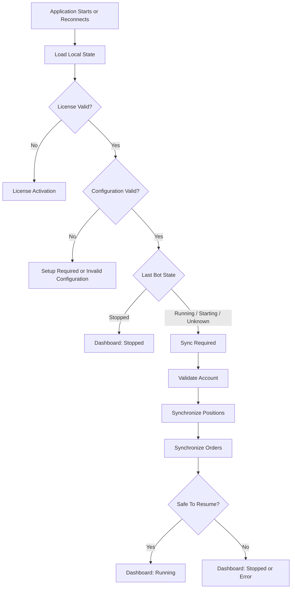
```mermaid
flowchart TD
    Start["Application Starts or Reconnects"] --> Load["Load Local State"]
    Load --> License{"License Valid?"}
    License -- "No" --> LicenseScreen["License Activation"]
    License -- "Yes" --> Config{"Configuration Valid?"}
    Config -- "No" --> Setup["Setup Required or Invalid Configuration"]
    Config -- "Yes" --> LastState{"Last Bot State"}
    LastState -- "Stopped" --> DashboardStopped["Dashboard: Stopped"]
    LastState -- "Running / Starting / Unknown" --> Sync["Sync Required"]
    Sync --> Account["Validate Account"]
    Account --> Positions["Synchronize Positions"]
    Positions --> Orders["Synchronize Orders"]
    Orders --> Decision{"Safe To Resume?"}
    Decision -- "Yes" --> DashboardRunning["Dashboard: Running"]
    Decision -- "No" --> DashboardStopped2["Dashboard: Stopped or Error"]
```

### Restart Recovery

On normal restart:

- Load license state.
- Load configuration.
- Restore bot status.
- If previous bot state was stopped, open Dashboard as stopped.
- If previous bot state was running, starting, disconnected, or unknown, enter `Sync Required` before allowing normal operation.
- Use a clean-shutdown marker to distinguish normal restart from crash recovery.
- Clear the clean-shutdown marker only after startup restoration has completed.

### Crash Recovery

After unexpected shutdown:

- Show recovery status.
- Load last known state.
- Validate license and configuration.
- Synchronize positions and orders before normal operation.
- If synchronization fails, keep the bot stopped, disconnected, or sync required according to severity.
- Require user-visible recovery status before any bot resumes.

### Exchange Reconnection

After Binance reconnection:

- Revalidate account permissions.
- Fetch current position state.
- Fetch recent order state.
- Compare with last known state.
- Update trade history and position monitoring.
- Resume only when safe.

### Open Position Synchronization

The Position Manager must compare current Binance position state against the last known local position state. If mismatch exists, the app must show a recoverable state and apply product-defined safe behavior.

Synchronization outcomes:

- Match: update local confirmation timestamp and continue.
- Binance has exposure but local state does not: show recovered exposure and keep bot stopped or sync required until user review or policy resolution.
- Local state has exposure but Binance does not: close local exposure state through recovery correction and record the correction.
- Exposure quantity differs: update to Binance reality, record correction, and require risk revalidation.
- Futures margin, leverage, or position mode differs: block resume until account state is supported.

### Order Synchronization

The Order Manager must reconcile recent Binance orders against local order records after restart, crash, rejection, or API failure. Unknown order state must remain visible until resolved or acknowledged according to product policy.

Order synchronization must:

- Fetch recent orders for the configured account, market mode, and trading pair.
- Match Binance orders to local order intents using client-side reference and Binance order identifiers.
- Resolve unknown states before allowing another order for the same bot action.
- Record fills, partial fills, cancellations, rejections, and missing-order corrections.
- Use a conservative reconciliation window long enough to cover the last active bot session and any unresolved local order intents.

## 11. Security Architecture

### Security Goals

- Protect Binance API credentials.
- Protect license information.
- Prevent accidental leakage through logs or UI.
- Request only required Binance permissions.
- Warn users not to enable withdrawal permissions.
- Keep account context explicit.

### Credential Handling

Sensitive credential values must:

- Be entered through masked UI fields.
- Be validated through the Account Service.
- Be stored through Secure Storage Provider, not plain SQLite.
- Be referenced by secure identifiers in other modules.
- Never be shown in full after entry.
- Never be included in logs, diagnostics, or screenshots generated by the app.
- Be removed from secure storage when the account is removed.
- Be rotated by replacing the account connection, not by editing secret values in place while a bot is running.

### Secure Storage Platform Policy

The Secure Storage Provider must abstract platform-specific secret storage:

- macOS: Keychain or equivalent OS-backed secure storage.
- Windows: Credential Manager or equivalent OS-backed secure storage.
- Linux: Secret Service-compatible storage or equivalent OS-backed secure storage.

Production builds must not silently fall back to plain local files or plain SQLite for Binance secrets. If no approved secure store is available, account connection must be blocked and the user must receive a clear message.

Encrypted fallback storage, if approved for a supported platform, must keep encryption keys outside SQLite and outside application logs.

### Permission Handling

The account validation flow must check:

- API key validity.
- Secret key validity.
- Spot trading permission when Spot is selected.
- Futures trading permission when Futures is selected.
- Withdrawal permission risk.
- Account context: Main Account or Sub Account.

### Secret Storage Diagram

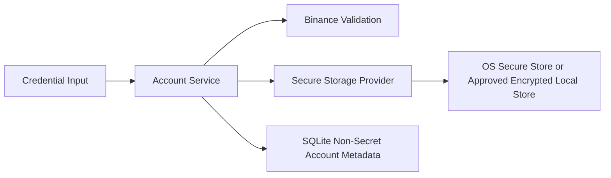
```mermaid
flowchart LR
    UI["Credential Input"] --> AccountService["Account Service"]
    AccountService --> Validator["Binance Validation"]
    AccountService --> SecureStore["Secure Storage Provider"]
    SecureStore --> OSStore["OS Secure Store or Approved Encrypted Local Store"]
    AccountService --> Metadata["SQLite Non-Secret Account Metadata"]
```

### License Security

License activation and validation must:

- Avoid exposing full license keys in logs.
- Store only the minimum local license state needed for startup decisions.
- Route invalid license states to License Activation.
- Block bot startup when license is invalid.

### License Enforcement Flow

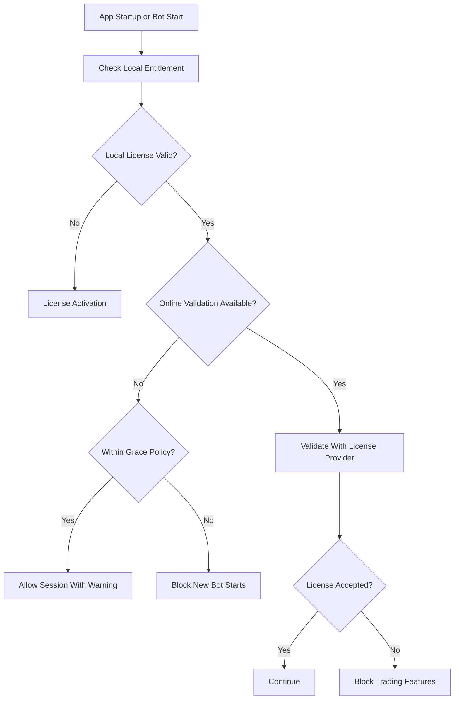
```mermaid
flowchart TD
    Start["App Startup or Bot Start"] --> Local["Check Local Entitlement"]
    Local --> ValidLocal{"Local License Valid?"}
    ValidLocal -- "No" --> Activation["License Activation"]
    ValidLocal -- "Yes" --> Online{"Online Validation Available?"}
    Online -- "Yes" --> Result["Validate With License Provider"]
    Online -- "No" --> Grace{"Within Grace Policy?"}
    Grace -- "Yes" --> Warn["Allow Session With Warning"]
    Grace -- "No" --> Block["Block New Bot Starts"]
    Result --> Status{"License Accepted?"}
    Status -- "Yes" --> Continue["Continue"]
    Status -- "No" --> Invalid["Block Trading Features"]
```

License enforcement rules:

- Bot startup requires a valid local entitlement and any required online validation result.
- Existing active bots may continue during temporary license-network failure only inside the approved grace policy.
- Explicit invalid or revoked license status blocks new bot starts and stops new strategy actions after safe synchronization.
- License status changes must be reflected in License Management and Dashboard state.

### Logging Redaction

Logs must redact:

- API keys.
- Secret keys.
- License keys.
- Authentication headers.
- Signed request payloads.
- Any exchange response field considered sensitive.

## 12. Configuration Management

### Configuration Categories

The application manages several configuration categories:

- Application preferences.
- License state.
- Account metadata and credential references.
- Bot instance configuration.
- Market mode and trading pair.
- Capital allocation.
- Risk settings.
- Last known bot state.
- Recovery state.

### Configuration Rules

- Configuration must be validated before saving.
- Bot startup must validate current saved configuration again.
- Risk settings can be edited only while the affected bot is stopped.
- Account changes can be made only while affected bots are stopped.
- Removing an account invalidates affected bot configurations.
- Pair availability must be checked against selected market mode.
- Futures mode must require explicit risk acknowledgment.
- Partial setup progress may be persisted as a draft, but draft configuration must never enable bot startup.
- The last known valid completed configuration should be preserved when a new edit fails validation.
- Configuration changes that affect account, market mode, pair, capital, or risk settings must invalidate affected pre-flight validation results.

### Configuration Persistence Diagram

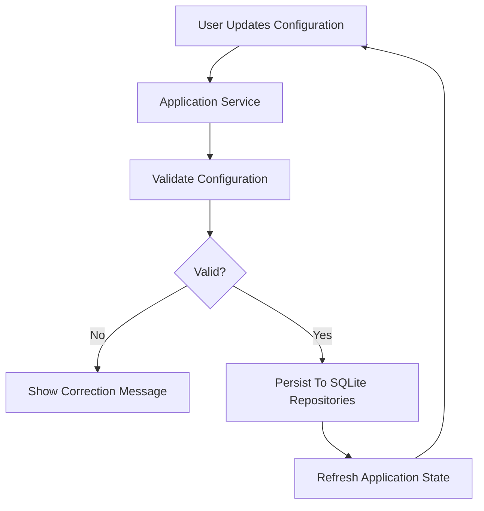
```mermaid
flowchart TD
    UI["User Updates Configuration"] --> App["Application Service"]
    App --> Validate["Validate Configuration"]
    Validate --> Decision{"Valid?"}
    Decision -- "No" --> Message["Show Correction Message"]
    Decision -- "Yes" --> Persist["Persist To SQLite Repositories"]
    Persist --> State["Refresh Application State"]
    State --> UI
```

### Configuration Versioning

The persistence format should include version awareness so future releases can migrate local configuration safely. Migration must preserve license state, account metadata, bot configurations, trade history, and recovery state whenever possible.

This document does not define migration scripts or schemas.

### Configuration Consistency Rules

- Saving a completed setup must be atomic.
- Saving account replacement must atomically update non-secret account metadata and secure credential references.
- Removing an account must atomically invalidate affected bot configurations and remove credential references.
- Saving risk settings must be blocked while affected bots are running.
- Bot configuration reads used for Start Bot must come from the latest validated saved state.
- A configuration migration failure must block startup and show a recovery-safe error rather than silently dropping user settings.

## 13. Logging Architecture

### Logging Goals

- Support troubleshooting without exposing secrets.
- Preserve bot lifecycle events.
- Preserve exchange and synchronization failures.
- Preserve order rejection and unknown order states.
- Help support non-technical users.
- Support diagnosis after crash or restart.

### Log Categories

- Application startup and shutdown.
- License activation and validation result.
- Account validation result.
- Setup completion.
- Bot lifecycle state changes.
- Start and stop requests.
- Strategy action decisions at safe summary level.
- Order submissions and results.
- Position synchronization results.
- Order synchronization results.
- Error classification and recovery actions.
- Persistence failures.

### Logging Diagram

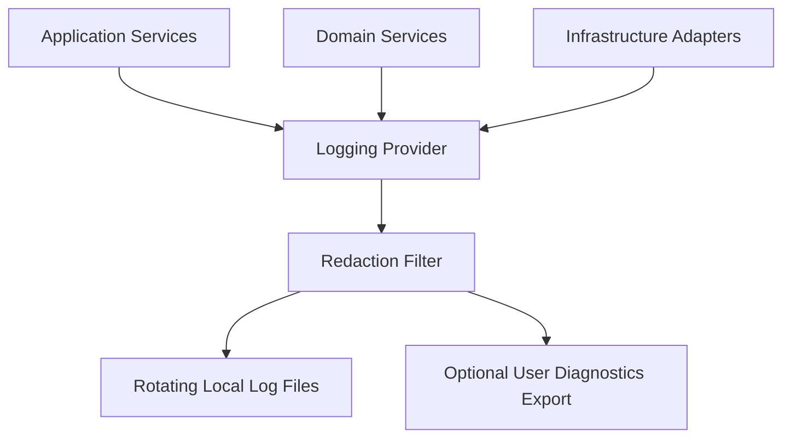
```mermaid
flowchart TD
    App["Application Services"] --> Logger["Logging Provider"]
    Domain["Domain Services"] --> Logger
    Infra["Infrastructure Adapters"] --> Logger
    Logger --> Redactor["Redaction Filter"]
    Redactor --> LocalLogs["Rotating Local Log Files"]
    Redactor --> Diagnostics["Optional User Diagnostics Export"]
```

### Logging Rules

- Logs must be local to the desktop application.
- Logs must use severity levels such as debug, info, warning, error, and critical.
- Logs must include correlation identifiers for bot instance, order action, and recovery session when available.
- Logs must not include full API keys, secret keys, license keys, or signed payloads.
- Logs should be rotated to avoid unbounded disk growth.
- User-facing error messages should include a support-safe reference identifier when useful.
- Default log retention should be time and size bounded.
- Diagnostic export, if provided, must be user-initiated.
- Diagnostic export must run the same redaction rules as local logging.
- Logs may include trade amounts and order statuses only when required for troubleshooting and never with secrets.
- Redaction should be tested as part of release readiness.

### Logging Retention And Export Policy

Version 1 should use a conservative local logging policy:

- Keep rotating local logs.
- Use a default retention window such as 30 days unless product or legal requirements change.
- Enforce a maximum total log size to avoid unbounded disk growth.
- Allow diagnostic export only through an explicit user action.
- Include bot instance, account context, order reference, and recovery session identifiers where useful.
- Exclude raw credentials, full license keys, signed payloads, and authentication headers from all logs and exports.

## 14. Future Scalability Considerations

The architecture should allow growth without changing the Version 1 architecture style.

### Multiple Bot Instances

The Bot Instance Manager should support multiple bot instances with isolated configuration, state, position tracking, order tracking, and trade history.

Future UI versions may expose multiple bot management more fully, but the runtime should avoid assuming only one bot exists.

### Additional Exchange Adapters

Although Version 1 supports only Binance, the Exchange Gateway boundary should keep Spot and Futures implementation details isolated. Future exchanges can be considered later without changing UI and domain boundaries.

This is a future possibility, not a Version 1 commitment.

### Additional Built-In Strategies

The strategy module should remain internally modular enough to support future built-in strategies. Version 1 must expose only one proprietary strategy and must not expose a strategy builder.

### Larger Trade History

Trade history queries should be designed so the UI can load data incrementally or filter by date, pair, bot instance, or status in future versions. This is an architectural consideration, not a database schema.

### More Advanced Risk Controls

Risk Management should remain a dedicated module so future account-level safety limits, presets, or additional checks can be added without changing UI screens or exchange adapters directly.

### Packaging And Platform Growth

Supported operating systems are not yet finalized. The architecture should keep OS-specific behavior behind infrastructure providers, especially secure storage, file paths, logging location, and auto-start or crash-detection behavior.

### Maintained Monolith

Future scalability should preserve the local layered desktop architecture unless product strategy changes significantly. Version 1 must not introduce microservices, distributed systems, event sourcing, or CQRS.

## Required Sequence Diagrams

## Start Bot Sequence

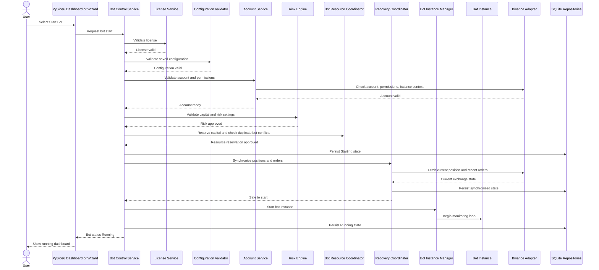
```mermaid
sequenceDiagram
    actor User
    participant UI as PySide6 Dashboard or Wizard
    participant BotControl as Bot Control Service
    participant License as License Service
    participant Config as Configuration Validator
    participant Account as Account Service
    participant Risk as Risk Engine
    participant Resources as Bot Resource Coordinator
    participant Recovery as Recovery Coordinator
    participant BotManager as Bot Instance Manager
    participant Bot as Bot Instance
    participant Exchange as Binance Adapter
    participant Store as SQLite Repositories

    User->>UI: Select Start Bot
    UI->>BotControl: Request bot start
    BotControl->>License: Validate license
    License-->>BotControl: License valid
    BotControl->>Config: Validate saved configuration
    Config-->>BotControl: Configuration valid
    BotControl->>Account: Validate account and permissions
    Account->>Exchange: Check account, permissions, balance context
    Exchange-->>Account: Account valid
    Account-->>BotControl: Account ready
    BotControl->>Risk: Validate capital and risk settings
    Risk-->>BotControl: Risk approved
    BotControl->>Resources: Reserve capital and check duplicate bot conflicts
    Resources-->>BotControl: Resource reservation approved
    BotControl->>Store: Persist Starting state
    BotControl->>Recovery: Synchronize positions and orders
    Recovery->>Exchange: Fetch current position and recent orders
    Exchange-->>Recovery: Current exchange state
    Recovery->>Store: Persist synchronized state
    Recovery-->>BotControl: Safe to start
    BotControl->>BotManager: Start bot instance
    BotManager->>Bot: Begin monitoring loop
    BotControl->>Store: Persist Running state
    BotControl-->>UI: Bot status Running
    UI-->>User: Show running dashboard
```

## Stop Bot Sequence

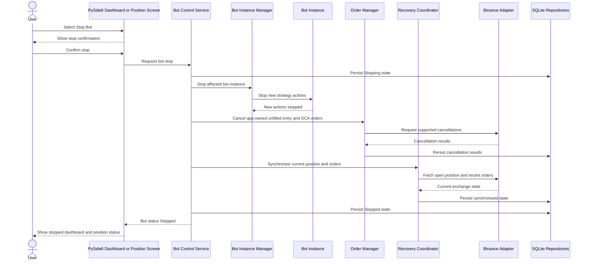
```mermaid
sequenceDiagram
    actor User
    participant UI as PySide6 Dashboard or Position Screen
    participant BotControl as Bot Control Service
    participant BotManager as Bot Instance Manager
    participant Bot as Bot Instance
    participant Orders as Order Manager
    participant Recovery as Recovery Coordinator
    participant Exchange as Binance Adapter
    participant Store as SQLite Repositories

    User->>UI: Select Stop Bot
    UI-->>User: Show stop confirmation
    User->>UI: Confirm stop
    UI->>BotControl: Request bot stop
    BotControl->>Store: Persist Stopping state
    BotControl->>BotManager: Stop affected bot instance
    BotManager->>Bot: Stop new strategy actions
    Bot-->>BotManager: New actions stopped
    BotControl->>Orders: Cancel app-owned unfilled entry and DCA orders
    Orders->>Exchange: Request supported cancellations
    Exchange-->>Orders: Cancellation results
    Orders->>Store: Persist cancellation results
    BotControl->>Recovery: Synchronize current position and orders
    Recovery->>Exchange: Fetch open position and recent orders
    Exchange-->>Recovery: Current exchange state
    Recovery->>Store: Persist synchronized state
    BotControl->>Store: Persist Stopped state
    BotControl-->>UI: Bot status Stopped
    UI-->>User: Show stopped dashboard and position status
```

## Trading Execution Sequence

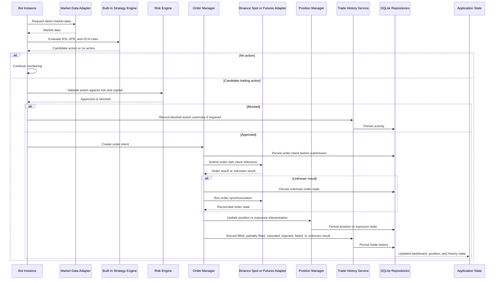
```mermaid
sequenceDiagram
    participant Bot as Bot Instance
    participant Market as Market Data Adapter
    participant Strategy as Built-In Strategy Engine
    participant Risk as Risk Engine
    participant Orders as Order Manager
    participant Exchange as Binance Spot or Futures Adapter
    participant Positions as Position Manager
    participant History as Trade History Service
    participant Store as SQLite Repositories
    participant UIState as Application State

    Bot->>Market: Request latest market data
    Market-->>Bot: Market data
    Bot->>Strategy: Evaluate RSI, ATR, and DCA rules
    Strategy-->>Bot: Candidate action or no action
    alt No action
        Bot->>Bot: Continue monitoring
    else Candidate trading action
        Bot->>Risk: Validate action against risk and capital
        Risk-->>Bot: Approved or blocked
        alt Blocked
            Bot->>History: Record blocked action summary if required
            History->>Store: Persist activity
        else Approved
            Bot->>Orders: Create order intent
            Orders->>Store: Persist order intent before submission
            Orders->>Exchange: Submit order with client reference
            Exchange-->>Orders: Order result or unknown result
            alt Unknown result
                Orders->>Store: Persist unknown order state
                Orders->>Exchange: Run order synchronization
                Exchange-->>Orders: Reconciled order state
            end
            Orders->>Positions: Update position or exposure interpretation
            Positions->>Store: Persist position or exposure state
            Orders->>History: Record filled, partially filled, canceled, rejected, failed, or unknown result
            History->>Store: Persist trade history
            Store-->>UIState: Updated dashboard, position, and history state
        end
    end
```

## Recovery Process Sequence

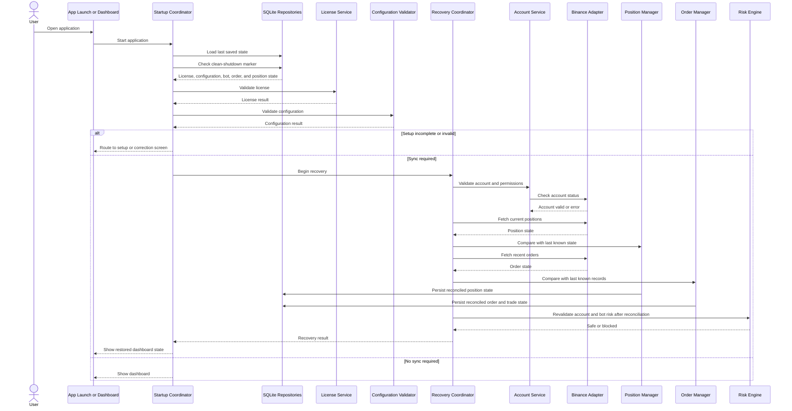
```mermaid
sequenceDiagram
    actor User
    participant UI as App Launch or Dashboard
    participant Startup as Startup Coordinator
    participant Store as SQLite Repositories
    participant License as License Service
    participant Config as Configuration Validator
    participant Recovery as Recovery Coordinator
    participant Account as Account Service
    participant Exchange as Binance Adapter
    participant Positions as Position Manager
    participant Orders as Order Manager
    participant Risk as Risk Engine

    User->>UI: Open application
    UI->>Startup: Start application
    Startup->>Store: Load last saved state
    Startup->>Store: Check clean-shutdown marker
    Store-->>Startup: License, configuration, bot, order, and position state
    Startup->>License: Validate license
    License-->>Startup: License result
    Startup->>Config: Validate configuration
    Config-->>Startup: Configuration result
    alt Setup incomplete or invalid
        Startup-->>UI: Route to setup or correction screen
    else Sync required
        Startup->>Recovery: Begin recovery
        Recovery->>Account: Validate account and permissions
        Account->>Exchange: Check account status
        Exchange-->>Account: Account valid or error
        Recovery->>Exchange: Fetch current positions
        Exchange-->>Recovery: Position state
        Recovery->>Positions: Compare with last known state
        Recovery->>Exchange: Fetch recent orders
        Exchange-->>Recovery: Order state
        Recovery->>Orders: Compare with last known records
        Positions->>Store: Persist reconciled position state
        Orders->>Store: Persist reconciled order and trade state
        Recovery->>Risk: Revalidate account and bot risk after reconciliation
        Risk-->>Recovery: Safe or blocked
        Recovery-->>Startup: Recovery result
        Startup-->>UI: Show restored dashboard state
    else No sync required
        Startup-->>UI: Show dashboard
    end
```
