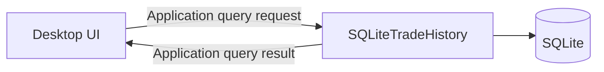

# Trade History Query and Pagination Implementation Plan

> **For agentic workers:** REQUIRED SUB-SKILL: Use superpowers:subagent-driven-development (recommended) or superpowers:executing-plans to implement this plan task-by-task. Steps use checkbox (`- [ ]`) syntax for tracking.

**Goal:** เพิ่ม application query สำหรับค้นหา Basket History แบบมีตัวกรอง การแบ่งหน้า จำนวนรายการทั้งหมด Net Realized PnL และ Trade Fills ตามลำดับ execution โดยรักษา Decimal และ UTC อย่างถูกต้อง

**Architecture:** `application` เป็นเจ้าของ immutable query request/result ส่วน `integrations/sqlite` เพิ่ม concrete read operations ด้วย parameterized SQL และ map กลับเป็น domain records เดิมโดยยังไม่สร้าง generic persistence interface ก่อน DEV-96 มี UI consumer จริง Query จำกัด Basket records ด้วย offset/limit แต่คำนวณ summary จาก Basket ที่ปิดแล้วและตรงกับตัวกรองทั้งหมดโดยไม่แปลง Decimal เป็น SQLite floating point

**Tech Stack:** Python 3.12, dataclasses, SQLite, pytest, mypy, Ruff

## Global Constraints

- UI ต้องใช้ query request/result จาก `application` และห้ามเขียน SQL หรืออ่าน table โดยตรง
- Basket เรียง `opened_at_utc DESC, basket_id DESC` เพื่อให้ผล deterministic
- Trade Fills เรียง `filled_at_utc ASC, fill_id ASC`
- ช่วงเวลาใช้ `opened_from_utc` แบบ inclusive และ `opened_before_utc` แบบ exclusive
- Decimal ต้อง round-trip และรวมค่าโดยไม่ผ่าน floating-point arithmetic
- Summary รวมเฉพาะ `net_realized_pnl` ของ Basket สถานะ `CLOSED` ที่ตรงกับตัวกรอง
- ใช้ parameterized SQL เท่านั้น และไม่เพิ่ม dependency ใหม่
- ใช้ Paper/fake data ระหว่างทดสอบ ห้ามเชื่อม Binance หรือส่ง Live order

---

### Task 1: Application Query Models

**Files:**
- Create: `src/tiewtrade/application/trade_history.py`
- Create: `tests/unit/application/test_trade_history_query.py`

**Interfaces:**
- Consumes: `BasketResult`, `BasketStatus`, `TradeFill`, `MarketType`, `TradeMode`
- Produces: `TradeHistoryFilter`, `PageRequest`, `BasketHistoryPage`

- [ ] **Step 1: Write failing validation tests**

```python
def test_trade_history_filter_requires_utc_bounds() -> None:
    with pytest.raises(ValueError, match="UTC"):
        TradeHistoryFilter(opened_from_utc=datetime(2026, 1, 1))


def test_page_request_requires_positive_values() -> None:
    with pytest.raises(ValueError, match="page_size"):
        PageRequest(page=1, page_size=0)
```

- [ ] **Step 2: Run tests and verify RED**

Run: `.venv/bin/python -m pytest tests/unit/application/test_trade_history_query.py -q`

Expected: FAIL because `tiewtrade.application.trade_history` does not exist.

- [ ] **Step 3: Implement immutable request/result types**

```python
@dataclass(frozen=True, slots=True)
class TradeHistoryFilter:
    symbol: str | None = None
    timeframe: str | None = None
    market_type: MarketType | None = None
    trade_mode: TradeMode | None = None
    status: BasketStatus | None = None
    opened_from_utc: datetime | None = None
    opened_before_utc: datetime | None = None


@dataclass(frozen=True, slots=True)
class PageRequest:
    page: int = 1
    page_size: int = 50

    @property
    def offset(self) -> int:
        return (self.page - 1) * self.page_size


@dataclass(frozen=True, slots=True)
class BasketHistoryPage:
    items: tuple[BasketResult, ...]
    page: int
    page_size: int
    total_items: int
    net_realized_pnl: Decimal


```

- [ ] **Step 4: Run focused tests and verify GREEN**

Run: `.venv/bin/python -m pytest tests/unit/application/test_trade_history_query.py -q`

Expected: PASS.

### Task 2: SQLite Filter, Ordering, Pagination and Summary

**Files:**
- Create: `tests/unit/integrations/sqlite/test_trade_history_query.py`
- Modify: `src/tiewtrade/integrations/sqlite/trade_history.py`

**Interfaces:**
- Consumes: `TradeHistoryFilter`, `PageRequest`, `BasketHistoryPage`
- Produces: `SQLiteTradeHistory.list_baskets(filters, page)` returning application-owned query results

- [ ] **Step 1: Write failing deterministic ordering and pagination test**

```python
def test_list_baskets_returns_latest_deterministic_page_and_total(
    history: SQLiteTradeHistory,
) -> None:
    seed_three_baskets(history)

    result = history.list_baskets(TradeHistoryFilter(), PageRequest(1, 2))

    assert [item.basket_id for item in result.items] == [LATEST_HIGH_ID, LATEST_LOW_ID]
    assert result.total_items == 3
```

- [ ] **Step 2: Run the test and verify RED**

Run: `.venv/bin/python -m pytest tests/unit/integrations/sqlite/test_trade_history_query.py -q`

Expected: FAIL because `SQLiteTradeHistory.list_baskets` does not exist.

- [ ] **Step 3: Implement one parameterized WHERE builder and bounded Basket query**

```python
clauses: list[str] = []
parameters: list[object] = []
if filters.symbol is not None:
    clauses.append("symbol = ?")
    parameters.append(filters.symbol)
# Repeat for timeframe, market_type, trade_mode, status and UTC bounds.

rows = connection.execute(
    f"SELECT * FROM basket_results {where_sql} "
    "ORDER BY opened_at_utc DESC, basket_id DESC LIMIT ? OFFSET ?",
    (*parameters, page.page_size, page.offset),
).fetchall()
```

- [ ] **Step 4: Add failing filter and exact summary tests**

Cover Symbol, Timeframe, Market Type, Trade Mode, Status, inclusive lower UTC bound, exclusive upper UTC bound, exact `Decimal` summary, empty result and page beyond the last item.

- [ ] **Step 5: Implement exact count and closed-Basket summary**

```python
total_items = connection.execute(
    f"SELECT COUNT(*) FROM basket_results {where_sql}",
    parameters,
).fetchone()[0]

summary_filters = filters if filters.status is not BasketStatus.OPEN else None
net_realized_pnl = _exact_decimal_sum(
    Decimal(row["net_realized_pnl"]) for row in summary_rows
)
```

The implementation must reuse the same non-status filters, always constrain summary rows to `status = 'closed'`, and accumulate Decimal coefficients/exponents without the global Decimal context rounding high-precision totals; an explicit `OPEN` filter therefore returns `0`.

- [ ] **Step 6: Run focused tests and verify GREEN**

Run: `.venv/bin/python -m pytest tests/unit/integrations/sqlite/test_trade_history_query.py tests/unit/integrations/sqlite/test_trade_history.py -q`

Expected: PASS.

### Task 3: Application Boundary Acceptance and Documentation

**Files:**
- Create: `tests/acceptance/test_trade_history_query_acceptance.py`
- Modify: `PROJECT_PLAN.md`
- Modify: `docs-site/content/system/trade-history.mdx` if that page exists; otherwise modify the existing Trade History system page found with `rg`.

**Interfaces:**
- Consumes: application query request/result และ `SQLiteTradeHistory`
- Produces: an end-to-end read flow that future UI composition can consume without exposing SQL

- [ ] **Step 1: Write failing acceptance test against the application query models**

```python
def test_sqlite_history_serves_application_query_after_restart(tmp_path: Path) -> None:
    # Persist open and closed Basket records, reopen SQLite and query through
    # application-owned request/result types.
    assert reopened.list_baskets(filters, page).items == expected
```

- [ ] **Step 2: Run the acceptance test and verify RED if any wiring is missing**

Run: `.venv/bin/python -m pytest tests/acceptance/test_trade_history_query_acceptance.py -q`

Expected: FAIL only for the missing application-boundary behavior.

- [ ] **Step 3: Complete minimal wiring and update project documentation**

Document the read flow as:



Record that DEV-94 supplies query/filter/pagination and that Desktop UI remains DEV-96.

- [ ] **Step 4: Run acceptance and all quality gates**

Run:

```bash
.venv/bin/python -m pytest -q
.venv/bin/python -m ruff check src tests
.venv/bin/python -m ruff format --check src tests
.venv/bin/python -m mypy src
npm --prefix docs-site test
npm --prefix docs-site run check:content
git diff --check
```

Expected: every command exits 0.

- [ ] **Step 5: Review and commit**

Use the repository code-review workflow, fix all blocking findings, rerun relevant gates, then commit only DEV-94 files:

```bash
git add docs/superpowers/plans/2026-07-26-trade-history-query-pagination.md \
  src/tiewtrade/application/trade_history.py \
  src/tiewtrade/integrations/sqlite/trade_history.py \
  tests/unit/application/test_trade_history_query.py \
  tests/unit/integrations/sqlite/test_trade_history_query.py \
  tests/acceptance/test_trade_history_query_acceptance.py \
  PROJECT_PLAN.md docs-site
git commit -m "feat: query paginated trade history"
```
