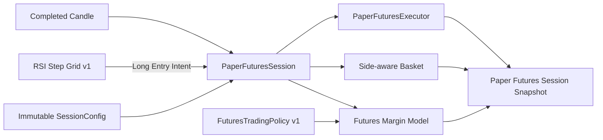

# Paper Futures Core and Execution Design

**Status:** Approved for implementation planning
**Date:** 2026-07-27

## Goal

ส่งมอบ headless Paper Futures vertical slice ที่ใช้ business rules ร่วมกับ Paper
Spot แต่จำลอง Futures execution, Cross Margin, leverage, Collateral Buffer และ
Liquidation ได้อย่าง deterministic โดยไม่เรียก Binance Private API และไม่ส่ง Live
order

งานนี้เป็น prerequisite ของ DEV-95 ซึ่งจะนำผล Paper Futures ไปบันทึกใน Trade
History ภายหลัง งานนี้ยังไม่รวม SQLite persistence, Desktop UI, startup Recovery
หรือ Live Futures execution

## Product Constraints

- ใช้ Binance Account เดียวต่อ installation และมี Active Bot Session ได้หนึ่งรายการ
- รองรับ BTCUSDT และ completed candles ตาม Timeframe ใน Session Configuration
- Paper และ Live ใช้ Strategy, Basket, Entry Pair, capital, risk และ PnL policies
  ร่วมกัน แต่ใช้ execution adapters แยกกัน
- RSI Step Grid Preset v1 ยังสร้างเฉพาะ Long Entry Intent
- Futures infrastructure ต้องมี side-aware contract สำหรับ Long และ Short เพื่อไม่
  ผูก execution model เข้ากับ Strategy ปัจจุบัน
- Paper Futures ใช้ One-way Mode, Cross Margin และ leverage จำนวนเต็ม 1x–5x
- Trading Capital และ Collateral Buffer ใช้อย่างละ 50% ของ Available Capital
- Paper Futures Phase แรกบันทึก Funding Fee เป็น `0.00`
- ไม่มี Stop Loss, Maximum Drawdown hard limit หรือ Max Daily Loss
- Liquidation เป็น terminal outcome ของ Paper Futures Session และต้อง fail closed

## Decisions

| Concern | Decision |
| --- | --- |
| Strategy direction | RSI Step Grid Preset v1 ยัง Long-only |
| Execution direction | Contract รองรับ Long และ Short |
| Position mode | One-way; ห้ามถือสองทิศทางพร้อมกัน |
| Margin mode | Cross Margin เท่านั้น |
| Leverage | จำนวนเต็ม 1x–5x และ immutable ตลอด Session |
| Capital split | Trading Capital 50%, Collateral Buffer 50% |
| Maintenance margin | Versioned System Policy v1 เท่ากับ 0.5% |
| Fee/slippage | ใช้ `fee_rate` และ `slippage_bps` จาก Session Configuration |
| Funding | `0.00` ใน Paper Futures v1 |
| Liquidation price source | Deterministic completed-candle OHLC ไม่ใช่ Binance Mark Price |
| Intrabar ambiguity | Liquidation ชนะ Take Profit เสมอ |
| Liquidation result | Basket `CLOSED` พร้อม `close_reason = LIQUIDATION` |
| Session after liquidation | terminal `LIQUIDATED`; ห้ามรับ Entry ใหม่ |
| Persistence | ส่งต่อให้ DEV-95; ไม่รวมในงานนี้ |

## Architecture



### Module Ownership

`trading` เป็นเจ้าของ business rules ที่ Paper และ Live Futures ต้องใช้ร่วมกัน:

- `PositionSide` (`LONG`, `SHORT`)
- `FuturesTradingPolicy`
- Futures capital allocation
- Cross Margin equity, maintenance margin และ liquidation calculations
- Side-aware Basket Take Profit และ realized PnL
- Basket close reason

`execution` เป็นเจ้าของ deterministic side effects ของ Paper Futures:

- Entry Fill ที่ candle open ถัดจาก signal
- Take Profit Fill
- Liquidation Fill
- fee, slippage, quantity และ price quantization
- deterministic Order/Fill identity

`application` เป็นเจ้าของลำดับ orchestration:

- completed-candle acceptance
- Indicator และ Strategy evaluation
- pending Entry Intent
- Entry Pair/Cooldown lifecycle
- Entry, Liquidation และ Take Profit ordering
- terminal Session state

`strategies/rsi_step_grid` ยังคงไม่รู้จัก Paper, Live, leverage, margin หรือ
Liquidation โดย Entry Intent ต้องระบุ `PositionSide` อย่างชัดเจน และ Preset v1 ส่ง
ค่า `LONG` เท่านั้น

ยังไม่สร้าง generic executor interface, registry หรือ factory เพราะ application มี
concrete Paper Spot และ Paper Futures sessions ที่แยก orchestration ชัดเจนอยู่แล้ว

## Configuration

`SessionConfig` เพิ่ม `futures_policy` และบังคับ market-specific policy แบบ mutually
exclusive:

- Spot Session ต้องมี `spot_policy` และห้ามมี `futures_policy`
- Futures Session ต้องมี `futures_policy` และห้ามมี `spot_policy`

`FuturesTradingPolicy` เป็น immutable Session policy ที่อ้างถึง system policy
version โดยประกอบด้วย:

- policy version
- `trading_capital_ratio = 0.5`
- `collateral_buffer_ratio = 0.5`
- `margin_mode = CROSS`
- `position_mode = ONE_WAY`
- leverage จำนวนเต็ม 1–5x
- `maintenance_margin_rate = 0.005`

System policy version เป็นเจ้าของ capital ratios, margin/position modes และ
Maintenance Margin Rate ส่วน leverage เป็นค่าที่ผู้ใช้เลือกก่อนเริ่ม Session แล้วถูก
ตรึงใน `FuturesTradingPolicy` instance Maintenance Margin Rate ไม่อยู่ใน Strategy
Preset และไม่เป็น form field โดย policy version, leverage และค่าจริงทั้งหมดที่ใช้ต้อง
ถูกบันทึกกับ Session เพื่อให้ replay และ Recovery ในอนาคตอธิบายผลเดิมได้

## Capital Allocation

สำหรับ Available Capital `A`, leverage `L` และ `max_entries = N`:

```text
trading_capital = A × 0.5
collateral_buffer = A × 0.5
initial_margin_per_entry = trading_capital ÷ N
target_notional_per_entry = initial_margin_per_entry × L
```

Collateral Buffer ไม่ใช้สร้าง Entry ใหม่ แต่เป็น Account Equity ที่ผู้ใช้ยอมเสี่ยง
ทั้งหมดเพื่อเลื่อน Liquidation

Acceptance scenario ส่งผ่าน configuration ไม่ hardcode ใน business logic:

| Configuration | Value |
| --- | ---: |
| Symbol | BTCUSDT |
| Timeframe | 5m |
| Available Capital | 200,000 USDT |
| Trading Capital | 100,000 USDT |
| Collateral Buffer | 100,000 USDT |
| Maximum Entries | 10 |
| Initial Margin per Entry | 10,000 USDT |
| Leverage | 3x |
| Target Notional per Entry | 30,000 USDT |

## Side-aware Basket

Basket มี `PositionSide` เดียวตั้งแต่ Entry แรกจนปิด และ One-way Mode ปฏิเสธ Entry
Intent ฝั่งตรงข้ามโดยไม่เปลี่ยน Basket, Entry Pair หรือ pending Strategy state

Take Profit:

```text
Long  = weighted_average_entry_price + ATR × multiplier
Short = weighted_average_entry_price - ATR × multiplier
```

Long Take Profit ปัดลงตาม tick size ส่วน Short Take Profit ปัดขึ้นตาม tick size เพื่อ
ใช้ conservative fill price

Gross realized PnL:

```text
Long  = (exit_price - entry_price) × quantity
Short = (entry_price - exit_price) × quantity
```

Closed Basket บันทึก:

- `close_reason = TAKE_PROFIT` หรือ `LIQUIDATION`
- Gross Realized PnL
- Entry, Exit และ Liquidation fees รวมเป็น Trading Fees
- Funding Fee `0.00`
- Net Realized PnL = Gross PnL − Trading Fees − Funding Fee

## Completed-candle Execution Order

สำหรับ completed candle ใหม่แต่ละแท่ง:

1. Fill pending Entry ที่ candle open ด้วย side-aware adverse slippage
2. หัก Entry fee จาก Account Equity ทันที
3. คำนวณ Cross Margin และประเมิน Liquidation ใน candle เดียวกันได้ แม้ Entry เพิ่ง
   Fill
4. ถ้า Liquidated ให้ปิด Basket และ Session ทันที โดยไม่ประเมิน Take Profit หรือ
   Strategy ต่อ
5. ถ้าไม่ Liquidated และ Take Profit มีผลตั้งแต่ก่อน candle ปัจจุบัน ให้ประเมิน Take
   Profit
6. อัปเดต Indicator และประเมิน Strategy เพื่อสร้าง pending Entry Intent สำหรับ
   candle ถัดไป

Take Profit ที่เพิ่งคำนวณใหม่หลัง Entry Fill เริ่มมีสิทธิ์ Fill ตั้งแต่ candle ถัดไป
เท่านั้น เพื่อไม่สมมติ intrabar order และไม่สร้าง look-ahead bias

หาก candle เดียวแตะทั้ง Liquidation และ Take Profit ให้ Liquidation ชนะเสมอ

## Deterministic Liquidation Model

ให้:

- `W` = Available Capital − accumulated Entry fees
- `E` = weighted average entry price
- `Q` = total position quantity ซึ่งเป็นค่าบวก
- `P` = current evaluation price
- `m` = Maintenance Margin Rate

Account Equity และ Maintenance Margin:

```text
Long unrealized PnL  = (P - E) × Q
Short unrealized PnL = (E - P) × Q

account_equity = W + unrealized_pnl
maintenance_margin = abs(P × Q) × m
```

Liquidation condition:

```text
account_equity <= maintenance_margin
```

Derived liquidation thresholds:

```text
Long  = (E × Q - W) ÷ (Q × (1 - m))
Short = (W + E × Q) ÷ (Q × (1 + m))
```

Long threshold ที่ไม่เป็นค่าบวกหมายถึง model ยังไม่มี Liquidation threshold ในช่วง
ราคาบวก

Completed-candle trigger:

- Long: `candle.low <= liquidation_price`
- Short: `candle.high >= liquidation_price`

Gap-aware conservative fill:

- Long ใช้ค่าต่ำกว่าระหว่าง candle open กับ liquidation price แล้วหัก slippage
- Short ใช้ค่าสูงกว่าระหว่าง candle open กับ liquidation price แล้วบวก slippage
- ปัดตาม Symbol Rules ในทิศทางที่เสียประโยชน์ต่อ Position
- Liquidation fee คำนวณด้วย Session `fee_rate` หลังได้ Fill price

Model นี้ตั้งใจให้ deterministic และ conservative ไม่อ้างว่าเท่ากับ Binance Mark
Price, Maintenance Margin Tier หรือ Liquidation engine จริง

## Terminal Session Behaviour

เมื่อ Liquidated:

- Basket ปิดด้วย `close_reason = LIQUIDATION`
- Session เปลี่ยนเป็น terminal `LIQUIDATED`
- pending Intent ถูกยกเลิก
- Entry Pair/Cooldown ไม่เริ่มรอบใหม่
- candles และ Entry Intents หลังจากนั้นถูกปฏิเสธโดยไม่เปลี่ยน state
- ผู้ใช้ต้องเริ่ม Session ใหม่ด้วยทุนใหม่

Stop Session, startup Recovery และ durable Session state เป็นงานลำดับถัดไปของ Paper
Trading Complete และไม่รวมใน scope นี้

## Error Handling and Invariants

- Reject Session ก่อนเริ่มเมื่อ leverage ไม่ใช่จำนวนเต็ม 1–5x
- Reject invalid market-policy combination ก่อนสร้าง runtime
- Reject non-positive/non-finite price, quantity, capital หรือ margin values
- Reject opposite-side Intent ใน One-way Mode โดยไม่เปลี่ยน state
- Reject Entry ที่ไม่ผ่าน Symbol Rules หรือ minimum notional โดยไม่สร้าง Fill
- Liquidation calculation ใช้ `Decimal` เท่านั้น
- Entry, TP และ Liquidation Fill IDs ต้อง deterministic จาก Session/Basket/Intent
- Unexpected execution invariant failure ต้อง fail closed และห้ามสร้าง Entry ต่อ
- ไม่มี API Key, Secret, Private Binance endpoint หรือ Live Order ใน implementation
  และ tests

## Verification

Unit tests ต้องครอบคลุม:

- Futures policy version, leverage boundaries และ mutually exclusive Session policy
- 50/50 Futures capital allocation และ per-entry target notional
- Side-aware Long/Short Basket average, Take Profit rounding และ PnL
- One-way opposite-side rejection โดยไม่มี state mutation
- Entry, TP และ Liquidation fills พร้อม fee, slippage และ Symbol Rules
- Long/Short liquidation thresholds
- Entry fee ทำให้ Account Equity ลดและ Liquidation ใกล้ขึ้น
- gap-aware Liquidation fill
- candle เดียวแตะ TP และ Liquidation แล้ว Liquidation ชนะ
- Liquidation ภายใน candle เดียวกับ Entry Fill
- terminal Session ปฏิเสธ candles และ Entries ใหม่
- Paper Spot regression ให้ผลเดิม

Acceptance test ใช้ BTCUSDT 5m, Available Capital 200,000 USDT, 10 Entries และ 3x
ผ่าน configuration และต้อง replay input เดิมแล้วได้ output เดิมทุกครั้ง

Quality gates:

```text
.venv/bin/python -m pytest -q
.venv/bin/python -m ruff check src tests
.venv/bin/python -m ruff format --check src tests
.venv/bin/python -m mypy src
npm --prefix docs-site test
npm --prefix docs-site run check:content
git diff --check
```

## Source of Truth Updates Required Before Production Code

Implementation plan ต้องแก้เอกสารต่อไปนี้ก่อน production code:

- `PRODUCT.md` — ระบุ Paper Futures One-way, deterministic liquidation, terminal
  Liquidated Session และ side-capable execution contract ที่ยังใช้ Long-only Strategy
- `CONTEXT.md` — เพิ่ม Position Side, Futures Trading Policy, Liquidation และ Basket
  Close Reason
- `ARCHITECTURE.md` — ระบุ ownership ของ Futures margin/liquidation model กับ concrete
  Paper Futures execution adapter
- `PROJECT_PLAN.md` — เพิ่ม Main Issue/Sub-issue sequence และระบุว่า DEV-95 ถูกปลด
  blocker หลัง core/executor พร้อม

## Out of Scope

- Short signal จาก RSI Step Grid Preset v1
- Hedge Mode หรือ Long/Short พร้อมกัน
- Binance Mark Price stream
- Binance Maintenance Margin Tier หรือ Leverage Bracket lookup
- Funding simulation ที่ไม่ใช่ `0.00`
- SQLite, Trade History และ restart persistence ซึ่งเป็น DEV-95
- Desktop UI
- Stop Session และ startup Recovery
- Live Futures adapter, Preflight, credentials หรือ Private API
- Multi-symbol, multi-account และ sub-account

## Success Criteria

งานนี้สำเร็จเมื่อ headless Paper Futures Session สามารถรับ completed candles, Fill
Long Entry จาก RSI Step Grid v1, คำนวณ 50/50 capital allocation, Basket Take Profit,
fees, slippage, Cross Margin และ deterministic Liquidation ได้ครบ พร้อม side-aware
contracts/tests สำหรับ Short โดยไม่มี Short signal ใน Preset v1 และไม่มีผลเปลี่ยนแปลง
ต่อ Paper Spot flow เดิม
