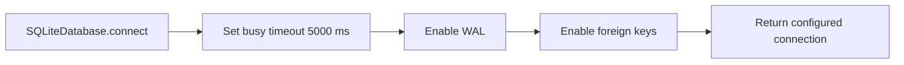

# SQLite WAL and Busy Timeout Design

## เป้าหมาย

ทำให้ทุก connection ที่สร้างผ่าน `SQLiteDatabase.connect()` ใช้ concurrency policy
เดียวกันอย่างชัดเจน เพื่อให้ Desktop UI อ่าน committed state ได้ขณะที่ runtime กำลัง
ถือ write transaction และให้ operation ที่ชน writer lock รอได้สูงสุด 5 วินาทีก่อน
รายงาน failure

งานนี้ไม่เปลี่ยน schema, repository contract, business rules หรือ UI behavior

## ข้อเท็จจริงของระบบปัจจุบัน

`sqlite3.connect()` ของ Python กำหนด lock timeout เริ่มต้นไว้ 5 วินาที ทำให้
`PRAGMA busy_timeout` ของ connection ปัจจุบันรายงาน `5000` อยู่แล้ว แม้ code จะยัง
ไม่ได้ประกาศค่านี้เอง อย่างไรก็ตาม default นี้เป็นรายละเอียดของ Python driver ไม่ใช่
contract ที่มองเห็นได้ของ TiewTrade

ส่วน `journal_mode` ของ database file ใหม่ยังเป็น `delete` ซึ่งไม่ตรงกับ flow ใน
Milestone 3 ที่ Desktop UI จะอ่านข้อมูลพร้อมกับ runtime เขียน Trade History

## แนวทางที่เลือก

`SQLiteDatabase.connect()` จะกำหนด policy ต่อไปนี้กับทุก connection:

1. `PRAGMA busy_timeout = 5000`
2. `PRAGMA journal_mode = WAL`
3. `PRAGMA foreign_keys = ON`

กำหนด `busy_timeout` ก่อนเปลี่ยนหรือตรวจ `journal_mode` เพื่อให้ operation ของ WAL
สามารถรอ database lock ตาม policy เดียวกันได้ การเรียก `journal_mode = WAL` ซ้ำบน
database ที่เป็น WAL อยู่แล้วปลอดภัย และครอบคลุมกรณีสร้าง database file ใหม่

## Ownership และขอบเขต

การตั้งค่าอยู่ใน `integrations/sqlite/database.py` เพราะเป็น policy ของ concrete
SQLite adapter ทุก repository และ coordinator ที่ใช้ `SQLiteDatabase` จึงได้ policy
เดียวกันโดยไม่ต้องทำซ้ำ

ไม่มีการเพิ่ม interface, factory หรือ configuration option เนื่องจากระบบมี SQLite
adapter เพียงแบบเดียวและค่า 5 วินาทีเป็น operational policy ของ Internal Alpha ไม่ใช่
ค่าที่ผู้ใช้แก้จาก Session form

## Data Flow

ทุก caller ยังคงเรียก `connect()` เหมือนเดิม ไม่มีการเปลี่ยน repository API เมื่อ
writer ถือ transaction อยู่ reader จะอ่าน committed snapshot ล่าสุดผ่าน WAL ส่วน
writer อีกตัวต้องรอ lock ภายในขอบเขต `busy_timeout`

## Testing

เพิ่ม `tests/unit/integrations/sqlite/test_database.py` ให้พิสูจน์ behavior ผ่าน public
`SQLiteDatabase.connect()`:

1. File-backed connection รายงาน `journal_mode = wal` และ `busy_timeout = 5000`
2. เมื่อ writer ถือ `BEGIN EXCLUSIVE` และมี uncommitted row, reader connection ยังอ่าน
   committed snapshot เดิมได้โดยไม่ต้องรอ writer ปล่อย transaction

ใช้ TDD โดยรัน tests ใหม่ให้ fail กับ implementation เดิมก่อน แล้วเพิ่ม production code
ขั้นต่ำให้ผ่าน จากนั้นรัน SQLite unit tests, full Python suite, Ruff, format, mypy,
documentation checks และ `git diff --check`

## สิ่งที่ไม่ทำ

- ไม่เพิ่ม retry loop ระดับ repository
- ไม่เปลี่ยน `BEGIN IMMEDIATE` หรือ transaction boundary เดิม
- ไม่ทำให้ SQLite รองรับหลาย writer พร้อมกัน
- ไม่เพิ่ม connection pool หรือ background thread
- ไม่เปลี่ยน database path หรือ migration version
