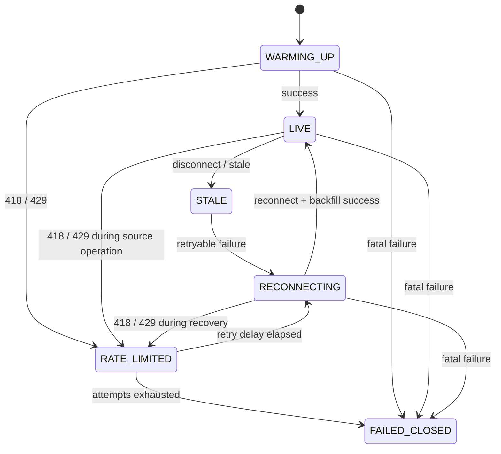
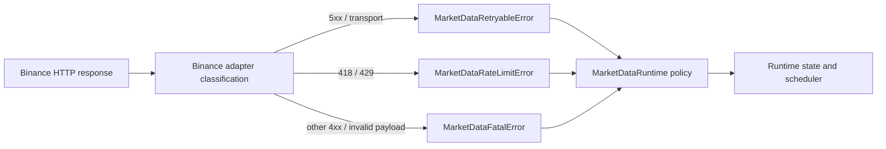

# DEV-119 Binance Market Data HTTP Errors Design

## สถานะ

- วันที่: 2026-07-28
- สถานะ: อนุมัติสำหรับจัดทำ implementation plan
- ขอบเขต: Public Binance Market Data Runtime เท่านั้น

## ปัญหา

`BinancePublicMarketData` แปลง HTTP failure, transport failure และ payload failure
ทั้งหมดเป็น `BinanceMarketDataPayloadError` ชนิดเดียว ทำให้ `MarketDataRuntime`
ไม่สามารถเลือกการตอบสนองที่ปลอดภัยตามสาเหตุได้ โดยเฉพาะ `429` และ `418`
ที่ต้องหยุดตาม `Retry-After` แทนการ retry ด้วยช่วง `1`, `2`, `4` วินาที

## เป้าหมาย

- แยก source failure ตามการกระทำที่ Runtime ต้องทำ
- รักษารายละเอียด HTTP ไว้ภายใน Binance adapter
- รองรับ `Retry-After` ทั้งจำนวนวินาทีและ HTTP-date
- แสดงสถานะ rate limit ให้ผู้ใช้และ diagnostics เห็นได้ชัดเจน
- ห้าม retry fatal request ที่ไม่มีทางสำเร็จจากการลองซ้ำ
- ทดสอบทั้งหมดด้วย fake transport โดยไม่เรียก Binance จริง

## สิ่งที่ไม่ทำ

- ไม่เปลี่ยนกลยุทธ์, Session policy หรือ execution adapter
- ไม่เพิ่ม Binance credentials หรือ Private API
- ไม่เปลี่ยน bounded reconnect policy ของการหลุดการเชื่อมต่อทั่วไป
- ไม่เพิ่ม generic provider framework หรือ factory ล่วงหน้า

## แนวทางที่พิจารณา

### 1. Domain errors และ `RATE_LIMITED` state — เลือกใช้

ให้ `market_data` เป็นเจ้าของ error contract ที่ Runtime ใช้ และให้ Binance adapter
แปล HTTP/transport/payload failure เป็น contract ดังกล่าว เพิ่ม
`MarketDataRuntimeState.RATE_LIMITED` เพื่อให้สถานะที่แสดงไม่ปะปนกับการ reconnect
ทั่วไป

ข้อดีคือ dependency direction ถูกต้อง, policy ทดสอบแยกได้ และผู้ใช้เห็นสาเหตุจริง
ข้อเสียคือมี state transition และ test matrix เพิ่มขึ้น

### 2. ใช้ `RECONNECTING` state เดิม

เพิ่มเฉพาะ reason และ delay แบบ rate limit วิธีนี้แก้ไฟล์น้อยกว่า แต่ state ที่ UI
เห็นยังสื่อว่ากำลัง reconnect ทั่วไปและซ่อน safety condition สำคัญ จึงไม่เลือกใช้

### 3. ให้ Runtime import Binance-specific errors

เขียนโค้ดน้อยที่สุด แต่ทำให้ business runtime ขึ้นกับ integration detail และขัดกับ
`ARCHITECTURE.md` จึงไม่เลือกใช้

## Error Contract

สร้าง focused module ใน `market_data` สำหรับ source failures สามประเภท:

| Error | ความหมาย | Runtime action |
| --- | --- | --- |
| `MarketDataRetryableError` | transport timeout, connection error หรือ service `5xx` | retry ด้วย bounded backoff เดิม |
| `MarketDataRateLimitError` | source ปฏิเสธเพราะ rate limit | เปลี่ยนเป็น `RATE_LIMITED` และรอตาม retry directive |
| `MarketDataFatalError` | request `4xx` อื่นหรือ payload ใช้งานไม่ได้ | `FAILED_CLOSED` ทันที |

`MarketDataRateLimitError` ส่ง retry directive ออกมาเป็นหนึ่งในสามรูปแบบ:

- ระยะเวลา เมื่อ header เป็นจำนวนวินาที
- UTC datetime เมื่อ header เป็น HTTP-date
- `None` เมื่อ header หายไปหรือ parse ไม่ได้

Runtime แปลง directive เป็นจำนวนวินาทีด้วย clock ของ `RuntimeScheduler` เพื่อให้
unit test deterministic และไม่บังคับให้ Binance adapter รู้จัก application clock

## Binance Adapter Classification

`BinancePublicMarketData` จำแนก failure ที่ boundary ดังนี้:

| Failure | Domain error |
| --- | --- |
| HTTP `418`, `429` | `MarketDataRateLimitError` |
| HTTP `500`–`599` | `MarketDataRetryableError` |
| HTTP `400`–`499` อื่น | `MarketDataFatalError` |
| `aiohttp.ClientError`, connection error, timeout | `MarketDataRetryableError` |
| JSON, kline หรือ payload ผิดรูปแบบ | `MarketDataFatalError` |

Adapter อ่าน header แบบ case-insensitive ผ่าน response headers แต่ไม่ส่ง status code
ดิบออกไปให้ `market_data` ใช้ตัดสิน policy

## Retry-After Policy

- จำนวนวินาที: รอตามค่าที่ไม่ติดลบ
- HTTP-date: รอจนถึง UTC datetime นั้นโดยเทียบกับ `RuntimeScheduler.now()`
- header หายไป, ว่าง หรือ parse ไม่ได้: ใช้ safe fallback `60` วินาที
- Runtime ห้ามนำ `(1.0, 2.0, 4.0)` มาใช้แทน rate-limit delay
- การรอต้องอยู่ใน run task เดิม จึงยังยกเลิกได้เมื่อผู้ใช้ Stop Session
- จำนวน retry ยังคง bounded เท่ากับ reconnect attempts ปัจจุบัน หลังใช้ครบแล้วให้
  `FAILED_CLOSED` ด้วย reason `RATE_LIMIT_EXHAUSTED`

## Runtime State Flow

เพิ่ม runtime reason อย่างน้อย:

- `RATE_LIMITED`
- `RATE_LIMIT_EXHAUSTED`
- `SOURCE_FATAL`

Fatal error ต้องไม่ผ่าน reconnect loop ส่วน retryable error ใช้ bounded backoff เดิม
ทั้งระหว่าง warm-up, stream recovery และ REST backfill

## Data Flow

## Testing Strategy

ทำ TDD ทีละ behavior โดยใช้ fake response/session/source เท่านั้น:

1. Binance adapter แปลง `429` พร้อม Retry-After แบบวินาที
2. Binance adapter แปลง `429` พร้อม Retry-After แบบ HTTP-date
3. `429` ไม่มีหรือมี header ผิดรูปแบบส่ง directive เป็น `None`
4. `418` เป็น rate limited
5. `400` เป็น fatal
6. `503` และ transport timeout เป็น retryable
7. Runtime ใช้ retry directive หรือ fallback `60` วินาทีและเข้า `RATE_LIMITED`
8. Runtime ไม่ใช้ `1/2/4` กับ rate limited
9. Runtime fail closed ทันทีเมื่อ fatal โดยไม่มี retry
10. Runtime ยังใช้ `1/2/4` กับ retryable failure และหยุดได้ระหว่าง sleep

หลัง focused tests ผ่าน ต้องรัน unit/integration/acceptance suite, Ruff, format check,
Mypy และ `git diff --check` ตาม `AGENTS.md`

## ความเข้ากันได้

- public API ของ Candle และ `MarketDataConfig` ไม่เปลี่ยน
- Session, strategy, execution และ persistence ไม่เปลี่ยน
- existing generic payload error ยังใช้กับ endpoint configuration และ kline parser
  ภายใน adapter ได้ แต่ error ที่ข้ามเข้าสู่ Runtime ต้องเป็น domain source error
- ไม่มี network call จริงใน test หรือ verification

## Acceptance Mapping

| Acceptance criterion | Design response |
| --- | --- |
| แยก error อย่างน้อยสามชนิด | Domain source error contract สามประเภท |
| รองรับ Retry-After สองรูปแบบ | duration หรือ UTC datetime directive |
| Fatal ไม่ retry | direct `FAILED_CLOSED` ด้วย `SOURCE_FATAL` |
| Rate limit ไม่ใช้ 1/2/4 | dedicated `RATE_LIMITED` policy และ fallback 60 วินาที |
| ครบ 429, 418, 400, 503 | fake transport test matrix |
| ไม่เรียก Binance จริง | injected fake session/source เท่านั้น |
