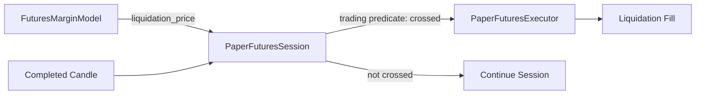
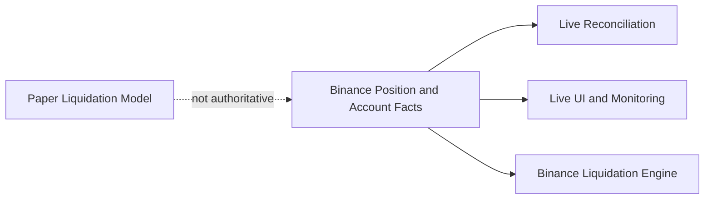

# DEV-123 Paper Futures Liquidation Definition Design

## เป้าหมาย

ทำให้ระบบมีเจ้าของและเกณฑ์ตัดสิน Liquidation ที่ชัดเจน โดยแยกขอบเขตดังนี้:

- Paper Futures ใช้โมเดล deterministic ภายในสำหรับ replay และ automated tests
- Live Futures ถือข้อมูล Position และ Liquidation จาก Binance เป็น authoritative account facts
  โดยไม่ใช้สูตร Paper เป็นคำตัดสินแทน Exchange

## การตัดสินใจ

เลือกทางเลือก A จาก DEV-123 สำหรับ Paper Futures:

- LONG ถูก Liquidation เมื่อ `candle.low <= liquidation_price`
- SHORT ถูก Liquidation เมื่อ `candle.high >= liquidation_price`
- หากราคาแตะระดับ Liquidation ระหว่าง completed Candle แล้วฟื้นกลับก่อนปิด Candle
  ให้ถือว่าเกิด Liquidation แล้ว
- `trading` เป็นเจ้าของ price-crossing rule และคำนวณ `liquidation_price`
- `application` เป็นผู้เรียงลำดับการตรวจ rule ก่อนเรียก execution adapter
- `execution` สร้าง gap-aware conservative fill หลังได้รับคำสั่งว่า Liquidation เกิดแล้ว
- `FuturesMarginSnapshot` เก็บเฉพาะ `account_equity` และ `liquidation_price` ซึ่งมี
  production consumer จริง
- ลบทั้ง `is_liquidated` และ `maintenance_margin` จาก snapshot เพราะไม่มี production
  consumer และไม่ควรขยาย public contract ล่วงหน้า

Live Futures ไม่ใช้ price crossing จาก completed Candle หรือสูตร Paper เป็น authoritative
verdict ระบบ Live ต้องอ่าน `liquidationPrice`, `markPrice` และ maintenance-margin facts จาก
Binance position/account APIs พร้อม account user-data stream แล้วใช้เพื่อแสดงผล เฝ้าระวัง และ
reconciliation เท่านั้น ส่วนการ Liquidation จริงเป็นการตัดสินและดำเนินการโดย Binance

## Module ownership

### `trading`

`FuturesMarginModel` เป็นเจ้าของ:

- สูตร Paper `liquidation_price`
- Paper `account_equity`
- side-aware predicate ว่าช่วงราคา Candle แตะ threshold หรือไม่

ไม่เพิ่ม generic interface, base class หรือ factory เพราะยังไม่มี consumer ที่สอง

### `application`

`PaperFuturesSession` รับ completed Candle และใช้ predicate จาก `trading` หากแตะ threshold
จึงเรียก `PaperFuturesExecutor.fill_liquidation()` ก่อนตรวจ Basket Take Profit

### `execution`

`PaperFuturesExecutor` ไม่ตัดสิน business rule ว่า Liquidation เกิดหรือไม่ มีหน้าที่สร้าง
Liquidation fill แบบ conservative โดยคง gap-aware price, fee, slippage, idempotency และ
symbol validation เดิม

## Data flow

## Source-of-truth changes

แก้ `PRODUCT.md` ก่อน `CONTEXT.md` ตาม Change Control:

- ระบุ Paper price-crossing rule และ intrabar recovery behavior
- ระบุว่า Live Futures ใช้ Binance liquidation-related account facts เป็น authoritative
- ระบุชัดว่า local Paper model ไม่ใช่ authoritative source สำหรับ Live

แก้เอกสาร Paper Futures เดิมที่เรียก equity inequality ว่า Liquidation condition ให้เป็นเพียง
สมการที่ใช้ derive threshold ไม่ใช่ runtime verdict

## Error handling และ safety

- validation ของราคา, quantity, capital, fees และ `current_price` คงเดิม
- predicate ต้องรองรับ boundary แบบ inclusive (`<=`/`>=`) และปฏิเสธ threshold ที่ไม่ถูกต้อง
- terminal state `LIQUIDATED`, `close_reason = LIQUIDATION` และการห้าม Entry ใหม่คงเดิม
- ไม่มี Live order, Binance private API, credentials หรือ network test ใน DEV-123

## Test strategy

ใช้ TDD โดยเพิ่ม failing tests ก่อน production code สำหรับ:

1. snapshot ไม่มี `maintenance_margin` และ `is_liquidated`
2. LONG เท่ากับ threshold พอดีต้องถูก Liquidation
3. SHORT เท่ากับ threshold พอดีต้องถูก Liquidation
4. executor สร้าง fill เมื่อ application เรียก โดยไม่ตัดสิน price crossing เอง
5. session ไม่เรียก executor เมื่อ trading predicate ไม่ผ่าน

จากนั้นรัน focused tests, full repository gates และตรวจว่าไม่มี production reference ของ field
ที่ลบออก

## สิ่งที่ไม่ทำ

- ไม่เพิ่ม equity-based guard ชั้นที่สอง
- ไม่เปลี่ยนสูตร `liquidation_price`, account equity, fill price, fee หรือ slippage
- ไม่เชื่อม Binance หรือ implement Live Futures ใน Issue นี้
- ไม่จำลอง Binance maintenance tiers หรือ Mark Price ใน Paper v1
- ไม่สร้าง abstraction สำหรับ Paper/Live liquidation ร่วมกัน เพราะ authoritative source ต่างกัน
