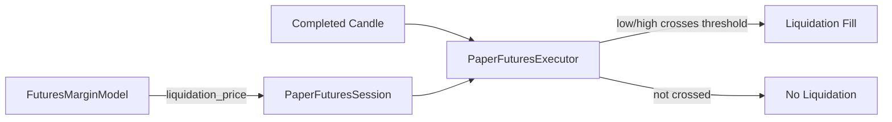

# DEV-123 Paper Futures Liquidation Definition Design

## เป้าหมาย

ทำให้ Paper Futures Policy v1 มีเกณฑ์ตัดสิน Liquidation เพียงแบบเดียว โดยคง
พฤติกรรมที่ระบบใช้งานจริงอยู่แล้ว: Position ถูก Liquidation เมื่อช่วงราคาของ completed
Candle แตะ `liquidation_price`

## การตัดสินใจ

เลือกทางเลือก A จาก DEV-123:

- LONG ถูก Liquidation เมื่อ `candle.low <= liquidation_price`
- SHORT ถูก Liquidation เมื่อ `candle.high >= liquidation_price`
- หากราคาแตะระดับ Liquidation ระหว่าง Candle แล้วฟื้นกลับก่อนปิด Candle ให้ถือว่าเกิด
  Liquidation แล้ว
- `account_equity` และ `maintenance_margin` เป็นข้อมูลคำนวณเพื่อแสดงสถานะและตรวจสอบ
  ย้อนหลัง แต่ไม่ใช่เกณฑ์ตัดสิน Liquidation
- ลบ `FuturesMarginSnapshot.is_liquidated` เพราะเป็นผลคำนวณซ้ำที่ไม่มี production
  consumer และอาจให้คำตอบต่างจากกฎ price-crossing

การตัดสินใจนี้ไม่เปลี่ยน execution behavior ปัจจุบันและไม่เปลี่ยน Strategy Preset
version แต่ทำให้ public contract กับเอกสารสะท้อน behavior จริงเพียงแบบเดียว

## ขอบเขตการแก้ไข

### Domain policy

ปรับหัวข้อ Liquidation ใน `CONTEXT.md` ให้ระบุ price-crossing rule และบทบาทของ
`account_equity`/`maintenance_margin` อย่างชัดเจน

### Margin snapshot

`FuturesMarginSnapshot` เหลือข้อมูล:

- `account_equity`
- `maintenance_margin`
- `liquidation_price`

`FuturesMarginModel.snapshot()` ยังคำนวณทั้งสามค่าเหมือนเดิม แต่ไม่คำนวณ boolean
Liquidation verdict

### Execution

ไม่เปลี่ยน `PaperFuturesExecutor.fill_liquidation()` เพราะมี price-crossing และ
gap-aware conservative fill ที่ใช้งานจริงและมี tests อยู่แล้ว

## Data flow

Margin model คำนวณ threshold ส่วน execution adapter ใช้ช่วงราคาของ Candle ตัดสินผล
จึงไม่มี equity-based verdict ซ้ำอีกชุดหนึ่ง

## Error handling และ safety

- validation ของราคา, quantity, capital, fees และ `current_price` คงเดิม
- validation ของ `liquidation_price` ใน executor คงเดิม
- terminal state `LIQUIDATED`, `close_reason = LIQUIDATION` และการห้าม Entry ใหม่คงเดิม
- ไม่มี Live order, Binance private API หรือ credentials ในขอบเขตนี้

## Test strategy

ใช้ TDD โดยเพิ่ม regression test ที่ยืนยันว่า `FuturesMarginSnapshot` ไม่มี
`is_liquidated` ก่อนแก้ production code แล้วจึง:

1. ลบ field และ calculation ออกจาก `futures_margin.py`
2. ปรับ tests ที่อ้าง boolean เดิมให้ตรวจเฉพาะ equity และ maintenance margin
3. รัน executor/session Liquidation tests เพื่อยืนยันว่า price-crossing behavior ไม่เปลี่ยน
4. รัน full repository quality gates

## สิ่งที่ไม่ทำ

- ไม่เพิ่ม equity-based guard ชั้นที่สอง
- ไม่เปลี่ยนสูตร `liquidation_price`, equity หรือ maintenance margin
- ไม่เปลี่ยน fill price, slippage, fee หรือ Liquidation priority
- ไม่ refactor Paper Futures orchestration นอกขอบเขต
- ไม่แก้ Live Futures ซึ่งยังไม่ผ่าน delivery gate
