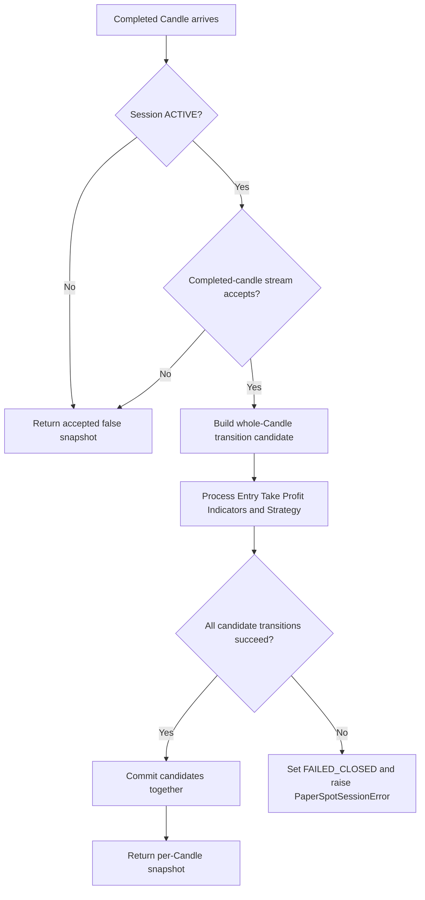

# Paper Spot Hardening Design

## Goal

ยกระดับ `PaperSpotSession` ให้มี atomic state transition, fail-closed behavior,
Session identity guard, per-candle snapshot contract และ capital validation เทียบเท่า
ส่วนที่เกี่ยวข้องของ Paper Futures โดยไม่รวม Spot/Futures orchestration เข้าด้วยกัน
และไม่เปลี่ยนผลลัพธ์ deterministic replay เดิม

## Scope

งานนี้ครอบคลุมเฉพาะ:

- atomic Entry Fill transition ภายใน `PaperSpotSession`
- Spot-specific Session state, failure reason, error และ identity
- identity guard ระหว่าง Paper Spot Session กับ SQLite Trade History
- `take_profit_fill` ที่มีอายุเฉพาะ snapshot ของ Candle ที่ปิด Basket
- finite-positive validation ของ `SpotCapitalPlan`
- regression และ deterministic replay tests

งานนี้ไม่รวมการรวม Spot/Futures เป็น orchestrator เดียว, การเปลี่ยน execution adapter,
การเพิ่ม Live behavior, การแก้ persistence coordinator contract หรือการเปลี่ยน Strategy
และ business policy

## Considered Approaches

### 1. Candidate-copy parity with Paper Futures — selected

สร้าง whole-Candle transition candidate ที่รวม Basket, Entry Pair lifecycle, Strategy,
Indicator, pending intent และ counters แล้ว commit state ทั้งชุดเมื่อทุก operation สำเร็จ
แนวทางนี้ขยาย candidate pattern ของ `PaperFuturesSession` ให้ปิด durable audit gap และ
มีต้นทุนจำกัดเพราะหนึ่ง Basket มี Entries สูงสุด 20 รายการ

### 2. Validate before mutating

ตรวจ `can_enter` และ invariant ทั้งหมดก่อนแก้ Basket วิธีนี้ใช้ memory น้อยกว่า แต่ไม่
รับประกัน atomicity เมื่อ callback เช่น `record_fill()` หรือ `on_entry_filled()` ล้มหลัง
object ก่อนหน้าถูกแก้แล้ว จึงไม่ปิด failure mode ตาม Acceptance Criteria

### 3. Shared generic Spot/Futures orchestrator

ย้าย flow ทั้งสองตลาดไปอยู่ใน abstraction เดียว วิธีนี้ลดโค้ดบางส่วน แต่ต้องเพิ่ม
conditional สำหรับ liquidation, margin, wallet balance, position side และ terminal
state ของ Futures ซึ่งขัดกับขอบเขต capability ที่ต่างกันและสร้าง abstraction ก่อนเวลา

## Architecture

คง `PaperSpotSession` และ `PaperFuturesSession` เป็น application orchestrator แยกกัน
แต่ใช้ pattern เดียวกันสำหรับ transaction-like state transition และ fail-closed safety
ส่วน `trading` ยังคงเป็นเจ้าของ Basket, capital และ Entry Pair policy และ
`integrations/sqlite` ยังคงเป็นเจ้าของ persistence-specific guard

ไม่มี base class, factory หรือ generic session interface ใหม่ในงานนี้

## Session Identity

เพิ่ม immutable `PaperSpotSessionIdentity` ที่ประกอบด้วย:

- `session_id: UUID`
- `symbol: str`
- `timeframe: str`
- `preset_version: str`

`PaperSpotSession.identity` คืน identity ที่ snapshot จาก immutable configuration ตอน
สร้าง Session ส่วน `PaperSpotHistoryContext.session_identity` และ
`PaperSpotSQLiteHistory.session_identity` คืน type เดียวกัน

`PersistentPaperSpotSQLiteSession` ต้องเปรียบเทียบ identity ทั้งสองใน constructor และ
raise `ValueError("Paper Spot Session and Trade History identity differ")` ก่อนเก็บ
dependency หากค่าใดไม่ตรงกัน

## Whole-Candle Atomic Transition

หลัง completed-candle stream ยอมรับ Candle แล้ว Session ต้องสร้าง Spot-specific
transition candidate ที่ถือ state ต่อไปนี้:

- Basket
- Entry Pair lifecycle
- Strategy
- Indicator state
- pending intent
- closed Basket count

Session ต้องประมวลผล Entry Fill, Take Profit close, Indicator update และ Strategy
evaluation บน transition candidate เท่านั้น แล้ว assign state ทั้งชุดกลับเข้า Session จริง
เพียงครั้งเดียวเมื่อทุก fallible step สำเร็จ

ภายใน candidate เมื่อมี pending intent และ executor ให้ Entry Fill:

1. สร้าง Basket ใหม่หรือใช้ Basket candidate ที่คัดลอกมาจาก state เดิม
2. apply Entry ไปยัง candidate Basket
3. apply `record_fill()` ไปยัง candidate lifecycle
4. apply `on_entry_filled()` ไปยัง candidate Strategy
5. ล้าง candidate pending intent
6. ดำเนิน Take Profit, Indicator และ Strategy steps ที่เหลือบน candidate เดิม
7. commit transition candidate ทั้งชุดหลังทุกขั้นสำเร็จ

หากขั้นใดล้ม original Basket, lifecycle และ Strategy ต้องไม่รับ partial mutation
รวมทั้ง Indicator, pending intent และ counters ต้องไม่รับ transition ของ Candle นั้น
exception จะถูกส่งให้ fail-closed boundary จัดการ โดย completed-candle stream ที่รับ
Candle ไปแล้วไม่ต้อง rollback เพราะ Session กลายเป็น terminal และไม่ resume ต่อ

กรณี executor ปฏิเสธ Entry เพราะ minimum notional ยังคงเรียก
`on_entry_rejected()`, ล้าง pending intent และเปิดทางให้ Strategy สร้าง intent ใหม่ตาม
behavior เดิม

## Fail-Closed State

เพิ่ม Spot-specific contracts:

- `PaperSpotSessionState.ACTIVE`
- `PaperSpotSessionState.FAILED_CLOSED`
- `PaperSpotFailureReason.EXECUTION_ERROR`
- `PaperSpotSessionError`

`process_completed_candle()` จะทำงานเฉพาะเมื่อ state เป็น `ACTIVE` เมื่อ exception ที่
ไม่ใช่ `PaperSpotSessionError` หลุดจาก execution/orchestration หลัง Candle ผ่าน
completed-candle acceptance แล้ว Session ต้อง:

1. เปลี่ยน state เป็น `FAILED_CLOSED`
2. ตั้ง failure reason เป็น `EXECUTION_ERROR`
3. ล้าง pending intent
4. reset Strategy object เพื่อไม่เก็บ armed signal ที่อาจอยู่ใน partial transition
5. raise `PaperSpotSessionError("Paper Spot execution failed")` โดยเก็บ original
   exception เป็น cause

Candle ถัดไปหลัง fail-closed ต้องคืน snapshot ที่ `accepted=False` โดยไม่เรียก Strategy
หรือ execution อีก ส่วน warm-up หลัง fail-closed ต้อง raise
`PaperSpotSessionError("Paper Spot session is not active")`

เพิ่ม `state` และ `failure_reason` ใน `PaperSpotSessionSnapshot` และเพิ่ม read-only
`PaperSpotSession.snapshot` เพื่อให้ consumer ตรวจสถานะได้โดยไม่ประมวลผล Candle

## Per-Candle Snapshot Contract

ลบ `_latest_take_profit_fill` ที่ทำให้ Fill ค้างข้าม Candle แล้วส่ง
`take_profit_fill` เข้า `_snapshot()` เป็น local result ของ Candle ปัจจุบันแทน

กติกา snapshot:

- Candle ที่ปิด Basket: `take_profit_fill` และ `closed_basket` ต้องมีค่าคู่กัน และใช้
  Basket ID เดียวกัน
- Candle อื่น รวมทั้ง Candle ถัดจากการปิด: ทั้งสอง field ต้องเป็น `None`
- `closed_basket_count` ยังคงเป็น cumulative count

`PersistentPaperSpotSQLiteSession` ต้องตรวจ pair contract และ Basket ID ให้ชัดก่อน
บันทึก close เพื่อไม่ให้ consumer ใหม่พึ่งค่า sticky โดยบังเอิญ

## Capital Validation

`SpotCapitalPlan.from_available()` ต้องใช้เงื่อนไขเดียวกับ Futures สำหรับ input
boundary:

```python
if not available.is_finite() or available <= 0:
    raise ValueError("available capital must be finite and positive")
```

ดังนั้น `NaN`, positive/negative Infinity, zero และค่าติดลบถูกปฏิเสธเป็น `ValueError`
ก่อนคำนวณ Entry notional

## Data Flow



candidate object ป้องกัน partial mutation ของทั้ง Candle ก่อน commit ส่วน fail-closed state ป้องกัน
Session ที่เจอ execution invariant failure ไม่ให้รับ Candle ต่อ

## Error Handling

- invalid configuration และ identity mismatch ยังคงเป็น `ValueError` ที่ boundary
- duplicate/stale Candle ที่ completed-candle stream ไม่รับ ยังคงคืน
  `accepted=False` โดยไม่ทำให้ Session fail-closed
- execution/orchestration exception หลัง Candle ถูกยอมรับถูก wrap เป็น
  `PaperSpotSessionError` และเปลี่ยน Session เป็น terminal `FAILED_CLOSED`
- เพราะ whole-Candle candidate ยังไม่ถูก commit Entry หรือ Basket close จาก Candle ที่
  ล้มจึงไม่ปรากฏใน memory และไม่ต้องส่ง durable snapshot ที่ไม่สมบูรณ์ให้ persistence
- persistence exception ยังคงเปลี่ยน persistence coordinator เป็น `BLOCKED` แยกจาก
  application Session state ตาม ownership เดิม

## Verification

ใช้ TDD สำหรับแต่ละ behavior:

1. บังคับ `record_fill()` บน candidate lifecycle ให้ล้ม แล้วพิสูจน์ว่า original Basket
   ไม่มี Entry เพิ่ม, Session เป็น `FAILED_CLOSED`, original exception เป็น cause และ
   Candle ถัดไปไม่ถูกประมวลผล
2. บังคับ candidate Strategy ให้ mutate แล้วล้ม และพิสูจน์ว่า Basket, lifecycle และ
   original Strategy ไม่รับ partial transition
3. บังคับ Indicator/Strategy step หลัง Entry Fill ให้ล้ม แล้วยืนยันว่า Entry ไม่ถูก
   commit ใน memory และไม่มี durable Entry record
4. บังคับ Indicator/Strategy step หลัง Basket close ให้ล้ม แล้วยืนยันว่า Basket เดิม
   ยังเปิดอยู่ทั้งใน memory และ Trade History
5. ตรวจ state/snapshot/warm-up behavior หลัง fail-closed
6. ตรวจ identity ตรงกันและ mismatch ทีละ field ระหว่าง Session กับ History
7. ตรวจว่า `take_profit_fill` มีเฉพาะ Candle ที่ปิด Basket และ Candle ถัดไปเป็น `None`
8. ตรวจ `NaN`, Infinity, negative Infinity, zero และค่าติดลบของ Spot capital
9. รัน deterministic 40-Candle replay และยืนยัน JSON เดิม:

```json
{"accepted_candles":40,"closed_baskets":1,"current_entries":0,"realized_pnl":"13.84062222"}
```

สุดท้ายรัน unit/integration/acceptance tests, Ruff check/format, Mypy, docs tests และ
`git diff --check` ตาม repository quality gates
