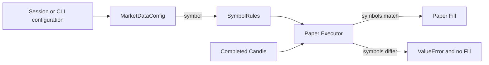

# Symbol-Bound Trading Rules Design

## สถานะ

- Issue: DEV-120
- สถานะการออกแบบ: อนุมัติเมื่อ 2026-07-28
- ขอบเขต: Level 1 — ปิดช่องที่ execution อาจใช้กฎของคนละ symbol

## ปัญหา

`SymbolRules` เก็บ `tick_size`, `step_size` และ `min_notional` แต่ไม่ระบุว่า
กฎเหล่านี้เป็นของ symbol ใด ดังนั้น Paper Executor สามารถรับ Candle ของอีก symbol
แล้วคำนวณราคา จำนวน และ minimum notional ต่อไปอย่างเงียบ ๆ ได้

Internal Alpha ยังรองรับเฉพาะ BTCUSDT แต่ market identity มาจาก configuration และ
ต้องไม่พึ่งข้อสมมติที่ซ่อนอยู่ใน execution code การผูกกฎกับ symbol ตั้งแต่ตอนนี้ทำให้
ระบบ fail fast ก่อนเปิด symbol เพิ่มในอนาคต

## เป้าหมาย

- ทำให้ `SymbolRules` ระบุเจ้าของกฎด้วย `symbol`
- ปฏิเสธ Candle ที่มี symbol ไม่ตรงก่อนคำนวณหรือสร้าง Fill
- ครอบทุก Paper execution method ที่ใช้ Candle ทั้ง Entry, Take Profit และ Liquidation
- ให้ replay composition ส่ง symbol จาก `MarketDataConfig` เป็นแหล่งข้อมูลเดียว

## แนวทางที่เลือก

เพิ่ม immutable `symbol: str` ใน `SymbolRules` แล้วให้ Paper Spot และ Paper Futures
Executor ตรวจ exact equality ระหว่าง `candle.symbol` กับ `symbol_rules.symbol` ที่
execution boundary ทุกครั้งก่อนใช้ Candle

แนวทางนี้ดีกว่าการตรวจเฉพาะ `fill_entry` เพราะ Take Profit และ Liquidation ก็ใช้
tick size และ Candle เช่นกัน และดีกว่าการตรวจครั้งเดียวใน application orchestration
เพราะ caller ที่ใช้ Executor โดยตรงจะไม่สามารถข้าม safety gate ได้

## Component Changes

### `trading.symbol_rules`

`SymbolRules` เพิ่ม field แรกเป็น `symbol: str` และยังคงเป็น frozen dataclass
หาก `symbol` ว่างหรือมีเฉพาะ whitespace ให้ raise `ValueError` ทันที ไม่ trim,
uppercase หรือแก้ค่าให้เงียบ ๆ เพื่อรักษา market identity ที่ configuration ส่งมา

### `execution.paper_spot`

`PaperSpotExecutor` ตรวจ symbol ที่ต้นของ:

- `fill_entry`
- `fill_take_profit`

เมื่อไม่ตรงให้ raise `ValueError` ก่อนคำนวณราคา จำนวน ค่าธรรมเนียม หรือ Fill

### `execution.paper_futures`

`PaperFuturesExecutor` ตรวจ symbol ที่ต้นของ:

- `fill_entry`
- `fill_take_profit`
- `fill_liquidation`

เมื่อไม่ตรงให้ raise `ValueError` ก่อนประเมินการแตะราคาและก่อนสร้าง Fill

ทั้งสอง Executor ใช้ helper private ภายในไฟล์ของตน ไม่สร้าง shared interface หรือ
generic validator เพราะมีเพียง validation ขนาดเล็กและ execution adapters มี semantics
แยกกันตามสถาปัตยกรรม

### `paper_replay_main`

การสร้าง `SymbolRules` ใช้ `symbol=market_data.symbol` แทนค่าคงที่ซ้อน ทำให้
`MarketDataConfig` เป็นแหล่ง market identity เดียวของ replay flow

ค่า BTCUSDT V1 ของ `tick_size`, `step_size` และ `min_notional` ยังเป็น snapshot
เดิมในรอบนี้ เพราะ Product ยังรองรับ BTCUSDT เพียง symbol เดียว

## Data Flow

การตรวจเกิดก่อน quantization และ minimum-notional calculation จึงไม่มีผลลัพธ์
บางส่วนหลุดออกมาเมื่อ market identity ไม่ตรงกัน

## Error Contract

ใช้ `ValueError` พร้อมข้อความที่ระบุทั้ง Candle symbol และ SymbolRules symbol เพื่อให้
ผู้เรียกและ test วินิจฉัย configuration mismatch ได้ชัดเจน ข้อผิดพลาดนี้เป็น programming
หรือ composition error ไม่ใช่เหตุการณ์ตลาดปกติ จึงไม่คืน `None` ซึ่งมีความหมายเดิมว่า
ตลาดยังไม่ Fill หรือ order ต่ำกว่า minimum notional

## Testing Strategy

พัฒนาด้วย TDD โดยเพิ่ม tests ต่อไปนี้ก่อน production code:

- `SymbolRules` ปฏิเสธ empty และ whitespace-only symbol
- Paper Spot ปฏิเสธ Entry และ Take Profit เมื่อ Candle symbol ไม่ตรง
- Paper Futures ปฏิเสธ Entry, Take Profit และ Liquidation เมื่อ Candle symbol ไม่ตรง
- Replay composition ส่ง `MarketDataConfig.symbol` เข้า `SymbolRules`
- Tests และ fixtures เดิมทุกจุดสร้าง `SymbolRules` ด้วย symbol ที่ตรงกับ Candle

การทดสอบทั้งหมดใช้ Candle และ Paper adapters ภายในเครื่อง ไม่มี Binance credentials,
Private API หรือ network request

## Non-Goals

- ไม่รองรับ symbol ที่สองใน Internal Alpha
- ไม่ดึงหรือ cache Binance `exchangeInfo`
- ไม่แยก Spot/Futures exchange filters ในรอบนี้
- ไม่เปลี่ยนค่าตัวเลข BTCUSDT V1
- ไม่เพิ่ม Live execution behavior
- ไม่สร้าง factory, registry หรือ generic symbol-rules provider

## ระดับ 2 ในอนาคต

เมื่อตัดสินใจเปิด symbol ที่สอง ให้สร้าง Issue แยกสำหรับ concrete Binance public
`exchangeInfo` adapter และ snapshot กฎตาม `MarketType` ตอนสร้าง Session เพื่อรักษา
immutable Session policy งานระดับ 2 ต้องไม่เปลี่ยนกฎของ Session ที่กำลังทำงานอยู่
โดยเงียบ ๆ
