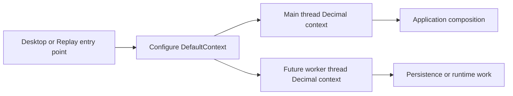
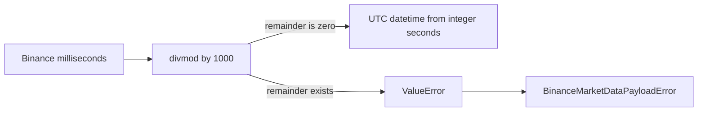

# DEV-126 Deterministic Decimal Context Design

## เป้าหมาย

ทำให้การคำนวณ `Decimal` ของ TiewTrade ใช้นโยบายเดียวกันทั้ง main thread และ worker
threads พร้อมเลิกใช้ float division ในการแปลง Binance Kline timestamp โดยไม่เปลี่ยน
ผลลัพธ์ deterministic Paper replay เดิม

## การตัดสินใจ

เลือกใช้ฟังก์ชันกลาง `configure_decimal_context()` ในไฟล์
`src/tiewtrade/decimal_context.py` และให้ entry point ทั้งสองเรียกเป็นขั้นตอนแรก:

- `desktop_main.run_desktop()` เรียกก่อนสร้าง path, database, application service หรือ UI
- `paper_replay_main.main()` เรียกก่อนสร้าง argument parser และ replay objects

ฟังก์ชันกำหนด `decimal.DefaultContext` ตามนโยบายเดียวกัน:

- precision เท่ากับ `28`
- rounding เป็น `ROUND_HALF_EVEN`
- เปิด trap สำหรับ `InvalidOperation`, `DivisionByZero` และ `Overflow`
- เรียก `decimal.setcontext(decimal.DefaultContext)` เพื่อใช้ policy กับ thread ปัจจุบัน

การแก้ `DefaultContext` ต้องเกิดก่อนสร้าง worker threads เพราะ Python ใช้
`DefaultContext` เป็นต้นแบบของ decimal context สำหรับ thread ใหม่ ส่วนการเรียก
`setcontext()` ทำให้ entry-point thread ใช้ค่าเดียวกันทันที ฟังก์ชันนี้เป็น startup
configuration และต้องให้ผลเดิมเมื่อเรียกซ้ำ

## Module ownership

### `tiewtrade.decimal_context`

เป็นเจ้าของ runtime-wide Decimal arithmetic policy เพียงเรื่องเดียว ไม่เก็บ Session state,
ไม่รู้จัก Paper/Live และไม่ import UI, SQLite หรือ Binance integration

มี consumer จริงสองรายคือ Desktop และ Paper Replay จึงไม่ใช่ abstraction ที่สร้างล่วงหน้า
และช่วยป้องกัน configuration สองชุดเปลี่ยนไม่พร้อมกัน

### Entry points

`desktop_main` และ `paper_replay_main` เป็นผู้กำหนดจังหวะเริ่ม policy ก่อน composition
ของ runtime แต่ไม่ทำซ้ำรายละเอียดค่า Decimal ภายในแต่ละไฟล์

### `integrations.binance.kline_parser`

ยังคงเป็นเจ้าของการ validate และ normalize Binance Kline payload โดยการแปลงเวลาใช้
integer arithmetic เท่านั้น

## Data flow



ทั้ง entry-point thread และ worker thread ที่สร้างหลังการตั้งค่าจึงใช้ precision, rounding
และ traps ชุดเดียวกัน



parser ปฏิเสธ timestamp ที่ละเอียดกว่า 1 วินาที ณ boundary ของ Binance payload แทนการ
ปล่อยให้ float conversion หรือ `Candle` validation เป็นผู้ตรวจภายหลัง

## Kline timestamp validation

`_utc_datetime(milliseconds)` เปลี่ยนจาก `milliseconds / 1000` เป็น:

```python
seconds, remainder = divmod(milliseconds, 1000)
if remainder:
    raise ValueError
return datetime.fromtimestamp(seconds, tz=UTC)
```

`parse_rest_kline()` และ `parse_websocket_kline()` มี error boundary ที่แปลง
`ValueError` เป็น `BinanceMarketDataPayloadError("invalid Binance market-data payload")`
อยู่แล้ว จึงไม่เพิ่ม exception type ใหม่

## ขอบเขตของคำว่าไม่มี float arithmetic

DEV-126 ห้าม float arithmetic ในข้อมูลทางการเงินและ Binance Kline timestamp ได้แก่ ราคา,
ปริมาณ, PnL, indicator และเวลาของ Candle งานนี้ไม่เปลี่ยน float ที่ใช้เป็นระยะเวลา timeout,
retry delay หรือ `asyncio` scheduling เพราะค่าเหล่านั้นไม่ใช่ข้อมูลการซื้อขายและ API ของ
ระบบเวลาใช้หน่วยวินาทีแบบ float โดยตรง

หลังแก้ต้องไม่มี `/ 1000`, `float()` หรือการแปลงผ่าน float ใน Kline parser และ flow ของ
ข้อมูลทางการเงิน

## Error handling และ safety

- timestamp milliseconds ต้องเป็น `int` จริงและหารด้วย `1000` ลงตัว
- timestamp ที่มีเศษต้องเป็น `BinanceMarketDataPayloadError` ที่ public parser boundary
- Decimal invalid operation, division by zero และ overflow ต้องไม่ถูกลดทอนเป็นค่าพิเศษ
- ไม่เปลี่ยน Session, Strategy, capital, Basket, execution หรือ persistence behavior
- ไม่เชื่อม Binance private API, credentials หรือส่ง Live order

## Test strategy

ใช้ TDD แยกเป็นสอง behavior:

1. เพิ่ม test สำหรับ `configure_decimal_context()` ที่เปลี่ยน current context เป็นค่าอื่นก่อน
   แล้วตรวจว่า main thread และ worker thread ใหม่เห็น `prec=28`, `ROUND_HALF_EVEN` และ
   traps สามตัวตรงกัน
2. เพิ่ม test ที่ส่ง REST Kline timestamp ซึ่งมีเศษ millisecond และยืนยันว่า public parser
   raise `BinanceMarketDataPayloadError` แทน error จาก `Candle`

ตรวจ entry-point integration ว่าทั้ง `run_desktop()` และ replay `main()` เรียก configuration
ก่อน composition จากนั้นรัน deterministic replay acceptance ซึ่งต้องยังได้ JSON เดิม:

```json
{"accepted_candles":40,"closed_baskets":1,"current_entries":0,"realized_pnl":"13.84062222"}
```

สุดท้ายรัน full tests, Ruff, format, Mypy, docs checks, `git diff --check` และค้นหา
float conversion/arithmetic ใน financial/Kline paths ด้วย `rg`

## สิ่งที่ไม่ทำ

- ไม่เปลี่ยน precision, rounding หรือสูตรทางธุรกิจจากค่าที่ DEV-126 กำหนด
- ไม่เปลี่ยน timeout, retry, reconnect หรือ asyncio scheduling ให้เป็น `Decimal`
- ไม่เพิ่ม per-Session Decimal policy หรือเปิดให้ผู้ใช้ตั้งค่าจาก form
- ไม่สร้าง generic configuration registry หรือ startup framework
- ไม่แก้ Strategy Preset หรือผลลัพธ์ของ Session เดิม
