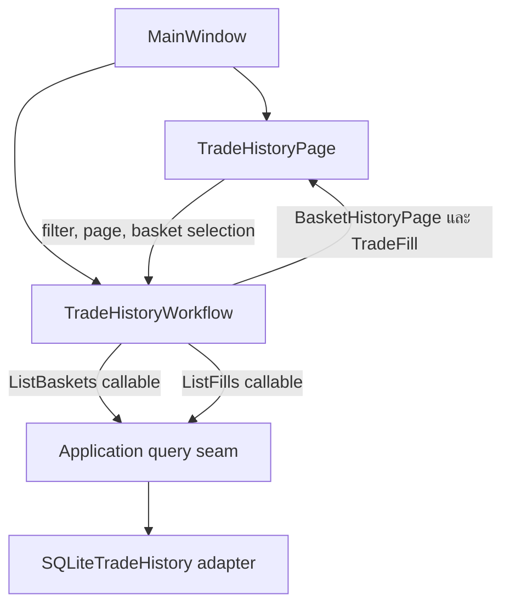

# DEV-96 Trade History UI Design

## เป้าหมาย

เพิ่มหน้า `Trade History` ใน Desktop UI เพื่อให้ผู้ใช้ตรวจสอบ Basket History และ
Trade Fills ที่ Bot บันทึกไว้ใน SQLite โดยใช้ application query ที่ส่งมอบใน DEV-94
ผ่าน background worker หน้า UI ต้องไม่เรียก SQLite โดยตรง ไม่คำนวณ business result
ซ้ำ และต้องเปิดดูได้แม้ไม่มี Active Paper Session

## ขอบเขต

งานนี้ครอบคลุม:

- navigation ระหว่าง `Session` และ `Trade History`
- ตัวกรอง Symbol, Timeframe, Market Type, Trade Mode, Basket Status และช่วงวันที่ UTC
- Basket History แบบ pagination
- Trade Fills ของ Basket ที่เลือก
- Total Net PnL ของผลลัพธ์ทั้งหมดตาม filter
- loading, empty, validation และ unavailable states
- background query lifecycle และ stale-result suppression
- UI view-model, workflow, widget interaction และ Desktop acceptance tests

งานนี้ไม่ครอบคลุม:

- Candlestick chart หรือ BUY/SELL markers
- CSV export
- Live execution, Binance Private API หรือ credentials
- การสร้างหรือแก้ Basket, Fill และ PnL
- schema หรือ migration ใหม่
- generic page, repository หรือ navigation framework

## การตัดสินใจหลัก

### เปิดดูได้โดยไม่ขึ้นกับ Active Paper Session

`Trade History` เป็นข้อมูลถาวรและเป็น navigation page อิสระ ผู้ใช้เปิดดูได้เสมอ
แม้ระบบไม่มี Active Paper Session หรือ Session Setup อยู่ใน unavailable state
ความล้มเหลวของ Session workflow และ Trade History workflow ต้องไม่ทำให้อีกหน้าหนึ่ง
สูญเสีย state หรือถูกปิดกั้น

### แสดงทุก Session เป็นค่าเริ่มต้น

เมื่อเปิดหน้า Trade History ครั้งแรก ระบบ query Basket ของทุก Session โดยไม่ใส่
filter เรียง `opened_at_utc DESC, basket_id DESC` ตาม contract ของ DEV-94 และโหลด
ครั้งละ 50 รายการ UI ไม่มี Session selector เพราะ Internal Alpha ใช้ Account เดียว
และประวัติแต่ละ record มี ownership ผ่าน `session_id` อยู่แล้ว

### ช่วงเวลาอ้างอิง Basket Opened At

ตัวกรองวันที่ใช้ `BasketResult.opened_at_utc`:

- `From Date (UTC)` รวมตั้งแต่ `00:00:00` ของวันที่เลือก
- `To Date (UTC)` รวมทั้งวันที่เลือก โดยแปลงเป็น
  `opened_before_utc = 00:00:00` ของวันถัดไป
- ทั้งสองขอบเขตเป็น optional
- ถ้า From Date อยู่หลัง To Date UI แสดง validation และไม่เริ่ม query

### ใช้ Apply Filters และ Reset

การเปลี่ยน widget ยังไม่ query จนผู้ใช้กด `Apply Filters` เพื่อหลีกเลี่ยงการสร้าง
background task หลายครั้งระหว่างเลือกค่า `Reset` คืนค่าทุก filter เป็น `All`, ปิด
date bounds และ query หน้า 1 ใหม่ทันที

### เลือก Basket แรกอัตโนมัติ

หลัง Basket query สำเร็จและมีข้อมูล UI เลือกแถวแรกแล้ว query Trade Fills ของ Basket
นั้นทันที เมื่อเปลี่ยน page หรือ filters ให้ล้าง Fill เดิม เลือก Basket แรกของผลลัพธ์
ใหม่ และ query Fills ใหม่

## Architecture และ Ownership



`MainWindow` เป็นเจ้าของ navigation และ wiring ระหว่าง page กับ workflow เท่านั้น
`TradeHistoryPage` เป็น PySide6 presentation layer และไม่ import SQLite
`TradeHistoryWorkflow` เป็นเจ้าของ query task lifecycle, generation guards,
pagination request, selection และ sanitized failure routing
`desktop_main.py` เป็น composition root ที่สร้าง `SQLiteTradeHistory` จาก
`SQLiteDatabase` ตัวเดียวกับ Session persistence แล้ว inject bound query callables
เข้า Desktop UI

### Shared Background Task

`SessionTask` มี implementation เป็น generic `QRunnable` อยู่แล้ว และ DEV-96 เป็น
consumer ตัวที่สอง จึง rename เป็น `BackgroundTask` ใน `ui/background_task.py`
พร้อม `BackgroundTaskSignals` ให้ `SessionWorkflow` และ `TradeHistoryWorkflow`
ใช้ร่วมกัน การเปลี่ยนชื่อนี้ไม่เปลี่ยน runtime behavior และไม่สร้าง base class,
registry หรือ worker framework

## Component Design

### TradeHistoryPage

`TradeHistoryPage` สร้างและแสดง widgets ต่อไปนี้:

- Heading `Trade History`
- Filter controls:
  - `Symbol`: All, BTCUSDT
  - `Timeframe`: All, 3m, 5m, 15m, 30m, 1h, 4h
  - `Market`: All, Spot, Futures
  - `Mode`: All, Paper, Live
  - `Status`: All, Open, Closed
  - optional `From Date (UTC)` และ `To Date (UTC)`
  - `Reset` และ `Apply Filters`
- Summary `Total Net PnL`
- Basket History table
- `Previous`, page label และ `Next`
- Trade Fills table
- scoped loading, empty, validation และ unavailable messages

Page ส่ง semantic requests ออกทาง Qt signals และรับ immutable application/domain
objects ผ่าน display methods Page ไม่สร้าง `TradeHistoryFilter`, `PageRequest` หรือ
คำนวณ pagination/PnL เอง

### TradeHistoryWorkflow

Workflow รับ callables:

```python
ListBaskets = Callable[[TradeHistoryFilter, PageRequest], BasketHistoryPage]
ListFills = Callable[[UUID], tuple[TradeFill, ...]]
```

Workflow เปิด public operations:

```python
start() -> None
apply_filters(values: TradeHistoryFilterValues) -> None
reset_filters() -> None
go_to_page(page: int) -> None
select_basket(basket_id: UUID) -> None
retry() -> None
close() -> None
```

`TradeHistoryFilterValues` เป็น immutable UI request ที่เก็บค่าข้อความ/วันที่จาก
form และแปลงเป็น validated `TradeHistoryFilter` ที่ workflow boundary

Workflow ส่ง semantic signals:

```python
baskets_loading(bool)
baskets_ready(BasketHistoryPage)
baskets_empty()
baskets_unavailable(str)
filter_invalid(str)
fills_loading(bool)
fills_ready(UUID, tuple[TradeFill, ...])
fills_empty(UUID)
fills_unavailable(UUID, str)
```

Page ไม่รับ exception object และไม่แสดงข้อความจาก exception โดยตรง

## Detailed Data Flow

### First Load

1. ผู้ใช้กด navigation `Trade History`
2. `MainWindow` แสดง `TradeHistoryPage`
3. ครั้งแรกเท่านั้น MainWindow เรียก `TradeHistoryWorkflow.start()`
4. Workflow ใช้ empty `TradeHistoryFilter` และ `PageRequest(page=1, page_size=50)`
5. Workflow emit `baskets_loading(True)` แล้วเริ่ม `BackgroundTask`
6. Worker เรียก `list_baskets(filters, page)`
7. เมื่อสำเร็จ Workflow ตรวจ generation แล้ว emit semantic result ก่อน
   `baskets_loading(False)`
8. Page แสดง Basket rows, `total_items`, page state และ Total Net PnL
9. ถ้ามี rows Workflow เลือก Basket แรกและเริ่ม Fill query
10. Fill result แสดงใน Trade Fills table เฉพาะเมื่อ Basket ยังเป็น selection ปัจจุบัน

### Apply Filters

1. Page ส่ง immutable filter values เมื่อกด `Apply Filters`
2. Workflow แปลง enum/string/date เป็น `TradeHistoryFilter`
3. Validation failure emit `filter_invalid` และไม่เรียก query
4. Validation สำเร็จเพิ่ม Basket generation, ตั้ง page เป็น 1, clear selection และ
   invalidate Fill generation
5. Page ล้าง Basket/Fill result เก่าก่อนแสดง loading
6. Workflow query หน้าแรกของ filter ใหม่
7. ผลลัพธ์เก่าจาก generation ก่อนหน้าถูกละทิ้ง

### Reset

1. Page reset controls เป็น `All` และปิด date bounds
2. Workflow ใช้ empty filter และ page 1
3. Flow หลังจากนั้นเหมือน Apply Filters ที่ valid

### Pagination

1. `Previous` ส่ง page ปัจจุบันลบหนึ่ง และ `Next` ส่ง page ปัจจุบันบวกหนึ่ง
2. Workflow ไม่ยอมรับ page ต่ำกว่า 1 หรือสูงกว่าจำนวนหน้าที่ทราบ
3. Filters คงเดิม ส่วน selection และ Fills ถูก invalidate
4. Query สำเร็จแล้วเลือก Basket แรกของหน้าใหม่อัตโนมัติ

### Basket Selection

1. Page เก็บ `basket_id` เป็น row metadata ไม่ parse จากข้อความใน cell
2. การเลือก row ส่ง UUID ไปยัง Workflow
3. Workflow เพิ่ม Fill generation และเริ่ม Fill query
4. ถ้าผู้ใช้เลือก row ใหม่ก่อน worker เดิมเสร็จ ผลเดิมถูกละทิ้ง
5. Basket query ใหม่ invalidate Fill query ทั้งหมดจาก Basket page เดิม

## Table Contracts

Basket History columns เรียงดังนี้:

1. `Opened At`
2. `Mode`
3. `Market`
4. `Symbol`
5. `Timeframe`
6. `Entries`
7. `Notional`
8. `Gross PnL`
9. `Fees`
10. `Funding Fee`
11. `Net PnL`
12. `Status`

Trade Fills columns เรียงดังนี้:

1. `Filled At`
2. `Side`
3. `Entry #`
4. `Price`
5. `Quantity`
6. `Notional`
7. `Commission`
8. `Realized PnL`
9. `Source`

เวลาแสดงเป็น ISO-like UTC พร้อม suffix `UTC` ค่า Decimal format จาก Decimal โดยตรง
และไม่แปลงผ่าน float ค่า PnL แสดงตัวเลขพร้อม semantic label:

- มากกว่า 0: `Profit`
- น้อยกว่า 0: `Loss`
- เท่ากับ 0: `Break-even`

สีอาจใช้เป็นข้อมูลเสริม แต่ semantic label ต้องปรากฏใน accessible text/cell text
เสมอ

## Loading, Empty และ Failure States

### Basket Query Success — Empty

- แสดง `No trade history`
- Basket และ Fill tables ไม่มี rows
- Total Net PnL แสดง `0.00 USDT · Break-even` เพราะ query สำเร็จและยืนยันว่าไม่มี
  matching closed Baskets
- pagination buttons disabled

### Fill Query Success — Empty

- Basket selection คงอยู่
- Fill area แสดง `No fills for this Basket`

### Basket Query Failure

- ล้าง Basket และ Fill tables รวมทั้ง selection
- ซ่อน Total Net PnL value ไม่สร้างค่าศูนย์ปลอม
- แสดง `Trade History unavailable`
- มี `Try Again` ซึ่งทำ Basket query ล่าสุดซ้ำ
- ไม่แสดง exception text, SQLite path หรือ persisted value ที่อาจไม่ปลอดภัย

### Fill Query Failure

- Basket table และ selection คงอยู่
- Fill area แสดง `Trade Fills unavailable`
- retry ทำ Fill query ของ Basket ที่ยังเลือกอยู่ซ้ำ
- ไม่เปลี่ยน Basket summary หรือ pagination state

## Concurrency และ Close Lifecycle

Basket และ Fill operations มี active task และ generation แยกกัน ผลลัพธ์ถูกยอมรับ
เมื่อ workflow ยังไม่ปิด, task เป็น generation ปัจจุบัน และ Basket selection ตรงกัน
เท่านั้น `close()` ปิดรับงานใหม่และ invalidate semantic callbacks ส่วน `finished`
ของ worker ที่กำลังทำงานยังต้อง disconnect callbacks และ clear task reference

Basket operation ใหม่ invalidate Fill operation เชิง semantic แต่ไม่บังคับ terminate
thread ที่กำลังอ่าน SQLite UI จะไม่ block รอ worker ขณะใช้งานปกติ และ callback เก่า
ไม่สามารถเขียน state ใหม่ทับผลลัพธ์ล่าสุด

## Composition

`desktop_main.run_desktop()` ใช้ `SQLiteDatabase` instance เดิม สร้าง
`SQLiteTradeHistory(database)` แล้วกำหนด migrated query callables ซึ่งเรียก
`prepare_database()` ภายใน worker ก่อนอ่านข้อมูล จากนั้นส่ง callables ผ่าน
`ui.desktop.run_desktop()` ไปยัง `MainWindow`

Composition นี้รักษากฎ:

- UI ไม่ import SQLite
- directory creation และ migration ไม่เกิดบน UI thread
- ไม่มี Binance connection หรือ Live side effect
- Trade History failure ไม่เปลี่ยน Session workflow state

## Testing Strategy

### View-model และ Formatter Tests

- filter values แปลงเป็น exact application enums และ inclusive UTC date range
- From หลัง To ถูกปฏิเสธก่อน query
- Decimal format ไม่ใช้ float และรักษาค่าที่มี precision สูง
- UTC display ไม่ใช้ local timezone
- positive, negative และ zero PnL มีตัวเลขและ semantic label
- page count, Previous และ Next state ถูกต้องสำหรับ empty, first, middle และ last page

### Workflow Unit Tests

- first load ใช้ empty filter, page 1 และ page size 50
- successful Basket query emit result ก่อน idle และเลือก Basket แรก
- empty result ไม่เริ่ม Fill query
- Apply/Reset กลับหน้า 1 และรักษา exact filters
- pagination ไม่ออกนอก bounds
- rapid filter/page changes ทิ้ง Basket result เก่า
- rapid Basket selection ทิ้ง Fill result เก่า
- Basket failure และ Fill failure แยก unavailable state
- retry ใช้ request ล่าสุด
- duplicate operation ขณะ task ประเภทเดียวกัน active ไม่สร้าง query ซ้ำ
- close suppress late semantic result แต่ finished cleanup ยังทำงาน

### Widget Interaction Tests

- navigation มี `Session` และ `Trade History` และสลับหน้าได้
- Trade History เปิดได้โดยไม่มี Active Session และเมื่อ Session page unavailable
- columns และลำดับตรงตาม Table Contracts
- Apply Filters, Reset, date validation และ pagination ส่ง semantic request ถูกต้อง
- row selection ส่ง UUID metadata ไม่ parse cell text
- loading, empty และ unavailable state ปิด/เปิด controls ถูกต้อง
- PnL แยก Profit/Loss/Break-even โดยไม่พึ่งสี

### Desktop Acceptance

- สร้าง SQLite database ชั่วคราวและบันทึก Spot/Futures Basket/Fill ผ่าน durable adapter
- เปิด Desktop แล้วแสดงทุก Session เรียงล่าสุดก่อน
- เลือก Basket แล้วแสดง Fills ที่สัมพันธ์กัน
- filter และ pagination ไม่โหลดทุก record เข้า memory
- Total Net PnL ตรงกับ application query
- ปิดและเปิด Desktop composition ใหม่แล้วยังอ่าน records เดิมได้
- SQLite read failure แสดง unavailable โดยไม่มีค่าศูนย์ปลอมหรือรายละเอียดภายใน
- source guard ยืนยัน UI ไม่ import SQLite, Strategy, Execution หรือ Binance
- no-network guard ยืนยัน acceptance flow ไม่เรียก Binance endpoint

## Acceptance Criteria Mapping

- Application shell/navigation: MainWindow navigation และ interaction tests
- Basket columns: Table Contracts และ widget tests
- Fill columns: Table Contracts และ widget tests
- Filters: FilterValues conversion และ Apply/Reset flow
- Total Net PnL: BasketHistoryPage summary โดยไม่คำนวณซ้ำใน UI
- Pagination: PageRequest 50 records และ bounded controls
- PnL accessibility: semantic labels ใน cell/summary text
- Query failure: scoped unavailable state และ sanitized copy
- No chart/CSV: ไม่มี component, action หรือ dependency สำหรับสอง feature นี้
- View-model/interactions: unit, workflow, widget และ acceptance layers

## ความเสี่ยงและการควบคุม

- **ผล worker เก่าทับ state ใหม่:** ใช้ operation-specific generation guards
- **MainWindow กลับมาใหญ่:** ย้าย history lifecycle ไป focused Workflow/Page
- **UI คำนวณยอดต่างจาก persistence:** แสดง `BasketHistoryPage.net_realized_pnl`
  โดยตรง
- **โหลดข้อมูลมากเกินไป:** page size 50 และ query Fills เฉพาะ Basket ที่เลือก
- **ข้อมูล error รั่ว:** ใช้ข้อความคงที่และไม่ส่ง exception objectถึง Page
- **กระทบ Session Setup:** workflows แยก state และมี regression tests ทั้งสองหน้า
