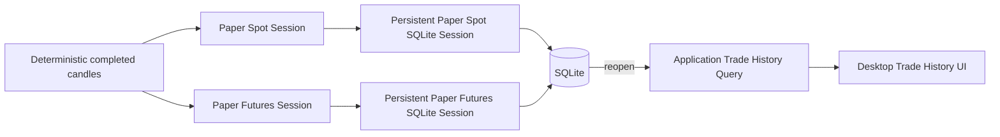

# DEV-97 Paper Trade History Acceptance Design

**Date:** 2026-07-29  
**Status:** Approved
**Scope:** Paper Spot and Paper Futures Trade History acceptance flow

## 1. Purpose

DEV-97 ต้องพิสูจน์ว่า Trade History ที่ส่งมอบใน DEV-91–DEV-96 ทำงานร่วมกันจริง
ตั้งแต่ Paper execution สร้าง Fill ไปจนถึง SQLite, application query และ Desktop UI
โดยผลลัพธ์ต้องคงเดิมหลังเปิดฐานข้อมูลใหม่และระบบต้องหยุดรับ Entry ใหม่เมื่อยืนยัน
durability ไม่ได้

งานนี้เป็น acceptance gate ของ capability ที่มีอยู่ ไม่ใช่การสร้าง runtime,
generic coordinator หรือ persistence abstraction ใหม่ หาก test-first ไม่พบช่องว่างใน
production code ให้เปลี่ยนเฉพาะ acceptance tests, test support และ delivery status

## 2. Current Gap

ระบบมีหลักฐานแยกส่วนอยู่แล้ว:

- Paper Spot และ Paper Futures สามารถสร้าง Basket/Fill แบบ durable
- SQLite query รองรับ filter, deterministic ordering, pagination และ closed Net PnL
- Desktop UI อ่าน Trade History ผ่าน application query และแสดง unavailable state
- persistence coordinator ปิดรับ candle ถัดไปหลังการบันทึกล้มเหลว

แต่ยังไม่มี acceptance scenario ที่เชื่อม Paper execution จริงทั้ง Spot และ Futures
เข้ากับ SQLite ไฟล์เดียว เปิดฐานข้อมูลใหม่ แล้วอ่านผลผ่าน Desktop composition จริง
ดังนั้น DEV-97 ต้องเพิ่มหลักฐานเชื่อมต่อระหว่าง capability เหล่านี้โดยไม่ทำซ้ำ unit tests
ทุกกรณี

## 3. Accepted Approach

ใช้ acceptance harness ที่เรียก production objects จริงตามลำดับ:

หลักการสำคัญ:

- ใช้ Paper execution และ SQLite adapters จริง ไม่สร้างผลลัพธ์หลักด้วยการ insert
  synthetic Basket/Fill โดยตรง
- ใช้ข้อมูล candle แบบ deterministic และไม่เชื่อม network
- เปิด SQLite ผ่าน object ชุดใหม่เพื่อพิสูจน์ restart boundary
- เปิด Desktop ผ่าน production composition seam และตรวจค่าที่ผู้ใช้เห็น
- ใช้ direct normalized persistence scenario เฉพาะ Partial Fill เพราะ Paper executor
  v1 สร้าง Fill เดียวต่อ Order และ Partial Fill เป็น contract สำหรับ future Live data
- แก้ production code เฉพาะเมื่อ RED test แสดง defect จริง

## 4. Acceptance Scenarios

### 4.1 Paper Execution to Durable Desktop History

1. สร้าง Paper Spot Session และ Paper Futures Session คนละ `session_id`
2. ป้อน completed candles แบบ deterministic ให้แต่ละ Session ผ่าน persistent
   SQLite coordinator
3. ยืนยันว่าแต่ละ Session ปิด Basket และบันทึก Entry/Exit Fills สำเร็จ
4. ทิ้ง database/store objects ชุดแรก แล้วสร้าง `SQLiteDatabase` และ
   `SQLiteTradeHistory` ชุดใหม่จากไฟล์เดิม
5. อ่าน Basket ผ่าน application query และยืนยัน Spot/Futures identity, Fills,
   execution costs และ Net PnL
6. เปิด Desktop composition ด้วย SQLite path เดิม แล้วตรวจ Basket rows, Fill rows,
   Basket selection และ Net PnL summary ที่แสดงจาก durable records

### 4.2 Restart and Closed Net PnL

- Query ก่อนและหลังเปิด SQLite ใหม่ต้องได้ Basket records, Fills และ Net PnL เท่ากัน
- เพิ่ม Open Basket ที่เกิดจาก Paper execution จริงโดยหยุด candle flow หลัง Entry Fill
- Open Basket ต้องแสดงใน history แต่ห้ามถูกรวมใน closed Net PnL summary
- ไม่ทำ Session recovery หรือ resume trading ใน Issue นี้; restart หมายถึง reopen
  durable Trade History เพื่ออ่านเท่านั้น

### 4.3 Deterministic Duplicate and Partial Fills

- บันทึก Fill payload เดิมซ้ำต้องเป็น idempotent no-op และ aggregate ไม่เปลี่ยน
- หลาย Fill ที่มี `order_id` และ `entry_number` เดียวกันต้องเพิ่ม notional/fee ตาม
  Fill จริง แต่เพิ่ม Basket `entry_count` เพียงครั้งเดียว
- Query Fills ต้องเรียง `filled_at_utc` แล้วตาม `fill_id` เหมือนเดิมทุกครั้ง
- Scenario นี้ใช้ normalized `SQLiteTradeHistory` boundary โดยตรง เพราะ Paper
  execution v1 ไม่มี intrabar partial-fill simulator

### 4.4 Fail-Closed Persistence

1. ใช้ Paper Session และ persistent SQLite coordinator จริง
2. ทำให้ SQLite write ล้มเหลวแบบ deterministic ก่อน Entry Fill commit
3. การประมวลผล candle ต้องส่ง persistence error กลับและไม่รายงาน READY
4. candle ถัดไปต้องถูกปฏิเสธด้วย blocked persistence state ก่อนเรียก core Session
5. ห้ามใช้ in-memory fallback และห้ามสร้าง Entry ใหม่หลัง durability ไม่แน่นอน

### 4.5 Query and UI Behavior

Acceptance suite ต้องใช้หลักฐานร่วมกับ tests ที่มีอยู่เพื่อครอบคลุม:

- Symbol, Timeframe, Market Type, Trade Mode, Status และ UTC date filters
- deterministic newest-first ordering
- pagination และ filtered closed Net PnL summary
- Basket selection โหลด Fills ตาม execution order
- query failure แสดง `Trade History unavailable` หรือ `Trade Fills unavailable`
  โดยไม่แสดงค่าศูนย์ปลอมและไม่เปิดเผย filesystem/database error

ไม่จำเป็นต้องทำซ้ำทุก permutation ใน end-to-end test เดียว หาก focused acceptance
หรือ unit test เดิมพิสูจน์พฤติกรรมนั้นชัดเจนและ DEV-97 เพิ่ม missing cross-layer proof แล้ว

## 5. Safety Boundary

Acceptance suite ต้อง:

- ใช้ `TradeMode.PAPER` เท่านั้น
- ไม่ import หรือเรียก Binance Private API
- ไม่ส่ง Live order
- ไม่อ่าน API key, secret, environment credentials หรือ OS Keyring
- ปิด network access ใน Desktop acceptance scenario และ fail ทันทีหากมีการเชื่อมต่อ
- ใช้ temporary SQLite files และ deterministic candle fixtures เท่านั้น

## 6. Code and Test Boundaries

คาดว่าจะเพิ่มหรือแก้เฉพาะ:

- acceptance test สำหรับ cross-layer Paper Trade History flow
- focused acceptance test สำหรับ fail-closed และ normalized Partial Fill contract
- test-support builders เฉพาะเมื่อช่วยลด setup duplication โดยไม่ซ่อน assertions
- `PROJECT_PLAN.md` หลัง verification ผ่าน เพื่อบันทึกสถานะ DEV-97

ไม่สร้าง production helper เพื่อให้ test เรียกง่ายขึ้น และไม่ย้าย business logic เข้า
test support หาก RED test พบ production defect ให้เพิ่ม failing test ที่เล็กที่สุดก่อนแก้
production code ด้วย TDD

## 7. Verification Strategy

ดำเนินการแบบ RED → GREEN → REFACTOR:

1. เพิ่ม cross-layer acceptance test และยืนยันว่า fail เพราะ missing acceptance wiring
   หรือ assertion gap ที่ตั้งใจพิสูจน์
2. เพิ่ม deterministic duplicate/partial-fill และ fail-closed acceptance evidence
3. รัน focused persistence, application query และ UI suites
4. รัน full Python suite
5. รัน Ruff lint, Ruff format check และ mypy
6. รัน documentation tests และ content checks
7. รัน `git diff --check`

## 8. Completion Criteria

DEV-97 เสร็จเมื่อ:

- Paper Spot/Futures execution จริงสร้าง durable history ที่ Desktop อ่านได้
- restart ไม่เปลี่ยน history หรือ closed Net PnL
- Open Basket, duplicate, Partial Fill และ SQLite failure semantics ถูกพิสูจน์
- UI success/unavailable states ถูกพิสูจน์จาก composition boundary
- ไม่มี Live/network/credential side effect ใน tests
- quality gates ทั้งหมดผ่าน
- task review และ whole-branch review ไม่เหลือ Critical หรือ Important finding

## 9. Non-Goals

- เริ่มหรือ resume Paper runtime จาก Desktop
- Session recovery หรือ Basket recovery
- Live Spot/Futures execution และ Binance reconciliation
- Binance Private API หรือ credentials
- chart, historical candle retention หรือ trade markers
- เปลี่ยน Trade History schema, UI design หรือ pagination contract โดยไม่มี failing
  acceptance evidence
- สร้าง generic repository, interface, factory หรือ acceptance coordinator
