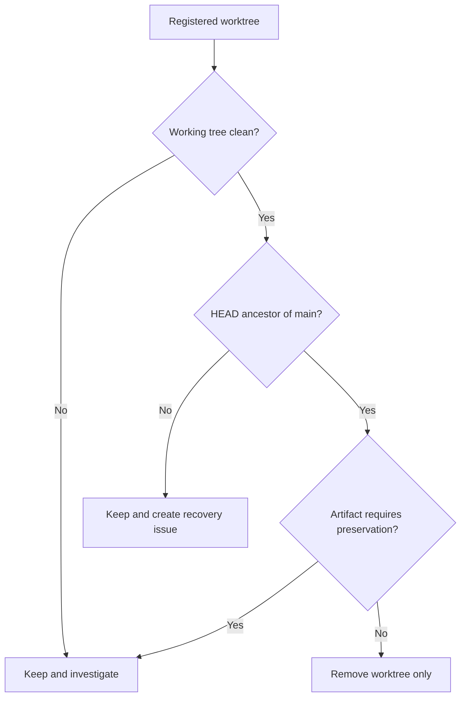

# DEV-128 Repository Source of Truth Cleanup Design

## เป้าหมาย

ทำให้คำสั่งสำหรับ Codex อ้างเอกสารที่มีอยู่จริง และทำความสะอาดเฉพาะ Git worktree
ที่พิสูจน์แล้วว่าไม่มีงานตกหล่น โดยรักษา DEV-115 และ DEV-116 ไว้สำหรับ recovery ผ่าน
DEV-130

## ปัญหาที่ตรวจพบ

`AGENTS.md` อ้าง `docs/adr/` เป็น Source of Truth แต่ repository ไม่มี directory นี้
เหตุผลของการตัดสินใจปัจจุบันถูกเก็บใน `docs/superpowers/specs/` อยู่แล้ว การสร้าง
`docs/adr/` เพิ่มจะทำให้มีแหล่งบันทึกเหตุผลสองแห่งและเพิ่มความเสี่ยงที่เอกสารไม่ตรงกัน

รายละเอียดเดิมของ DEV-128 ล้าสมัยอีกสองจุด:

- `.mcp.json` และ `.superpowers/` ถูกเพิ่มใน `.gitignore` แล้ว
- worktree ที่ค้างมีมากกว่าสองตัว และ DEV-115/DEV-116 ยังมี commits ที่ไม่อยู่ใน
  `main` แม้ Linear แสดงสถานะ Done

## การตัดสินใจ

เลือกแนวทาง B โดยแก้ `AGENTS.md` ให้ใช้ `docs/superpowers/specs/` เป็นแหล่งเหตุผลของ
การตัดสินใจด้านสถาปัตยกรรม ไม่สร้าง `docs/adr/` และไม่คัดลอก design document ไปเก็บซ้ำ

การทำความสะอาด worktree ใช้หลักฐานสามข้อพร้อมกัน:

1. working tree ต้องไม่มี tracked หรือ untracked source changes
2. HEAD ต้องเป็น ancestor ของ `main`
3. ไม่มี artifact ที่ต้องเก็บเพื่อ recovery หรือ audit

หากไม่ผ่านข้อใดข้อหนึ่งต้องเก็บ worktree ไว้และสร้างงาน recovery แยก ไม่ใช้
`git worktree remove --force` เพื่อกลบงานที่ยังไม่ถูกนำเข้า `main`

## Worktree classification

### ลบได้หลังตรวจซ้ำ

- `dev-95` — working tree สะอาดและ HEAD อยู่ใน `main`
- `dev-114` — working tree สะอาดและ HEAD อยู่ใน `main`
- `dev-118` — working tree สะอาดและ HEAD อยู่ใน `main`
- `dev-121` — working tree สะอาดและ HEAD อยู่ใน `main`
- `dev-99-runtime-refactor` — detached HEAD อยู่ใน `main`; `.superpowers/` เป็น
  generated review scratch และไม่ใช่ product source

การลบใน DEV-128 หมายถึงลบ worktree registration และ directory เท่านั้น ไม่ลบ local
branch หรือ remote branch เพราะ Git Workflow ห้ามลบ branch โดยไม่มีคำสั่งชัดเจน

### ต้องเก็บ

- `dev-115` — มี commits `a64768d..3a31823` ที่ไม่อยู่ใน `main`
- `dev-116` — มี commits ของ DEV-115 และ commits เพิ่มถึง `4573387` ที่ไม่อยู่ใน
  `main`
- `dev-128` — เป็น worktree ที่กำลังทำ Issue นี้

DEV-115 และ DEV-116 ถูกสำรองเป็น remote branches แล้ว และ recovery แยกเป็น DEV-130
เพื่อสร้าง branch ใหม่จาก `main` ล่าสุด ห้าม merge หรือ cherry-pick branch เก่าทั้งก้อน
เพราะอาจย้อน hardening ที่เพิ่มภายหลัง

## Data flow

ขั้นตอนนี้ให้ Git history เป็นหลักฐานแทนสถานะ Linear เพียงอย่างเดียว เพราะสถานะ Done
ไม่ยืนยันว่า commit ถูก merge เข้า `main`

## Linear alignment

ปรับ description ของ DEV-128 ให้สะท้อนสถานะจริงและบันทึกว่า:

- Source of Truth ใช้ `docs/superpowers/specs/`
- local configuration ถูก ignore แล้ว
- DEV-115/DEV-116 ไม่อยู่ในขอบเขต cleanup และ recovery ผ่าน DEV-130
- acceptance ของ worktree cleanup หมายถึงเหลือเฉพาะ worktree ที่กำลังใช้งานจริงหรือ
  ต้องเก็บสำหรับ recovery

DEV-115 และ DEV-116 ยังคงสถานะเดิม แต่มี comment ชี้ไป DEV-130 เพื่อไม่ให้ audit trail
สื่อว่างานอยู่ใน `main` แล้ว

## Safety และ error handling

- ตรวจ `git status` และ ancestry ซ้ำทันที ก่อนลบ worktree แต่ละตัว
- หาก worktree เปลี่ยนสถานะหลัง design นี้ ให้หยุดและไม่ลบตัวนั้น
- ไม่ใช้ `--force`, ไม่ลบ branch/tag และไม่ rewrite history
- ไม่แก้ business rules, UI, persistence, execution หรือ Trading Safety
- ไม่ push หรือ merge DEV-128 จนกว่าผู้ใช้จะยืนยันแยกตาม Git Workflow

## Verification strategy

1. ตรวจว่า `AGENTS.md` ไม่อ้าง `docs/adr/` และ path ที่อ้างมีอยู่จริง
2. รัน documentation tests และ content check
3. รัน Python test suite, Ruff, format และ Mypy เพื่อยืนยันว่า documentation-only change
   ไม่กระทบ repository gates
4. รัน `git diff --check`
5. รัน `git worktree list` และยืนยันว่าเหลือ DEV-115, DEV-116, DEV-128 และ main
6. รัน `git status` ใน worktree ที่เหลือเพื่อยืนยันว่าไม่มีงานถูกลบโดยไม่ตั้งใจ

## สิ่งที่ไม่ทำ

- ไม่สร้าง `docs/adr/` หรือย้าย design documents เดิม
- ไม่ recovery implementation ของ DEV-115/DEV-116 ภายใน DEV-128
- ไม่ merge หรือ cherry-pick branch DEV-115/DEV-116
- ไม่ลบ local/remote branches ของ worktree เก่า
- ไม่เปลี่ยนสถานะ DEV-115/DEV-116 กลับเป็น Todo
- ไม่แก้ product code หรือสร้าง generic cleanup script
