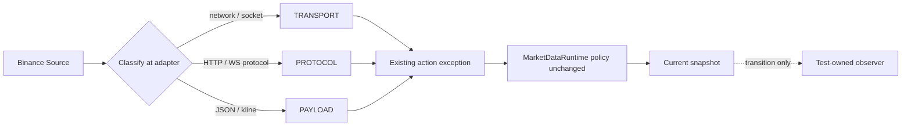

# DEV-101 Market Data Diagnostics Hardening Design

**Date:** 2026-07-30
**Status:** Approved
**Scope:** Public Market Data Runtime diagnostics and internal contracts

## 1. Purpose

DEV-101 ทำให้ Public Market Data Runtime เหมาะกับการทำงานระยะยาวขึ้นโดยนำ
state history ที่โตไม่จำกัดออกจาก production object, ทำ optional contract ของ
backfill ให้ตรงกับ call graph จริง และจำแนกสาเหตุของ source failure สำหรับ diagnostics
โดยไม่เปลี่ยน retry, rate-limit หรือ fail-closed policy ที่ส่งมอบแล้ว

## 2. Constraints

- คง `MarketDataRuntimeSnapshot`, state sequence และ reason ที่ caller สังเกตได้
- คง bounded reconnect delays `1`, `2`, `4` วินาที, deadline `30` วินาที และ
  rate-limit fallback `60` วินาที
- Failure kind ใช้เพื่อ diagnostics เท่านั้น ห้ามทำให้ Runtime permissive ขึ้น
- ไม่เพิ่ม Structured Logging หรือ operational event ของ DEV-100
- ไม่ขยาย mypy gate ไปยัง tests ซึ่งเป็น scope ของ DEV-102
- ใช้ fake source และ fake transport เท่านั้น ไม่มี credentials, Private API หรือ Live Order
- ไม่เพิ่ม generic error framework, registry, factory หรือ base adapter ใหม่

## 3. Runtime Transition Observation

`MarketDataRuntimeStatus` จะเก็บเฉพาะ immutable snapshot ปัจจุบันและ delivery
watermark โดยลบ `_visited_states` กับ property `visited_states` ออกจาก production
implementation ทั้ง `MarketDataRuntimeStatus` และ `MarketDataRuntime`

เพื่อให้ tests ยังพิสูจน์ state sequence ได้ Runtime รับ optional synchronous callback
`on_transition: Callable[[MarketDataRuntimeSnapshot], None] | None` แล้วส่งให้ Status
Tracker callback ได้รับ initial `STARTING` snapshot หนึ่งครั้งและ snapshot ใหม่หลังทุก
state transition แต่ไม่รับ notification จาก `record_delivery()` เพราะ watermark update
ไม่ใช่ state transition

Production composition ไม่ส่ง callback จึงไม่มี collection หรือ retained state history
ส่วน tests ใช้ recorder ที่อยู่ใน test code เป็นเจ้าของ list ของ states เอง Callback เป็น
observer เท่านั้นและต้องไม่เปลี่ยน Runtime decision

หาก synchronous observer โยน `Exception` ให้ Status Tracker แยก failure นั้นออกและคง
snapshot กับ Runtime decision ที่เลือกไว้แล้ว โดยไม่เพิ่ม log หรือ operational event;
`BaseException` เช่น `KeyboardInterrupt` และ `SystemExit` ไม่อยู่ใน failure boundary นี้

```text
MarketDataRuntimeStatus
  ├─ snapshot: current immutable state only
  └─ on_transition(snapshot) ──> test-owned recorder
```

## 4. Required Backfill Observation

Call graph ปัจจุบันมีทางเข้า `_backfill_to_boundary()` สองทาง:

1. live gap ผ่าน `_backfill_through(observed)`
2. reconnect ผ่าน candle แรกที่ `_next_reconnect_candle()` คืนค่า

ทั้งสองทางมี `Candle` เสมอ ดังนั้น `observed` ใน `_backfill_to_boundary()` และ
`CompletedCandlePipeline.process_backfill()` จะเปลี่ยนจาก `Candle | None` เป็น
`Candle` และไม่มี default value

Pipeline จะตรวจ buffered observation ทุกครั้งหลังตรวจ backfill batch หาก observation
ยังเป็น candle ใหม่ แปลว่า backfill ไม่ครอบคลุมช่วงที่ต้องกู้และต้อง fail closed ผ่าน
`CandlePipelineInputError` เหมือนเดิม Branch `observed is None` ถูกลบเพราะเข้าไม่ถึง
จาก production call graph

## 5. Source Failure Classification

ชนิด exception เดิมยังเป็นผู้กำหนด Runtime action:

- `MarketDataRetryableError` — bounded retry
- `MarketDataTimeoutError` — bounded retry โดยรักษา timeout semantics
- `MarketDataRateLimitError` — รอตาม retry directive
- `MarketDataFatalError` — fail closed ทันที

เพิ่ม `MarketDataFailureKind` ใน `market_data/source_errors.py` เพื่อจำแนกสาเหตุอีกแกน
หนึ่งโดยไม่เปลี่ยน inheritance หรือ action:

| Failure kind | ความหมาย | ตัวอย่าง |
| --- | --- | --- |
| `TRANSPORT` | network/socket/client failure | timeout, `aiohttp.ClientError`, WebSocket transport error |
| `PROTOCOL` | provider/protocol response ใช้งานไม่ได้ | HTTP status, rate limit, unexpected WebSocket message type |
| `PAYLOAD` | payload decode หรือ normalized candle ผิดรูปแบบ | invalid JSON, invalid REST/WebSocket kline |

`MarketDataSourceError` เปิด read-only `kind` property Concrete Binance adapter ต้อง
กำหนด kind ณ จุดแปล exception ส่วน Runtime ยังคงตัดสิน retry/fail-closed จาก exception
type เดิมและห้าม branch ตาม kind

กรณี rate limit มี kind `PROTOCOL` แบบคงที่ ส่วน timeout มี kind `TRANSPORT` แบบคงที่
HTTP `5xx` เป็น retryable พร้อม kind `PROTOCOL`; HTTP `4xx` อื่นเป็น fatal พร้อม kind
`PROTOCOL`; malformed JSON/kline เป็น fatal พร้อม kind `PAYLOAD`; network/client
failure เป็น retryable พร้อม kind `TRANSPORT`

## 6. Error and State Flow



## 7. Testing Strategy

ใช้ TDD แยกสาม behavior:

1. Status/Runtime tests พิสูจน์ว่า production object ไม่มี `visited_states` และ test-owned
   observer ได้รับ initial state กับ transition sequence เดิม รวมทั้ง observer failure ไม่
   ทำให้ constructor หรือ transition ล้มและไม่ย้อน snapshot ที่ Runtime เลือกไว้
2. Pipeline/runtime tests พิสูจน์ว่า `observed` เป็น required candle และ backfill ที่ไม่
   ครอบคลุม observation ยัง fail closed
3. Source error/Binance adapter tests พิสูจน์ kind ของ transport, protocol และ payload
   พร้อมยืนยัน exception action type เดิม

หลัง focused tests ผ่าน ต้องรัน Python suite ทั้งหมด, Ruff check, Ruff format check,
mypy source และ `git diff --check` ตาม `PROJECT_PLAN.md`

## 8. File Changes

- Modify: `src/tiewtrade/market_data/runtime_state.py`
- Modify: `src/tiewtrade/market_data/runtime.py`
- Modify: `src/tiewtrade/market_data/candle_pipeline.py`
- Modify: `src/tiewtrade/market_data/source_errors.py`
- Modify: `src/tiewtrade/integrations/binance/public_market_data.py`
- Modify: focused tests ใต้ `tests/unit/market_data/` และ
  `tests/unit/integrations/binance/`
- Modify: `tests/acceptance/test_public_market_data_runtime.py` เพื่อย้ายการเก็บ
  transition sequence ไปอยู่ใน test-owned observer

ไม่สร้าง production module ใหม่ เพราะ ownership ของ status และ source error อยู่ใน
focused modules ที่มีอยู่แล้ว

## 9. Success Criteria

- Runtime production object ไม่เก็บ state history ที่โตไม่จำกัด
- Tests ยังตรวจ state sequence เดิมผ่าน test-owned observer
- `observed` เป็น required `Candle` ตรงกับ production call graph
- Binance adapter จำแนก `TRANSPORT`, `PROTOCOL` และ `PAYLOAD` ชัดเจน
- Runtime action, state sequence, retry, rate limit และ fail-closed behavior ไม่เปลี่ยน
- Regression tests และ quality gates ผ่านโดยไม่มี network หรือ Live side effect

## 10. Out of Scope

- Structured logs, log fields หรือ persistence ของ operational events
- UI/Notification behavior ใหม่
- การเปลี่ยน business, Strategy, Session, execution หรือ persistence policy
- การเพิ่ม retry attempt หรือ fallback ใหม่
- การเก็บ Candle ลง SQLite
