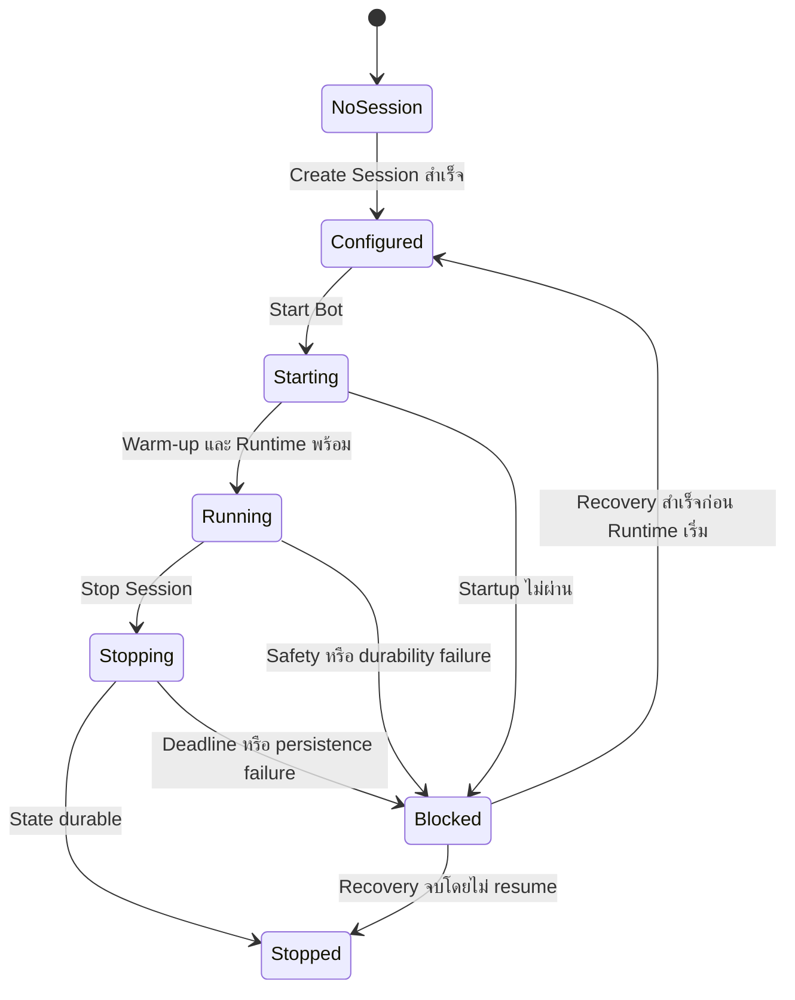
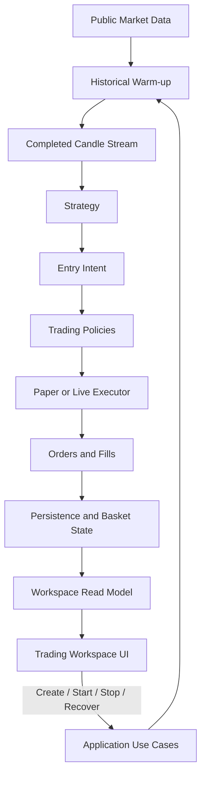

# Unified Trading Workspace Design

## เป้าหมาย

ปรับ Desktop UI ของ TiewTrade ให้เป็น Trading Workspace หน้าเดียวซึ่งจัดวางข้อมูล
คล้าย Binance เพื่อให้ผู้ใช้เห็นสถานะ Bot, Basket, Orders และ Trade History ในบริบท
เดียวกัน โดย Bot เป็นผู้สร้างคำสั่งซื้อขายเท่านั้นและไม่มี Manual Order Terminal

งานนี้เปลี่ยนเฉพาะ information architecture, presentation flow และ application-facing
read model ของ Desktop UI ไม่เปลี่ยน Strategy, capital allocation, Basket lifecycle,
execution policy หรือกฎ Paper/Live ที่กำหนดใน `PRODUCT.md`

## ขอบเขต

งานนี้ครอบคลุม:

- Trading Workspace หน้าเดียวแทนการแยกหน้า Session และ Trade History
- Full Dark Theme สำหรับ application shell, panels, controls และ tables
- TiewTrade Blue เป็นสี primary action
- persistent session/status header
- state-driven Bot Control ด้านขวา
- Open Orders, Position / Basket และ Trade History แบบ tabbed tables
- Notification Center แบบ drawer
- responsive behavior สำหรับหน้าต่าง Desktop ขนาดเล็ก
- thin UI read model และ asynchronous application boundary
- Start, Stop และ Recovery flow สำหรับ Paper Trading
- Chart area และ trade markers เป็น delivery slice สุดท้าย

งานนี้ไม่ครอบคลุม:

- Manual Buy/Sell หรือการส่ง Order จากผู้ใช้
- Live Spot หรือ Live Futures execution ก่อนผ่าน Paper acceptance และ Live gates
- Binance Private API หรือ credentials ระหว่างการพัฒนา UI
- การเปลี่ยน business rule ของ RSI Step Grid, Basket, Entry Pair หรือ capital policy
- การบังคับเก็บ completed candle ทุกแท่งลง SQLite
- การคัดลอก Binance branding, assets หรือ visual identity

## การตัดสินใจหลัก

### Stateful Trading Workspace

ใช้ Workspace หน้าเดียวเป็น information architecture หลัก Bot Control เปลี่ยนเนื้อหา
ตาม Session state ขณะที่ข้อมูลตลาดและข้อมูลซื้อขายยังอยู่ตำแหน่งเดิม การจัดวางนี้ช่วยให้
ผู้ใช้เข้าใจสถานะปัจจุบันโดยไม่ต้องสลับหลายหน้าและไม่ทำให้ UI กลายเป็น Manual Trading
Terminal

```text
┌──────────────────────────────────────────────────────────────┐
│ TiewTrade  Symbol · Timeframe · Mode · Runtime · Freshness  🔔│
├───────────────────────────────────────────────┬──────────────┤
│                                               │              │
│              Chart Area                      │ Bot Control  │
│         (พัฒนาเป็นลำดับสุดท้าย)               │              │
│                                               │              │
├───────────────────────────────────────────────┤              │
│ Open Orders | Position/Basket | Trade History │              │
│                                               │              │
│                 Data Table                    │              │
└───────────────────────────────────────────────┴──────────────┘
```

### Paper-first, Live-compatible

Implementation แรกเชื่อมเฉพาะ Paper Runtime และ fake adapters การออกแบบ state,
read model และ table contracts รองรับ Live ในอนาคตโดยไม่เปิด Live control ก่อนผ่าน
Milestone 4/5 การเลือก `TradeMode.LIVE` ในอนาคตยังต้องผ่าน Preflight, explicit
confirmation และ reconciliation ตาม `PRODUCT.md`

Paper และ Live ใช้ Strategy, risk, capital และ Basket policies ร่วมกัน แต่ใช้ execution
adapters คนละตัว UI ไม่รู้จักหรือเลือก concrete adapter

## Information Architecture

### Persistent Status Header

Header แสดงข้อมูลที่ต้องเห็นตลอดเวลา:

- Symbol
- Timeframe
- Trade Mode
- Market Type
- Strategy Preset
- Runtime State
- Data Freshness
- Notification unread count

สถานะต้องใช้ข้อความร่วมกับสีหรือไอคอนเสมอเพื่อไม่ให้ความหมายขึ้นกับสีเพียงอย่างเดียว

### Main Workspace

พื้นที่หลักประกอบด้วย Chart Area ด้านบนและ tabbed tables ด้านล่าง ระหว่างที่ Chart
ยังไม่ถูกส่งมอบให้แสดง honest placeholder โดยไม่สร้างข้อมูลราคาเทียม ตารางยังทำงานได้
ครบโดยไม่ขึ้นกับ Chart

### Bot Control

Bot Control อยู่ด้านขวา กว้างประมาณ 320–360 px เมื่อหน้าต่างกว้างตั้งแต่ 1,200 px
ขึ้นไป เมื่อหน้าต่างแคบกว่า 1,200 px ให้ยุบเป็น drawer ที่เปิดจากปุ่มซึ่งแสดง state
ปัจจุบันอย่างชัดเจน

### Notification Center

Notification Center เป็น drawer ทุกขนาดหน้าต่าง ปุ่มเปิด drawer แสดง unread count และ
severity สูงสุดที่ยังไม่อ่าน Notification สำคัญต้องปรากฏใน Bot Control หรือ workspace
state ด้วย ไม่พึ่ง drawer เป็นช่องทางเดียว

## Bot Control State Model



### `No Session`

แสดง Session configuration form สำหรับ Symbol, Timeframe, Market Type, Strategy และ
capital/session policies ที่ผู้ใช้เลือกได้ Form แปลงข้อมูลเป็น application request เท่านั้น
และไม่เริ่ม Market Data, Strategy หรือ Execution

### `Configured`

แสดง immutable configuration summary และปุ่ม `Start Bot` การสร้าง Session สำเร็จ
หมายถึง configuration ถูกบันทึกอย่าง durable แต่ Runtime ยังไม่เริ่มทำงาน

### `Starting`

แสดง progress ของ Historical Warm-up, Market Data connection และ Runtime
initialization ปิด control ที่อาจเริ่มซ้ำ และยอมรับผลจาก startup generation ล่าสุดเท่านั้น

### `Running`

แสดง Runtime state, latest price, Data Freshness, Entry Count, Basket Average,
Basket Take Profit และ `Stop Session` ไม่มี Manual Buy/Sell หรือ manual order fields

### `Stopping`

`Stop Session` หมายถึงหยุดสร้าง Entry ใหม่ บันทึก state ปัจจุบัน คง Basket Take Profit
และไม่บังคับปิด Basket ระบบรอให้งานที่กำลังประมวลผลจบภายใน deadline 30 วินาทีและ
ไม่อนุญาตให้กดคำสั่งซ้ำ

### `Stopped`

แสดง durable Session summary ผู้ใช้ยังเปิด Trade History ได้เสมอ

### `Blocked / Recovery Required`

แสดง sanitized failure reason และ recovery action ที่ตรงกับปัญหา ห้ามสร้าง Entry หรือ
ส่ง execution request จนกว่าจะตรวจ state และ durability ผ่าน

## Bottom Table Contracts

### Open Orders

แสดงคำสั่งที่ Bot สร้างและยังไม่ terminal โดยเรียงล่าสุดก่อน:

1. Order ID
2. Created Time
3. Symbol
4. Side
5. Order Type
6. Price
7. Quantity
8. Filled Quantity
9. Status

หนึ่ง Order รองรับหลาย Partial Fills แต่ Partial Fills ไม่สร้าง Position หรือ Basket
ใหม่โดยอัตโนมัติ

### Position / Basket

แสดง Position และ Basket ที่ Bot เป็นเจ้าของ:

1. Symbol และ Market Type
2. Entry Count
3. Total Quantity
4. Average Entry Price
5. Current Price
6. Basket Take Profit
7. Unrealized PnL
8. Liquidation Price สำหรับ Futures
9. Basket Lifecycle

Paper Futures ใช้ deterministic paper policy ส่วน Live Futures ในอนาคตต้องแสดง
authoritative Position, PnL และ Liquidation facts จาก Binance integration

### Trade History

Trade History เปิดดูได้เสมอแม้ไม่มี Active Bot Session และเรียงล่าสุดก่อน:

1. Buy/Sell Time
2. Symbol และ Timeframe
3. Side
4. Entry/Exit Price
5. Quantity
6. Fee
7. Realized PnL
8. Session ID
9. Order ID
10. Execution Source (`Paper` หรือ `Binance`)

Live Trade ในอนาคตต้องบันทึก execution facts จริงที่ reconcile จาก Binance ไม่คำนวณ
execution result แทนด้วยค่าประมาณใน UI

ทุก tab ต้องมี independent Loading, Empty, Error และ Stale Data state ความล้มเหลวของ
tab หนึ่งต้องไม่ล้าง durable result ของ tab อื่น

## Data Flow และ Module Ownership



กฎ boundary:

- UI เป็น thin PySide6 presentation layer
- UI ห้าม import SQLite, Strategy, Binance SDK หรือ Execution adapter
- UI ส่ง semantic application request และแสดง immutable snapshot/read model
- Application Runtime เป็นเจ้าของ Session lifecycle และ completed-candle orchestration
- persistence, network และ Runtime work ทำผ่าน focused workers นอก UI thread
- callback เก่าหลัง state transition หรือ window close ต้องไม่เขียนทับ UI state ใหม่
- Live Runtime ต้อง reconcile authoritative Binance state ก่อนอนุญาตให้ส่ง Order
- Database เก็บ Session, Orders, Fills, Basket และ Trade History
- Chart ในภายหลังโหลด Historical Candles ตามช่วงที่แสดงและใช้ Trade History วาง
  Buy/Sell markers โดย design นี้ไม่บังคับเก็บ Candle ทุกแท่งลงฐานข้อมูล

## Visual System

Full Dark Theme ใช้สีพื้นฐานต่อไปนี้:

| Role | Color | การใช้งาน |
| --- | --- | --- |
| App Background | `#0B0E11` | พื้นหลัง application |
| Primary Surface | `#141A22` | panels และ tables |
| Raised Surface | `#1B2430` | inputs, active surfaces และ drawers |
| Subtle Border | `#2B3441` | เส้นแบ่งที่จำเป็น |
| Primary Text | `#F1F5F9` | headings และข้อมูลหลัก |
| Secondary Text | `#94A3B8` | labels และ metadata |
| Primary Action | TiewTrade Blue | primary buttons, active tabs และ focus |
| Positive / Ready | `#0ECB81` | profit และ successful operational state |
| Negative / Error | `#F6465D` | loss, error และ destructive action |
| Warning / Paper | `#F0B90B` | warning และ Paper mode indicator |

สีเขียวและแดงใช้เฉพาะ semantic trading/operational states ไม่ใช้เป็นสีตกแต่ง Panel ใช้
ระดับสีพื้นผิวและ subtle border แทนกรอบหนา ใช้ border radius 6–8 px และ layout ที่
กระชับแบบ Trading Terminal

`Stop Session` ใช้ destructive styling และ confirmation dialog ตัวเลขราคา Quantity
และ PnL ต้องจัดแนวให้อ่านเปรียบเทียบง่าย Active tab ใช้ TiewTrade Blue และ keyboard
focus ต้องมองเห็นชัด

## Responsive และ Accessibility

- ตั้งแต่ 1,200 px ขึ้นไปแสดง Workspace และ Bot Control คู่กัน
- ต่ำกว่า 1,200 px ให้ Bot Control เป็น drawer และพื้นที่หลักใช้ความกว้างเต็ม
- Notification Center เป็น drawer ทุกขนาด
- ตารางเลื่อนแนวนอนได้โดย header และ selected row state ยังอ่านได้
- หน้าต่างขั้นต่ำประมาณ 1,024 × 700 px
- control สำคัญใช้งานผ่าน keyboard ได้
- state, PnL และ severity ต้องมี accessible text ไม่สื่อสารด้วยสีอย่างเดียว
- modal confirmation ต้องคืน focus ไปยัง control ที่เรียกเมื่อปิด

## Loading, Failure และ Safety Behavior

- ใช้ loading state เฉพาะขอบเขตที่กำลังโหลด ไม่ปิดทั้ง Workspace โดยไม่จำเป็น
- รักษา last-known durable data เมื่อ refresh ล้มเหลวและแสดง `Stale` อย่างชัดเจน
- ไม่แสดง raw exception, credential, database path หรือ transport payload ใน UI
- Start/Stop/Recover action ต้องป้องกัน repeated submission
- durability failure หรือ state mismatch ต้อง fail closed และเปลี่ยนเป็น `Blocked`
- closing window ต้องเริ่ม controlled shutdown โดยไม่ block UI thread
- UI tests และ acceptance tests ใช้ Paper/Fake adapters เท่านั้น

## Delivery Slices

1. **Workspace Shell and Dark Theme** — สร้างหน้าเดียว, header, main grid, drawers,
   tabs และ responsive layout
2. **Trading Workspace Read Model** — สร้าง immutable snapshot สำหรับ UI ผ่าน
   application boundary
3. **Bot Control State Flow** — เชื่อม Session setup และ lifecycle states โดยยังไม่
   เปิด execution side effect ที่ยังไม่มี acceptance
4. **Orders, Basket and Trade History Tabs** — เชื่อม durable/query data พร้อม scoped
   states
5. **Runtime Start, Stop and Recovery Integration** — เชื่อม Paper Runtime ผ่าน
   application use cases และ deadline 30 วินาที
6. **Notification Center and Safety Feedback** — แสดง operational events, blocked
   state และ recovery actions
7. **Chart and Trade Markers** — โหลด Historical/Live Candles และวาง markers เป็น
   delivery slice สุดท้าย
8. **Responsive and Acceptance Verification** — พิสูจน์ Paper Spot/Futures flow,
   resize behavior, keyboard access และ restart/recovery

แต่ละ slice ต้องส่งมอบเป็น tracer bullet ที่ทดสอบได้ ไม่สร้าง generic UI framework,
base class, registry หรือ placeholder Module ล่วงหน้า

## Testing Strategy

### Unit Tests

- read model แปลง application/domain state เป็น exact UI state โดยไม่คำนวณ business
  decision ซ้ำ
- Bot Control state transition และ action availability ถูกต้อง
- Decimal, UTC, PnL และ status formatting ไม่ใช้ float หรือ local timezone
- responsive breakpoint และ drawer state ไม่ทำให้ active operation สูญหาย
- stale generation และ callback หลัง close ถูกละทิ้ง

### UI Tests

- Full Dark Theme ครอบ application shell, panels, controls, tables และ dialogs
- persistent header และ tab switching แสดงค่าถูกต้อง
- Bot Control แสดง control ตาม state และป้องกัน repeated action
- Open Orders, Position / Basket และ Trade History แสดง loading, empty, error และ
  stale states แยกกัน
- Trade History เปิดได้โดยไม่มี Active Session
- Bot Control drawer ทำงานเมื่อหน้าต่างแคบกว่า 1,200 px
- keyboard focus และ semantic status text ตรวจสอบได้ด้วย PySide6 offscreen tests

### Integration และ Acceptance Tests

- Create Session ไม่เริ่ม Runtime
- Start Bot ทำ Warm-up และเริ่ม Paper Runtime ครั้งเดียว
- completed candle flow อัปเดต Orders, Basket และ durable Trade History
- Stop Session หยุด Entry ใหม่ บันทึก state คง Basket Take Profit และไม่ force close
- restart โหลด durable state และเข้าสู่ Recovery/Blocked เมื่อ state ไม่ตรง
- SQLite หรือ Runtime failure fail closed โดย UI ยังตอบสนอง
- ไม่มี Binance Private API, credentials หรือ Live Order ใน Paper acceptance

### Quality Gates

```bash
.venv/bin/python -m pytest -q
.venv/bin/python -m ruff check src tests
.venv/bin/python -m ruff format --check src tests
.venv/bin/python -m mypy
npm --prefix docs-site test
npm --prefix docs-site run check:content
git diff --check
```

Chart slice ต้องเพิ่ม visual interaction tests และ Historical/Live candle tests ก่อนถือว่า
Unified Trading Workspace เสร็จครบ ส่วน slice ก่อนหน้าไม่ต้องรอ Chart เพื่อส่งมอบ
Session controls และ durable trading tables

