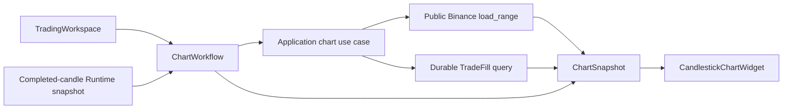

# Dark Candlestick Chart Design

## Goal

DEV-138 replaces the Trading Workspace chart placeholder with a dark candlestick
chart for the configured Paper Session. It helps the user inspect recent price
action and the Bot's durable Buy/Sell fills without creating a manual trading
terminal or changing any trading policy.

## Scope

- Show completed OHLCV candles for the configured symbol and immutable Session
  timeframe.
- Load only the visible historical range from Binance public market data; do not
  persist chart candles in SQLite.
- Add Buy/Sell markers from durable `TradeFill` records using each fill's UTC
  timestamp and price.
- Keep the latest completed candle current while the Paper Runtime is running.
- Show loading, empty, and unavailable states inside the chart area. A chart
  failure must leave Bot Control and all table tabs usable.
- Preserve the existing full dark visual system and responsive Workspace layout.

## Non-goals

- No manual Buy/Sell buttons, order-entry form, order-book, indicator controls,
  chart drawing tools, or Binance branding.
- No live/private Binance API, credentials, SQLite candle cache, or changes to
  strategy, capital, Basket, execution, or lifecycle rules.
- No intrabar candle updates: the chart accepts completed candles only.

## Chosen Approach

The chart is a focused `QWidget` rendered with `QPainter`, backed by immutable
application read models. It avoids a new charting dependency, keeps the terminal
visual style under TiewTrade control, and is sufficient for the first chart
slice. `ui` requests semantic chart data through injected use cases; it never
imports Binance, SQLite, execution, or strategy modules.

Other approaches considered:

1. **PySide6/QPainter (chosen):** no package dependency, controlled dark
   rendering, straightforward UI tests. Initial interaction is limited to
   visible-window paging rather than a full TradingView feature set.
2. **Qt Charts:** supplies a ready-made chart scene but gives less control over
   candlestick and marker presentation and adds a second visual style to
   maintain.
3. **External chart library:** richer interaction but adds package, lifecycle,
   styling, and security surface that is not needed for Internal Alpha.

## Architecture

### Ownership

`application/chart_data.py` owns immutable `ChartSnapshot`, visible-range
request validation, and mapping of public candles plus durable fills into chart
facts. `integrations/binance` implements the historical-candle request through
the existing public endpoint. `integrations/sqlite` remains the owner of durable
fill retrieval. `ui/candlestick_chart.py` only renders a supplied snapshot and
emits visible-range requests.

The concrete desktop composition root injects two use cases into a focused
`ChartWorkflow`:

- `load_chart_candles(session, visible_range) -> ChartSnapshot`
- `list_chart_fills(session_id, visible_range) -> tuple[TradeFill, ...]`

The first use case selects `BinancePublicEndpoints` from the configured market
type and calls the existing public `load_range()`. It closes the public source
after each bounded request. The second use case is a SQLite query restricted to
the configured Session and time window. Neither is called directly by a widget.

### Read Model

`ChartSnapshot` contains:

- Session-bound `symbol` and `timeframe`
- a UTC `[start, end)` visible range
- ascending, unique completed `Candle` values
- marker facts with `fill_id`, `side`, `price`, and `filled_at_utc`
- one of `LOADING`, `READY`, `EMPTY`, or `UNAVAILABLE`, with sanitized message
  only for `UNAVAILABLE`

The model rejects a candle whose symbol/timeframe differs from the Session,
non-UTC ranges, duplicate candle open times, unfinished range membership, or a
marker outside the requested range. This gives the widget a complete and
validated fact set.

### Data Flow

When a Session becomes configured, the workflow requests a default bounded
window ending at the latest completed timeframe boundary. When the user pages
the visible window, it requests the next or previous equal-sized range. When
the Runtime supplies a newer completed candle for the same Session, the
workflow replaces or appends only that completed candle and refreshes durable
markers; an older callback is discarded by the workflow generation check.

### UI Layout and Interaction

The chart occupies the main workspace width above the existing tables. On wide
windows the 360 px Bot Control remains docked right; below the existing 1,200
px breakpoint it remains the existing drawer and the chart uses full width.

The chart header shows `BTCUSDT · 5m · Paper`-style Session facts, a UTC visible
range, and Previous/Next controls. Candles use subtle grid lines, green for
close >= open and red otherwise. A marker is a labeled upward green triangle for
Buy or downward red triangle for Sell, anchored at the durable Fill price and
UTC time. Marker labels are never interpreted as an action control.

`UNAVAILABLE` presents a safe chart-specific message and retry button. It does
not replace the Workspace header, Bot Control, Open Orders, Position/Basket, or
Trade History state.

## Error Handling and Safety

- All public HTTP work runs in `BackgroundTask`; no network call runs on the Qt
  event thread.
- Public-data failures are mapped to `Chart unavailable` with no transport
  payload, path, secret, or exception detail shown in the UI.
- A chart callback is ignored if its request generation or configured Session
  no longer matches the active Workspace state.
- The chart does not use an in-progress candle and cannot start, stop, recover,
  or execute a Bot action.
- `TradeFill` remains authoritative for marker history. No marker is generated
  from a strategy signal or an unfilled order.

## Testing

- Unit tests prove ChartSnapshot Session/range/candle/marker validation and
  marker mapping rules.
- Workflow tests use fake candle and fill use cases to prove loading, latest
  request wins, completed-candle update, and chart-only failure isolation.
- Widget tests verify dark semantic rendering state, Buy/Sell marker text,
  range controls, keyboard-accessible controls, and no marker/action button
  invokes trading behavior.
- Composition tests prove the desktop root selects public endpoints from the
  configured market type without a private endpoint or credentials dependency.
- Existing full UI and Paper Runtime acceptance tests remain required.

## Acceptance Mapping

| DEV-138 acceptance criterion | Design response |
| --- | --- |
| Dark chart and configured timeframe | Session-bound snapshot plus QPainter widget uses workspace dark theme. |
| Historical visible range; no forced SQLite candles | Bounded public `load_range()` use case; SQLite stores only fills. |
| Completed-candle updates only | Workflow accepts only validated completed Candle facts. |
| Durable Buy/Sell markers in UTC | Markers derive only from Session-scoped `TradeFill`. |
| Chart failure isolates other UI | Chart-specific unavailable state and separate workflow. |
| No manual Buy/Sell | Markers are labels only; no trading action is added. |
