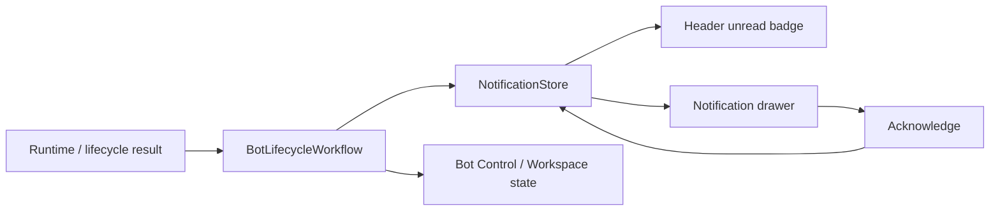

# Notification Center and Safety Feedback Design

## เป้าหมาย

DEV-137 เพิ่ม operational notification สำหรับ Paper Trading Workspace เพื่อให้ผู้ใช้
เห็นเหตุการณ์ lifecycle และ safety ที่สำคัญโดยไม่ต้องอ่าน raw logs และไม่เปลี่ยน
durable trading state, strategy หรือ execution behavior

## ขอบเขต

- แสดง unread count และ severity สูงสุดที่ยังไม่ acknowledge ใน Header
- แสดง Notification Center drawer พร้อมเวลา UTC, severity, category และข้อความที่
  sanitize แล้ว
- แสดง `Blocked`, `Stale` และ recovery result ใน Bot Control/Workspace state ตามเดิม
  โดย Notification Center เป็นช่องทางเสริม ไม่ใช่ source เดียวของ safety state
- รองรับเหตุการณ์ซ้ำโดยไม่ทำให้ UI block หรือสร้าง notification ซ้ำต่อ snapshot เดียว
- ใช้ Paper/fake adapters ในทุก test; ไม่เพิ่ม Live execution, Binance Private API,
  credentials หรือ network call ใหม่

## สิ่งที่ไม่ทำ

- ไม่ persist notification ลง SQLite ใน DEV-137
- ไม่เพิ่ม log viewer, alert delivery ภายนอก, chart หรือ trade marker
- ไม่สร้าง state จาก raw exception, database path, credential หรือ transport payload

## Architecture

Notification read model เป็น owner ใน `ui` เพราะเป็นข้อมูล presentation ที่สร้างจาก
immutable `BotLifecycleResult` และ `TradingWorkspaceSnapshot` ที่ผ่าน application
boundary แล้ว จึงไม่มี dependency จาก UI กลับไป SQLite, strategy, session หรือ
market-data runtime

`NotificationStore` เก็บรายการในหน่วยความจำ, identity ของเหตุการณ์ล่าสุด และ
acknowledged flag เท่านั้น แต่ละ record มี `occurred_at_utc`, `severity`, `category`,
`message` และ stable fingerprint สำหรับ deduplicate ซ้ำจาก snapshot เดิม

## Event Mapping

| Input state | Severity | Category | Message rule |
| --- | --- | --- | --- |
| `BLOCKED` | Critical | Safety | ใช้ sanitized lifecycle reason เท่านั้น |
| `STALE` | Warning | Market data | บอกว่าข้อมูลไม่สดและหยุด Entry ใหม่ |
| recovery completed | Info | Recovery | บอกผล Recovery แบบ safe state |
| `RUNNING`/`STOPPED` transition | Info | Runtime | บอก transition ที่เกิดขึ้น |

Store รับเฉพาะ message ที่ผ่าน `BotLifecycleResult` แล้ว และใช้ข้อความกำหนดเองสำหรับ
state ที่ไม่มีข้อความ จึงไม่แสดง exception detail หรือ payload โดยตรง

## Interaction

- ปุ่ม Notification ใน Header แสดง unread count และ accessible text ที่มี severity
  สูงสุด
- drawer เปิดได้ทุกขนาดหน้าต่าง, รายการเรียงใหม่ไปเก่า และแต่ละรายการมี UTC time,
  severity, category, message และปุ่ม Acknowledge
- Acknowledge เปลี่ยนเฉพาะ read model ในหน่วยความจำ ไม่ลบ Basket, Fill, Session หรือ
  lifecycle marker
- เหตุการณ์ fingerprint เดิมที่เกิดซ้ำจาก UI refresh ไม่เพิ่ม row ใหม่; เหตุการณ์เดิม
  ที่ถูก acknowledge ยังคง acknowledged จนกว่าจะเกิด transition ใหม่ที่ fingerprint ต่าง

## Failure และ Safety

- ไม่มี event ใหม่เมื่อ snapshot ไม่มี state ที่ต้องแจ้ง
- repeated publish และ repeated acknowledge ต้อง idempotent
- failure ของ notification presentation ต้องไม่ขัดขวาง lifecycle action หรือการ render
  workspace ล่าสุด
- UI รักษา state `Blocked`/`Stale` ใน Bot Control แม้ drawer ปิดหรือ notification ถูก
  acknowledge แล้ว

## Verification

- unit tests: mapping severity/category, sanitization, deduplication, acknowledge และ
  unread/highest severity
- Qt UI tests: Header badge, drawer rows/UTC/accessible text และ UI ไม่ค้างเมื่อ event ซ้ำ
- deterministic workflow tests: `Blocked`, `Stale`, recovery และ stale callback
- acceptance tests: Paper/fake lifecycle path โดยยืนยันว่าไม่มี private endpoint,
  credential, SQLite mutation หรือ Live adapter

## Self-review

- ใช้ read model ใน UI เท่านั้นและไม่เพิ่ม persistence โดยไม่มี requirement
- `Blocked`/`Stale` ยังคงมี authoritative visual state นอก drawer
- ข้อความทุกประเภทผ่าน lifecycle result หรือข้อความกำหนดเอง จึงไม่ expose raw secret
  หรือ transport detail
- Chart, notifications ภายนอก และ Live execution อยู่นอกขอบเขตชัดเจน
