# User Flow

## Document Purpose

This document defines the Version 1 user journeys and system flows for TiewTrade, a desktop trading bot application for non-technical Binance traders.

The document is intended to support later Architecture Design and Database Design phases by clarifying product behavior, required states, user decisions, recovery paths, and error handling. It does not define UI mockups, technical architecture, database schemas, or source code.

## Source Documents

- `/docs/project-overview.md`
- `/docs/screen-list.md`

## Version 1 Scope Boundary

Version 1 includes:

- Offline License File validation.
- First-run setup wizard.
- Binance Spot and Binance Futures support.
- Binance Main Account and Sub Account support.
- One built-in proprietary strategy.
- RSI Entry, ATR Take Profit, and Multi-Entry / DCA Position Management.
- Dashboard, account management, trade history, position monitoring, start bot, stop bot, and risk settings.

Version 1 excludes:

- Multiple strategies.
- Strategy builder.
- AI strategy builder.
- Copy trading.
- Mobile app.
- Web app.
- Telegram notifications.
- Portfolio management.
- Marketplace.

## Flow Notation

Text-based diagrams use the following simple notation:

```text
Step
↓
Next Step
↓
Decision?
├─ Yes → Outcome
└─ No → Alternative Outcome
```

Mermaid diagrams are included where they clarify branching or recovery behavior.

## User-Facing Product States

The application should expose simple, understandable states to the user:

- `License Required`: The app cannot be used until a valid Offline License File is selected and validated locally.
- `Setup Required`: The app is licensed, but required bot configuration is incomplete.
- `Stopped`: Configuration exists and the bot is not trading.
- `Starting`: The user started the bot and the app is preparing live operation.
- `Running`: The bot is active.
- `Stopping`: The user requested the bot to stop and the app is completing the stop action.
- `Disconnected`: The app cannot currently reach Binance or validate account state.
- `Error`: A blocking issue requires user attention or recovery.
- `Sync Required`: The app restarted or recovered and must verify positions, orders, and bot state before normal operation.

## Primary Journey Overview

```text
Open Application
↓
Validate License
↓
Complete First-Run Setup
↓
Review Configuration
↓
Start Bot or Start Later
↓
Dashboard
↓
Monitor Positions and Trade History
↓
Stop Bot or Adjust Settings While Stopped
```

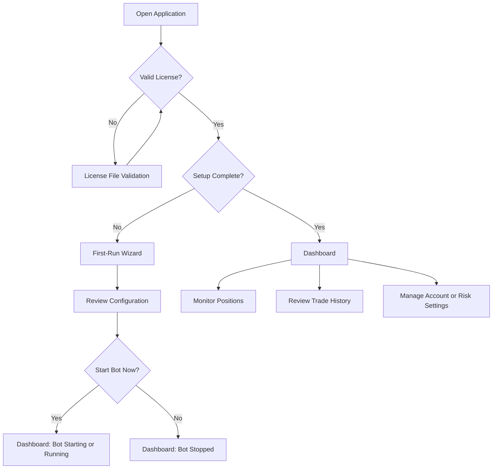
```mermaid
flowchart TD
    A["Open Application"] --> B{"Valid License?"}
    B -- "No" --> C["License File Validation"]
    C --> B
    B -- "Yes" --> D{"Setup Complete?"}
    D -- "No" --> E["First-Run Wizard"]
    E --> F["Review Configuration"]
    F --> G{"Start Bot Now?"}
    G -- "Yes" --> H["Dashboard: Bot Starting or Running"]
    G -- "No" --> I["Dashboard: Bot Stopped"]
    D -- "Yes" --> J["Dashboard"]
    J --> K["Monitor Positions"]
    J --> L["Review Trade History"]
    J --> M["Manage Account or Risk Settings"]
```

## Mandatory Version 1 User Flows

## 1. First Launch Setup Flow

### Flow Name

First Launch Setup Flow

### Goal

Guide a new user from opening the desktop application for the first time to a complete bot configuration, with the option to start the bot immediately or start later.

### Preconditions

- The application is installed.
- No completed local setup configuration exists.
- The user has or can obtain a valid lifetime license.
- The user has a Binance account and can provide API credentials.

### Main Flow

```text
Open Application
↓
App Launch / Loading Screen
↓
License Validation
↓
License File Validation if required
↓
First-Run Welcome Screen
↓
Connect Binance Account
↓
Select Spot or Futures
↓
Select Trading Pair
↓
Configure Capital
↓
Configure Risk Settings
↓
Review Configuration
↓
Start Bot or Start Later
↓
Main Dashboard
```

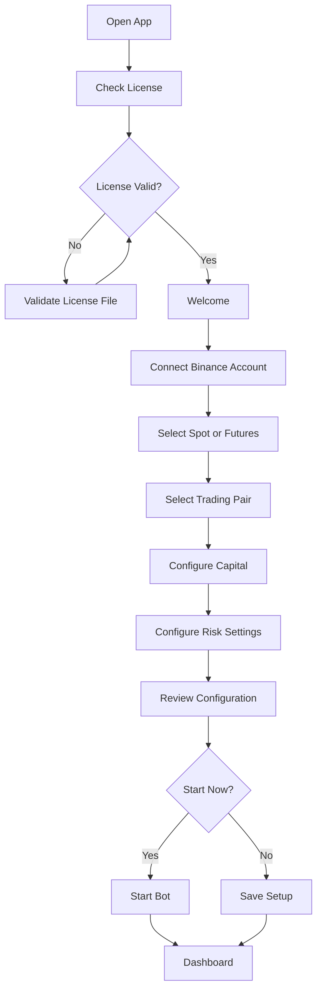
```mermaid
flowchart TD
    A["Open App"] --> B["Check License"]
    B --> C{"License Valid?"}
    C -- "No" --> D["Validate License File"]
    D --> C
    C -- "Yes" --> E["Welcome"]
    E --> F["Connect Binance Account"]
    F --> G["Select Spot or Futures"]
    G --> H["Select Trading Pair"]
    H --> I["Configure Capital"]
    I --> J["Configure Risk Settings"]
    J --> K["Review Configuration"]
    K --> L{"Start Now?"}
    L -- "Yes" --> M["Start Bot"]
    L -- "No" --> N["Save Setup"]
    M --> O["Dashboard"]
    N --> O
```

### Alternative Flow

- User exits setup before completion: application remains in `Setup Required` state.
- User chooses Start Later: configuration is saved and Dashboard opens with bot status `Stopped`.
- User edits a setup section from Review Configuration: user returns to the selected wizard step, then proceeds again to review.
- User selects Futures: the flow includes additional risk messaging before review and start.

### Error Flow

- Invalid license redirects to Offline License File Validation Flow.
- Invalid API credentials keep the user on Connect Binance Account.
- Missing Binance permissions keep the user on the relevant step with a plain-language correction message.
- Unsupported trading pair keeps the user on Select Trading Pair.
- Invalid capital or risk settings prevent continuation.
- Network failure pauses setup and offers Retry.

### Success Outcome

- A valid Version 1 bot configuration exists.
- The user reaches the Dashboard.
- Bot status is either `Running`, `Starting`, or `Stopped` depending on the final user choice.

## 2. Offline License File Validation Flow

### Flow Name

Offline License File Validation Flow

### Goal

Validate the user's Offline License File locally before allowing product access.

### Preconditions

- The application is installed.
- The user has access to an Offline License File.
- The app can read the selected local license file.

### Main Flow

```text
Open Application
↓
License Validation
↓
No Valid License Found
↓
License File Validation Screen
↓
User Selects Offline License File
↓
Validate License File Locally
↓
License File Accepted
↓
Continue to Setup or Dashboard
```

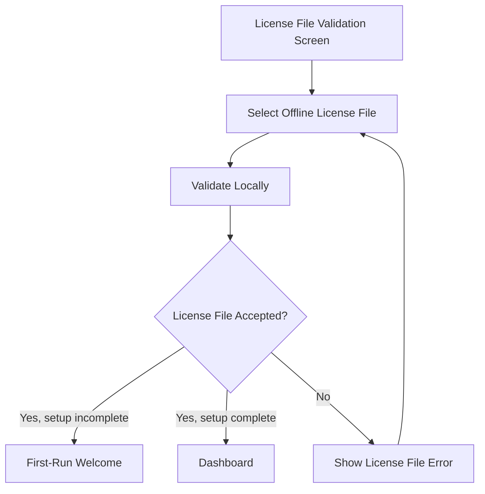
```mermaid
flowchart TD
    A["License File Validation Screen"] --> B["Select Offline License File"]
    B --> C["Validate Locally"]
    C --> D{"License File Accepted?"}
    D -- "Yes, setup incomplete" --> E["First-Run Welcome"]
    D -- "Yes, setup complete" --> F["Dashboard"]
    D -- "No" --> G["Show License File Error"]
    G --> B
```

### Alternative Flow

- User already has a valid local license file state: application skips license file selection and routes to setup or Dashboard.
- User changes license file from License Management: application returns to License File Validation Screen.
- User exits validation: application closes or remains blocked from product access.

### Error Flow

- Missing file: ask the user to select a valid Offline License File.
- Invalid file: show correction message and allow selecting another file.
- Expired, corrupted, or unsupported license file: show a clear message and support path.
- File read failure: show a local file access error and allow retry or file replacement.

### Success Outcome

- License status is valid.
- Product access is unlocked.
- User is routed to First-Run Welcome if setup is incomplete, or Dashboard if setup is complete.

## 3. Application Startup Flow

### Flow Name

Application Startup Flow

### Goal

Route returning users to the correct application state and restore safe bot visibility after launch.

### Preconditions

- The application is installed.
- A local application state may or may not exist.
- A valid Offline License File may or may not already be available locally.

### Main Flow

```text
Open Application
↓
Load Local App State
↓
Validate License
↓
Check Setup Completion
↓
Restore Last Known Bot State
↓
Synchronize Account, Position, and Orders if needed
↓
Open Dashboard
```

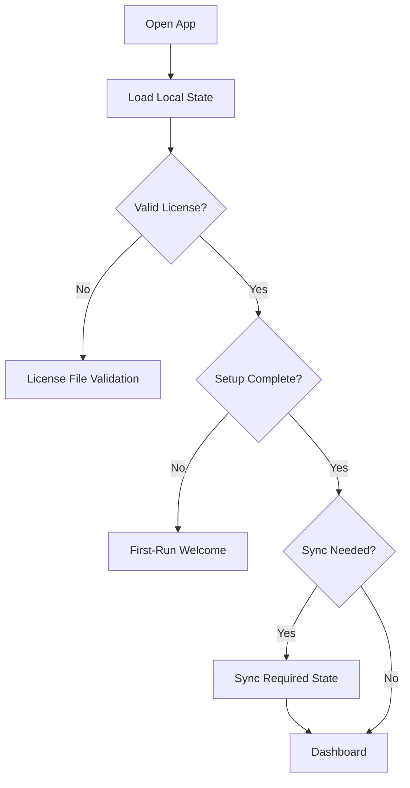
```mermaid
flowchart TD
    A["Open App"] --> B["Load Local State"]
    B --> C{"Valid License?"}
    C -- "No" --> D["License File Validation"]
    C -- "Yes" --> E{"Setup Complete?"}
    E -- "No" --> F["First-Run Welcome"]
    E -- "Yes" --> G{"Sync Needed?"}
    G -- "Yes" --> H["Sync Required State"]
    H --> I["Dashboard"]
    G -- "No" --> I
```

### Alternative Flow

- Setup incomplete: route to First-Run Welcome or the last incomplete wizard step.
- Bot was stopped before exit: Dashboard opens with `Stopped` status.
- Bot was running before exit: application enters `Sync Required` before showing normal running state.
- License file is missing or invalid: application routes to License File Validation Screen.

### Error Flow

- Corrupted or unreadable configuration: route to Error / Connection Issue Screen with recovery options.
- License invalid: route to License File Validation Screen.
- Binance connection unavailable: open Dashboard in `Disconnected` or `Sync Required` state with Retry.

### Success Outcome

- The user reaches the appropriate screen.
- Local state is restored safely.
- The user can clearly see whether the bot is stopped, running, disconnected, or needs synchronization.

## 4. Dashboard Navigation Flow

### Flow Name

Dashboard Navigation Flow

### Goal

Allow users to move between primary Version 1 screens while keeping bot status visible and controls easy to access.

### Preconditions

- Valid license exists.
- Setup is complete.
- User is on the Main Dashboard.

### Main Flow

```text
Dashboard
↓
Choose Navigation Item
├─ Positions → Position Monitoring
├─ Trade History → Trade History
├─ Account → Account Management
├─ Risk Settings → Risk Settings
└─ License → License Management
↓
Return to Dashboard
```

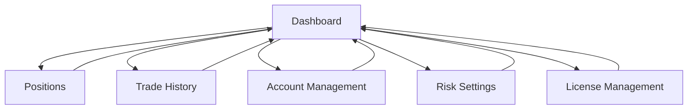
```mermaid
flowchart TD
    A["Dashboard"] --> B["Positions"]
    A --> C["Trade History"]
    A --> D["Account Management"]
    A --> E["Risk Settings"]
    A --> F["License Management"]
    B --> A
    C --> A
    D --> A
    E --> A
    F --> A
```

### Alternative Flow

- User selects current position summary: navigate to Position Monitoring.
- User selects recent trade activity: navigate to Trade History.
- User selects account status: navigate to Account Management.
- User selects risk summary: navigate to Risk Settings.

### Error Flow

- If a screen cannot load current data, show an inline error and preserve navigation.
- If license becomes invalid, route to License File Validation Screen.
- If account connection fails, keep navigation available but show `Disconnected` status.

### Success Outcome

- User can move between all primary screens without losing bot status awareness.
- User always has a clear route back to Dashboard.

## 5. Add Binance Account Flow

### Flow Name

Add Binance Account Flow

### Goal

Connect and validate a Binance Main Account for Spot and/or Futures use.

### Preconditions

- Valid license exists.
- User is in first-run setup or Account Management.
- User has Binance API key and secret for the Main Account.
- Bot is stopped if replacing or adding an account after setup.

### Main Flow

```text
Open Connect Binance Account
↓
Select Main Account
↓
Enter API Key
↓
Enter Secret Key
↓
Review Permission Guidance
↓
Test Connection
↓
Connection Valid
↓
Save Account
↓
Continue Setup or Return to Account Management
```

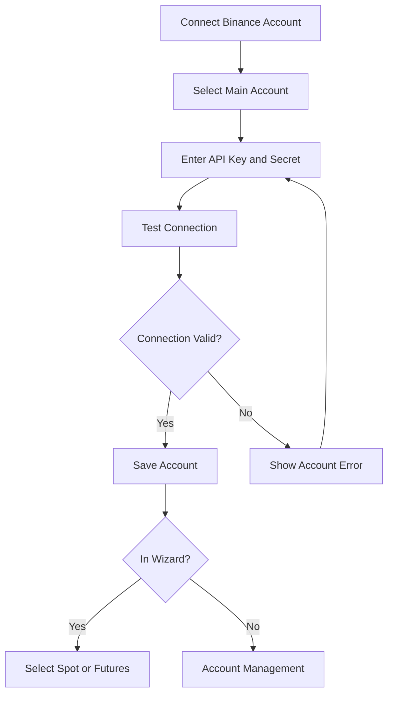
```mermaid
flowchart TD
    A["Connect Binance Account"] --> B["Select Main Account"]
    B --> C["Enter API Key and Secret"]
    C --> D["Test Connection"]
    D --> E{"Connection Valid?"}
    E -- "Yes" --> F["Save Account"]
    F --> G{"In Wizard?"}
    G -- "Yes" --> H["Select Spot or Futures"]
    G -- "No" --> I["Account Management"]
    E -- "No" --> J["Show Account Error"]
    J --> C
```

### Alternative Flow

- User cancels before saving: return to previous screen with no account changes.
- User enters credentials but does not test: Continue remains disabled.
- User later changes market mode: permissions are checked again for the selected mode.

### Error Flow

- Invalid API key: show Invalid API Key flow.
- Invalid secret key: show Invalid Secret Key flow.
- Missing Spot or Futures permissions: show permission-specific message.
- Withdrawal permission detected or suspected: warn user and block or strongly discourage continuation according to product policy.
- Network or Binance API failure: show retry path.

### Success Outcome

- Main Account connection is saved.
- Account status is shown as connected.
- User can continue setup or return to account overview.

## 6. Add Binance Sub Account Flow

### Flow Name

Add Binance Sub Account Flow

### Goal

Connect and validate a Binance Sub Account for bot operation while making the selected account context clear.

### Preconditions

- Valid license exists.
- User is in first-run setup or Account Management.
- User has API credentials for the intended Sub Account.
- Bot is stopped if replacing or adding an account after setup.

### Main Flow

```text
Open Connect Binance Account
↓
Select Sub Account
↓
Enter Sub Account API Key
↓
Enter Sub Account Secret Key
↓
Review Permission Guidance
↓
Test Connection
↓
Connection Valid
↓
Confirm Sub Account Context
↓
Save Account
↓
Continue Setup or Return to Account Management
```

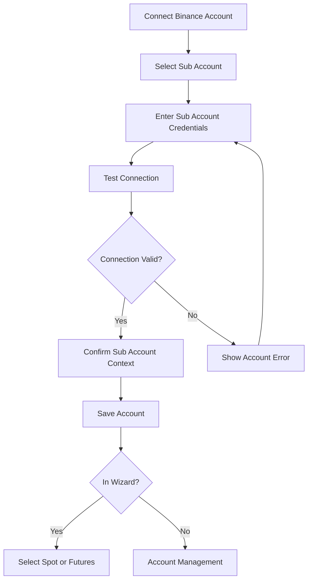
```mermaid
flowchart TD
    A["Connect Binance Account"] --> B["Select Sub Account"]
    B --> C["Enter Sub Account Credentials"]
    C --> D["Test Connection"]
    D --> E{"Connection Valid?"}
    E -- "Yes" --> F["Confirm Sub Account Context"]
    F --> G["Save Account"]
    G --> H{"In Wizard?"}
    H -- "Yes" --> I["Select Spot or Futures"]
    H -- "No" --> J["Account Management"]
    E -- "No" --> K["Show Account Error"]
    K --> C
```

### Alternative Flow

- User switches from Sub Account to Main Account before saving: account type selection updates and credentials are revalidated.
- User cancels: return to previous screen without saving.
- User cannot confirm account context: remain on the connection step and advise verifying Binance API setup.

### Error Flow

- Credentials belong to an unexpected account context: show clear warning and require correction.
- Missing Sub Account permissions: show correction message.
- Invalid key, invalid secret, network failure, or Binance API failure follows the dedicated error flows.

### Success Outcome

- Sub Account connection is saved.
- Dashboard and setup review clearly identify the account as a Sub Account.
- Bot operation uses the selected Sub Account context.

## 7. Edit Account Flow

### Flow Name

Edit Account Flow

### Goal

Allow the user to replace or update Binance account credentials safely.

### Preconditions

- Valid license exists.
- User has completed or started account setup.
- User is on Account Management.
- Bot is stopped before account credentials can be changed.

### Main Flow

```text
Open Account Management
↓
Select Replace Account
↓
Confirm Bot Is Stopped
↓
Enter New Account Credentials
↓
Test Connection
↓
Connection Valid
↓
Review Account Type and Permissions
↓
Save Account Changes
↓
Return to Account Management
```

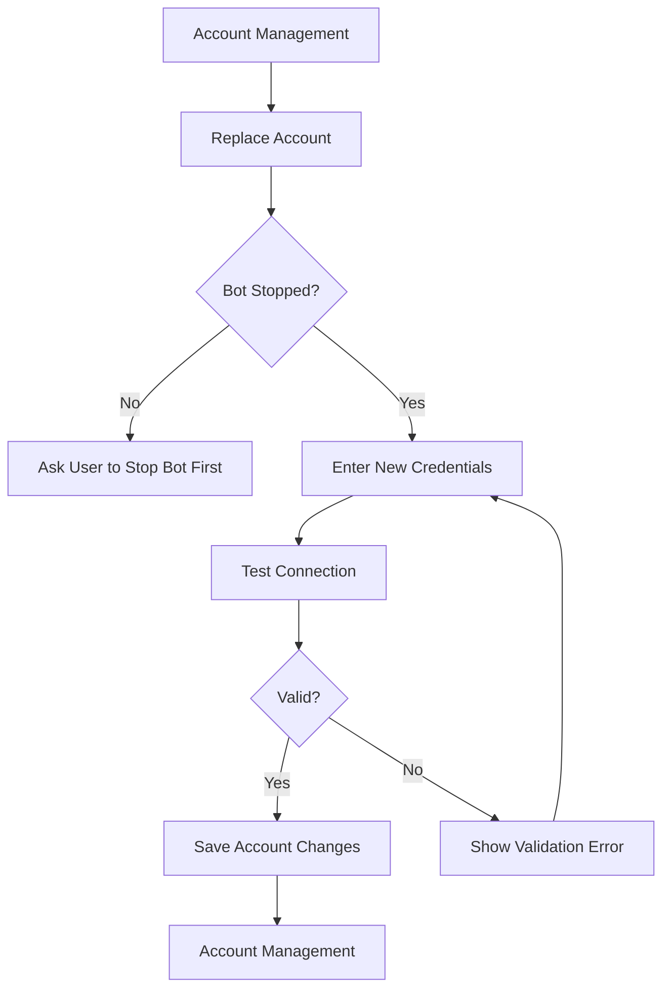
```mermaid
flowchart TD
    A["Account Management"] --> B["Replace Account"]
    B --> C{"Bot Stopped?"}
    C -- "No" --> D["Ask User to Stop Bot First"]
    C -- "Yes" --> E["Enter New Credentials"]
    E --> F["Test Connection"]
    F --> G{"Valid?"}
    G -- "Yes" --> H["Save Account Changes"]
    H --> I["Account Management"]
    G -- "No" --> J["Show Validation Error"]
    J --> E
```

### Alternative Flow

- User cancels replacement: existing account remains active.
- User changes account type from Main Account to Sub Account or vice versa: setup review and Dashboard labels update.
- User edits account during incomplete setup: returns to the relevant wizard step after saving.

### Error Flow

- Bot running: block account edit and prompt user to stop bot first.
- New account lacks permissions for current market mode: save is blocked or current market configuration must be changed.
- Invalid credentials, network failure, or Binance API failure follow dedicated error flows.

### Success Outcome

- Account credentials are replaced.
- The app shows updated account status.
- Bot remains stopped until the user starts it again.

## 8. Remove Account Flow

### Flow Name

Remove Account Flow

### Goal

Allow the user to remove the connected Binance account while preventing accidental loss of required bot configuration.

### Preconditions

- Valid license exists.
- A Binance account is connected.
- User is on Account Management.
- Bot is stopped.

### Main Flow

```text
Open Account Management
↓
Select Remove Account
↓
Show Confirmation
↓
User Confirms Removal
↓
Remove Account Connection
↓
Set Configuration to Account Required
↓
Return to Account Management
```

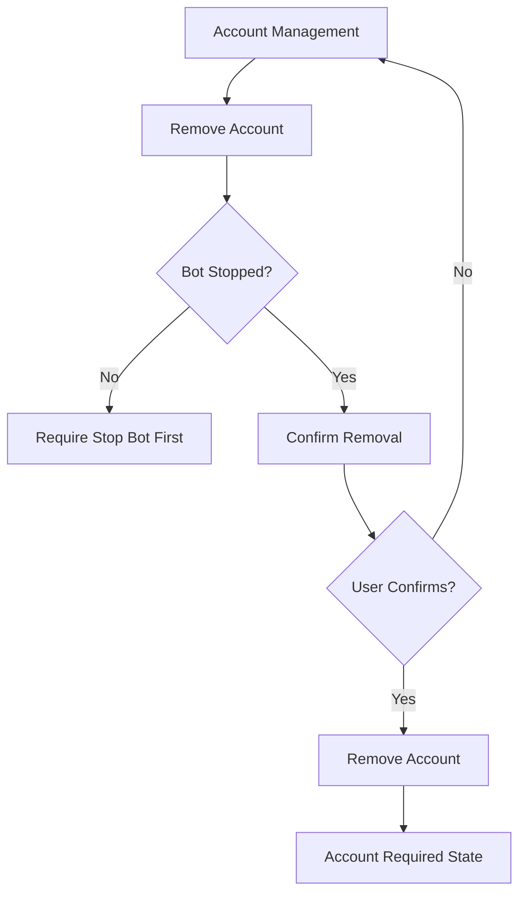
```mermaid
flowchart TD
    A["Account Management"] --> B["Remove Account"]
    B --> C{"Bot Stopped?"}
    C -- "No" --> D["Require Stop Bot First"]
    C -- "Yes" --> E["Confirm Removal"]
    E --> F{"User Confirms?"}
    F -- "No" --> A
    F -- "Yes" --> G["Remove Account"]
    G --> H["Account Required State"]
```

### Alternative Flow

- User cancels confirmation: no changes are made.
- User removes account during incomplete setup: setup remains incomplete and returns to Connect Binance Account.

### Error Flow

- Bot running: block removal and prompt Stop Bot Flow.
- Account removal fails locally: show error and keep existing account state unchanged.

### Success Outcome

- Account connection is removed.
- Bot cannot be started until a valid account is added.
- Dashboard and Account Management show that account setup is required.

## 9. Start Bot Flow

### Flow Name

Start Bot Flow

### Goal

Allow the user to start automated trading only after all required configuration, account, license, balance, and risk checks pass.

### Preconditions

- Valid license exists.
- Setup is complete.
- Binance account is connected and valid.
- Trading pair is supported.
- Capital and risk settings are valid.
- Bot is currently stopped.

### Main Flow

```text
Dashboard or Wizard Start Bot Step
↓
User Selects Start Bot
↓
Validate License
↓
Validate Account Connection
↓
Validate Market Mode and Pair
↓
Validate Capital and Balance
↓
Validate Risk Settings
↓
Show Risk Acknowledgment if Required
↓
Set Bot Status to Starting
↓
Synchronize Account, Position, and Orders
↓
Begin Built-In Strategy Monitoring
↓
Set Bot Status to Running
```

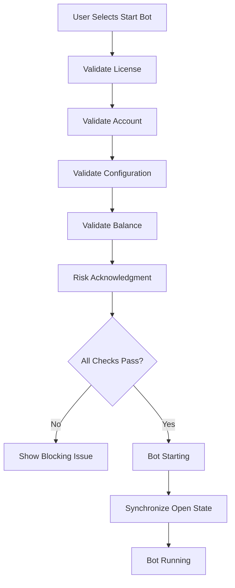
```mermaid
flowchart TD
    A["User Selects Start Bot"] --> B["Validate License"]
    B --> C["Validate Account"]
    C --> D["Validate Configuration"]
    D --> E["Validate Balance"]
    E --> F["Risk Acknowledgment"]
    F --> G{"All Checks Pass?"}
    G -- "No" --> H["Show Blocking Issue"]
    G -- "Yes" --> I["Bot Starting"]
    I --> J["Synchronize Open State"]
    J --> K["Bot Running"]
```

### Alternative Flow

- User starts from final wizard step: successful start routes to Dashboard.
- User starts from Dashboard: Dashboard remains visible and bot status changes to `Starting`, then `Running`.
- User chooses Start Later in wizard: configuration is saved and bot remains `Stopped`.
- Futures mode requires additional acknowledgment before start.

### Error Flow

- Invalid configuration blocks start and routes user to the relevant setup or settings screen.
- Insufficient balance blocks start and routes user to capital configuration or Dashboard message.
- Unsupported pair blocks start and routes user to trading pair selection.
- Network or Binance API failure sets status to `Disconnected` or `Error`.
- Open position or order mismatch triggers synchronization before bot can run.

### Success Outcome

- Bot status becomes `Running`.
- Dashboard shows active configuration and monitoring state.
- Trading Execution Flow begins.

## 10. Stop Bot Flow

### Flow Name

Stop Bot Flow

### Goal

Allow the user to stop automated trading intentionally, with clear communication about open positions and pending actions.

### Preconditions

- Bot status is `Running`, `Starting`, or `Disconnected`.
- User is on Dashboard or Position Monitoring.

### Main Flow

```text
User Selects Stop Bot
↓
Open Stop Bot Confirmation
↓
Show Current Bot Status
↓
Show Open Position Summary if Present
↓
Explain Stop Behavior
↓
User Confirms Stop
↓
Set Bot Status to Stopping
↓
Stop New Strategy Actions
↓
Do Not Close Existing Positions
↓
Synchronize Current Position and Orders
↓
Set Bot Status to Stopped
↓
Return to Dashboard
```

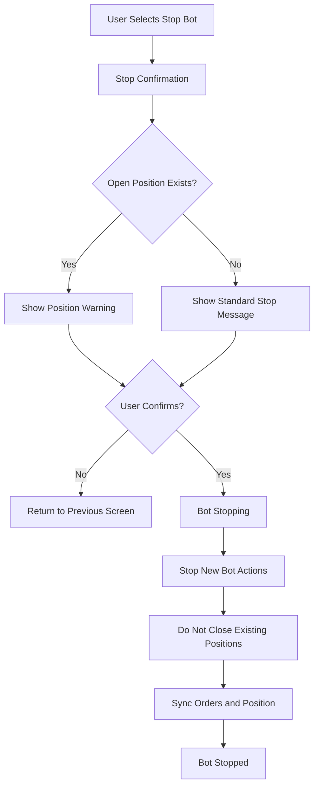
```mermaid
flowchart TD
    A["User Selects Stop Bot"] --> B["Stop Confirmation"]
    B --> C{"Open Position Exists?"}
    C -- "Yes" --> D["Show Position Warning"]
    C -- "No" --> E["Show Standard Stop Message"]
    D --> F{"User Confirms?"}
    E --> F
    F -- "No" --> G["Return to Previous Screen"]
    F -- "Yes" --> H["Bot Stopping"]
    H --> I["Stop New Bot Actions"]
    I --> J["Do Not Close Existing Positions"]
    J --> K["Sync Orders and Position"]
    K --> L["Bot Stopped"]
```

### Alternative Flow

- User cancels confirmation: bot remains in its previous state.
- Bot is already stopped: show stopped status and no confirmation is needed.
- Bot is disconnected: user can request stop locally, then app completes synchronization when exchange connection returns.

### Error Flow

- Stop action cannot complete due to network failure: status becomes `Disconnected` with recovery instructions.
- Binance API failure prevents order or position confirmation: status becomes `Sync Required` or `Error`.
- Existing Spot holdings or Futures positions remain under user control and are not automatically closed or liquidated.

### Success Outcome

- Bot no longer initiates new trading actions.
- Dashboard shows `Stopped`.
- User understands whether any open position still exists.
- Any existing position remains visible and under user control.

## 11. Trading Execution Flow

### Flow Name

Trading Execution Flow

### Goal

Describe the live bot journey from running state through built-in strategy monitoring, order activity, position updates, and trade history recording.

### Preconditions

- Bot status is `Running`.
- License, account, market mode, pair, capital, and risk settings are valid.
- Initial synchronization is complete.

### Main Flow

```text
Bot Running
↓
Monitor Selected Trading Pair
↓
Evaluate Built-In Proprietary Strategy
↓
RSI Entry Condition Identified
↓
Validate Capital and Risk Limits
↓
Place Entry Order
↓
Update Position Monitoring
↓
Apply Multi-Entry / DCA Position Management if Conditions Require
↓
Calculate ATR-Based Take Profit Target
↓
Place or Update Take Profit Action
↓
Order Filled, Rejected, Canceled, or Failed
↓
Record Trade Activity
↓
Update Dashboard, Position Monitoring, and Trade History
```

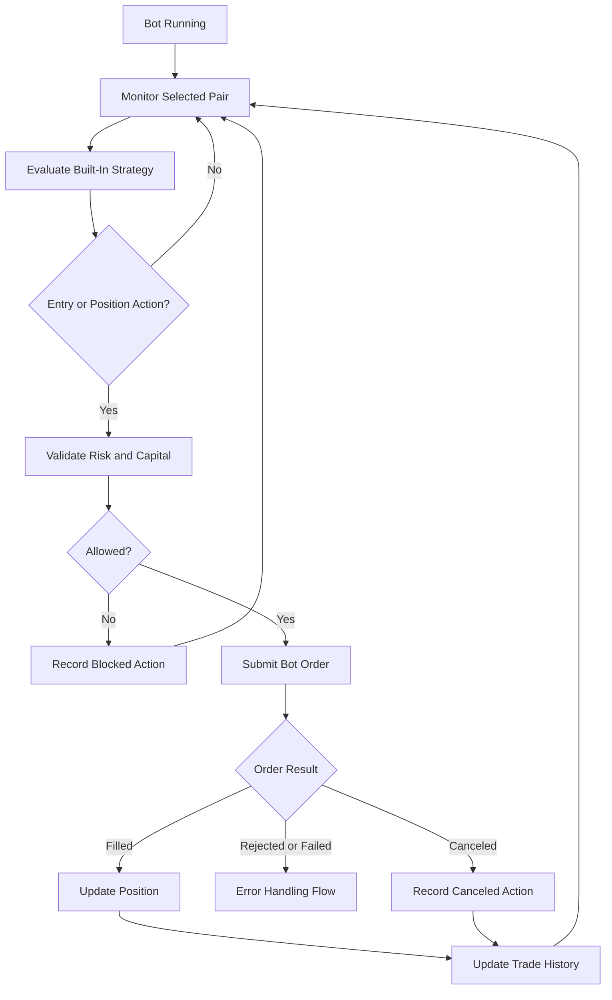
```mermaid
flowchart TD
    A["Bot Running"] --> B["Monitor Selected Pair"]
    B --> C["Evaluate Built-In Strategy"]
    C --> D{"Entry or Position Action?"}
    D -- "No" --> B
    D -- "Yes" --> E["Validate Risk and Capital"]
    E --> F{"Allowed?"}
    F -- "No" --> G["Record Blocked Action"]
    G --> B
    F -- "Yes" --> H["Submit Bot Order"]
    H --> I{"Order Result"}
    I -- "Filled" --> J["Update Position"]
    I -- "Rejected or Failed" --> K["Error Handling Flow"]
    I -- "Canceled" --> L["Record Canceled Action"]
    J --> M["Update Trade History"]
    L --> M
    M --> B
```

### Alternative Flow

- No entry signal exists: bot continues monitoring.
- DCA condition is not met: no additional entry is placed.
- Take profit condition is not met: position remains monitored.
- Spot and Futures share strategy logic but show different risk context and position behavior.

### Error Flow

- Order rejected: follow Order Rejected flow.
- Insufficient balance: follow Insufficient Balance flow.
- Binance API failure: follow Binance API Failure flow.
- Network failure: follow Network Connection Failure flow.
- Configuration becomes invalid while running: set bot to safe error or stopped state according to product policy.

### Success Outcome

- Bot actions are reflected in Dashboard, Position Monitoring, and Trade History.
- The user can understand what happened without needing to know strategy internals.
- Bot continues running until stopped or blocked by an error.

## 12. Position Monitoring Flow

### Flow Name

Position Monitoring Flow

### Goal

Allow users to understand active position status, DCA progress, take profit progress, and exposure.

### Preconditions

- Valid license exists.
- Setup is complete.
- User is on Dashboard or Position Monitoring.

### Main Flow

```text
Dashboard
↓
User Opens Position Monitoring
↓
Load Active Position State
↓
Show Pair, Market Mode, and Bot Status
↓
Show Entry Summary
↓
Show Multi-Entry / DCA Progress
↓
Show ATR Take Profit Progress
↓
Show Exposure and Risk Values
↓
User Returns to Dashboard or Stops Bot
```

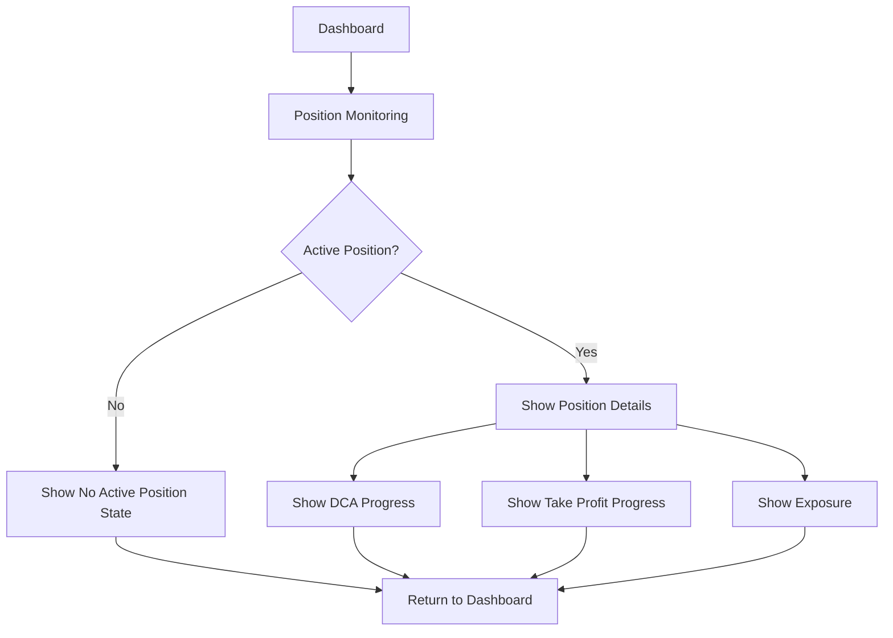
```mermaid
flowchart TD
    A["Dashboard"] --> B["Position Monitoring"]
    B --> C{"Active Position?"}
    C -- "No" --> D["Show No Active Position State"]
    C -- "Yes" --> E["Show Position Details"]
    E --> F["Show DCA Progress"]
    E --> G["Show Take Profit Progress"]
    E --> H["Show Exposure"]
    D --> I["Return to Dashboard"]
    F --> I
    G --> I
    H --> I
```

### Alternative Flow

- No active position: show empty state and return option.
- Bot stopped with open position: show position state and clarify bot status.
- User selects Stop Bot from this screen: open Stop Bot Confirmation Screen.

### Error Flow

- Position data cannot be loaded: show recoverable error and Retry.
- Position differs from last local state: run Open Position Synchronization flow.
- Binance API unavailable: show `Disconnected` status.

### Success Outcome

- User can see current position state and risk exposure.
- User can return to Dashboard or stop the bot if needed.

## 13. Trade History Flow

### Flow Name

Trade History Flow

### Goal

Allow users to review completed, failed, canceled, or rejected bot trade activity.

### Preconditions

- Valid license exists.
- Setup may be complete or previously completed.
- Trade records may or may not exist.

### Main Flow

```text
Dashboard
↓
User Opens Trade History
↓
Load Trade Activity
↓
Show Trades by Time
↓
User Filters or Selects a Trade
↓
Show Trade Details
↓
User Returns to Dashboard
```

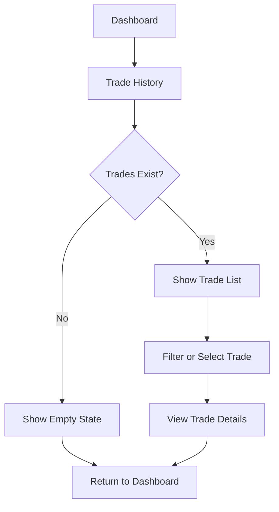
```mermaid
flowchart TD
    A["Dashboard"] --> B["Trade History"]
    B --> C{"Trades Exist?"}
    C -- "No" --> D["Show Empty State"]
    C -- "Yes" --> E["Show Trade List"]
    E --> F["Filter or Select Trade"]
    F --> G["View Trade Details"]
    D --> H["Return to Dashboard"]
    G --> H
```

### Alternative Flow

- No trades exist: show empty state explaining that bot trades will appear after activity occurs.
- User filters by date, pair, or status if filtering is supported.
- Trade details may expand inline or open in a detail view in later UX design.

### Error Flow

- Trade history cannot load: show Retry and keep Dashboard navigation available.
- A trade record is incomplete due to prior crash or connection failure: mark as needing synchronization or show limited details.

### Success Outcome

- User can review bot trading activity.
- Successful, failed, canceled, and rejected events are distinguishable.

## 14. Settings Management Flow

### Flow Name

Settings Management Flow

### Goal

Provide a simple path for users to manage Version 1 settings without exposing strategy-building or advanced technical controls.

### Preconditions

- Valid license exists.
- User is on Dashboard.
- Setup is complete or partially complete.

### Main Flow

```text
Dashboard
↓
User Opens Settings-Related Area
├─ Account Management
├─ Risk Settings
└─ License Management
↓
User Reviews or Updates Allowed Settings
↓
Validation Runs
↓
Changes Are Saved
↓
Return to Dashboard
```

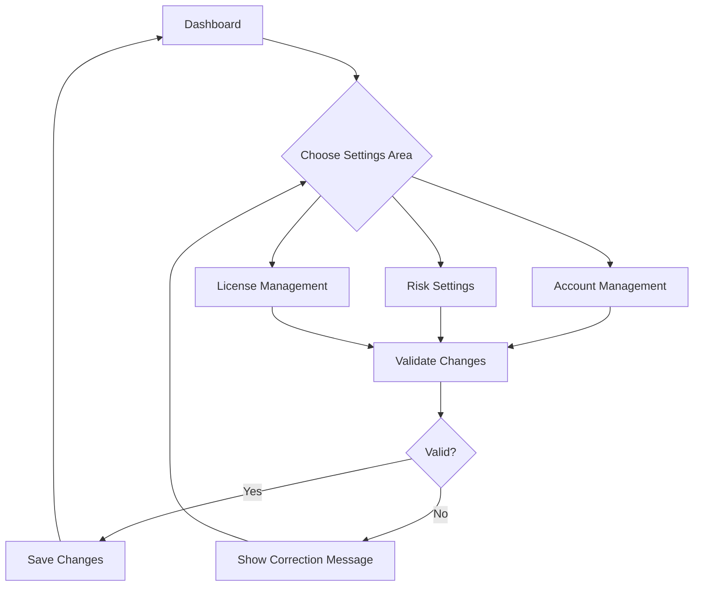
```mermaid
flowchart TD
    A["Dashboard"] --> B{"Choose Settings Area"}
    B --> C["Account Management"]
    B --> D["Risk Settings"]
    B --> E["License Management"]
    C --> F["Validate Changes"]
    D --> F
    E --> F
    F --> G{"Valid?"}
    G -- "Yes" --> H["Save Changes"]
    G -- "No" --> I["Show Correction Message"]
    H --> A
    I --> B
```

### Alternative Flow

- User views settings without changing anything: return to Dashboard.
- Bot is running: account and risk edits are blocked or read-only until bot is stopped.
- User changes license file: route to Offline License File Validation Flow.

### Error Flow

- Invalid account changes follow account error flows.
- Invalid risk settings follow Invalid Configuration flow.
- License file validation failure routes to License File Validation Screen.

### Success Outcome

- Allowed settings changes are saved.
- User remains aware of bot status.
- Strategy logic remains inaccessible and unchanged.

## 15. Risk Settings Flow

### Flow Name

Risk Settings Flow

### Goal

Allow users to configure required trading risk controls before bot start and edit them later only when safe.

### Preconditions

- Valid license exists.
- User is in first-run setup or Risk Settings Screen.
- Bot is stopped for editing after setup.

### Main Flow

```text
Open Risk Settings
↓
Show Current Market Mode and Pair
↓
Show Required Risk Fields
↓
User Enters or Updates Risk Values
↓
Validate Required Values
↓
Show Plain-Language Summary
↓
Save Risk Settings
↓
Return to Review Configuration or Dashboard
```

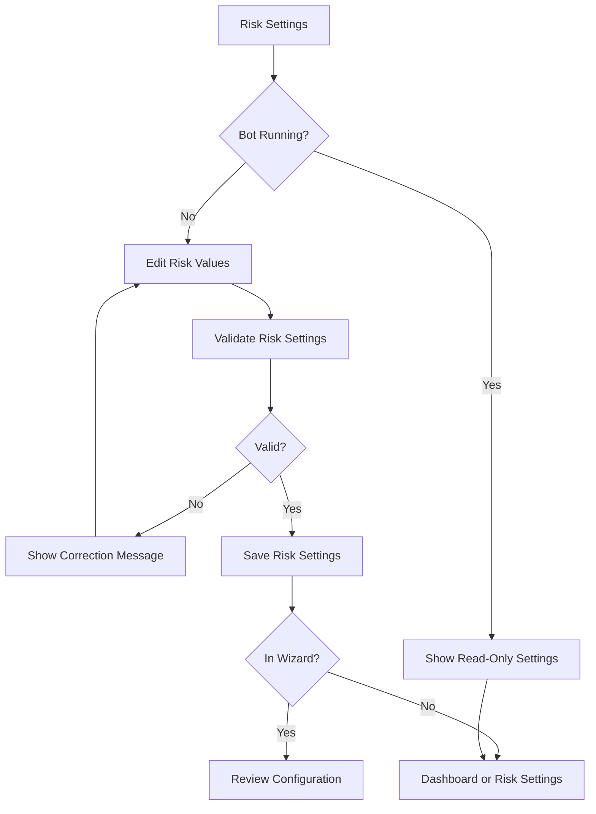
```mermaid
flowchart TD
    A["Risk Settings"] --> B{"Bot Running?"}
    B -- "Yes" --> C["Show Read-Only Settings"]
    B -- "No" --> D["Edit Risk Values"]
    D --> E["Validate Risk Settings"]
    E --> F{"Valid?"}
    F -- "No" --> G["Show Correction Message"]
    G --> D
    F -- "Yes" --> H["Save Risk Settings"]
    H --> I{"In Wizard?"}
    I -- "Yes" --> J["Review Configuration"]
    I -- "No" --> K["Dashboard or Risk Settings"]
    C --> K
```

### Alternative Flow

- User cancels edits: previous risk settings remain active.
- User is in Futures mode: additional risk language appears.
- User changes market mode later: risk settings may require review or revalidation.

### Error Flow

- Missing required values: block save and show required fields.
- Invalid values: block save and explain correction in plain language.
- Bot running: block edits and prompt user to stop bot first.

### Success Outcome

- Risk settings are saved and valid.
- User can review settings before starting the bot.
- Bot startup is allowed only when risk settings pass validation.

## Dedicated Error Handling Flows

## 16. Invalid API Key Flow

### Flow Name

Invalid API Key Flow

### Goal

Help the user correct an invalid Binance API key without exposing technical error details.

### Preconditions

- User is adding or editing a Binance account.
- API key validation fails.

### Main Flow

```text
User Tests Connection
↓
API Key Is Rejected
↓
Show Invalid API Key Message
↓
Highlight API Key Field
↓
User Re-enters API Key
↓
User Tests Connection Again
```

### Alternative Flow

- User cancels correction and returns to previous screen.
- User switches account type and enters a different key.

### Error Flow

- Repeated failure keeps user on account connection screen.
- Network failure changes to Network Connection Failure flow.
- Binance API unavailable changes to Binance API Failure flow.

### Success Outcome

- API key is accepted.
- User can continue account setup.

## 17. Invalid Secret Key Flow

### Flow Name

Invalid Secret Key Flow

### Goal

Help the user correct an invalid Binance secret key safely.

### Preconditions

- User is adding or editing a Binance account.
- Secret key validation fails.

### Main Flow

```text
User Tests Connection
↓
Secret Key Is Rejected
↓
Show Invalid Secret Key Message
↓
Clear or Mask Secret Key Field
↓
User Re-enters Secret Key
↓
User Tests Connection Again
```

### Alternative Flow

- User cancels correction and returns to previous screen.
- User creates new API credentials in Binance and returns to enter them.

### Error Flow

- Repeated failure keeps user on account connection screen.
- Invalid API key may also be shown if both credentials are wrong.
- Network or Binance API failures route to the appropriate dedicated flow.

### Success Outcome

- Secret key is accepted.
- User can continue account setup.

## 18. Network Connection Failure Flow

### Flow Name

Network Connection Failure Flow

### Goal

Keep the user informed when the application cannot reach Binance or other required exchange/network services.

### Preconditions

- The app attempts Binance validation, market data access, order placement, or synchronization.
- Network connectivity is unavailable or unstable.

### Main Flow

```text
Online Action Starts
↓
Network Request Fails
↓
Show Connection Problem Message
↓
Set Relevant State to Disconnected or Retry Required
↓
Offer Retry
↓
Connection Restored
↓
Resume Previous Flow or Synchronize State
```

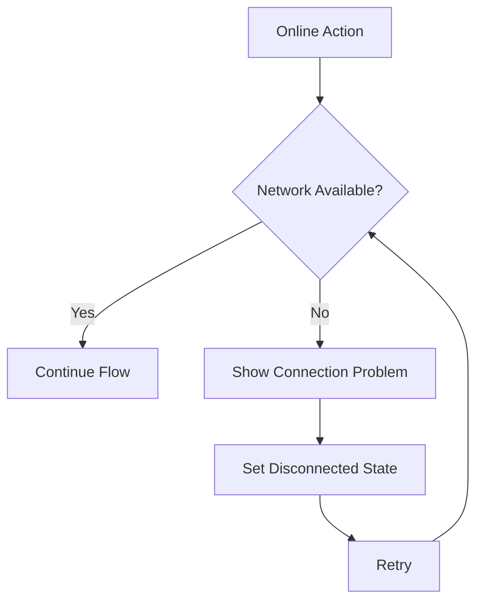
```mermaid
flowchart TD
    A["Online Action"] --> B{"Network Available?"}
    B -- "Yes" --> C["Continue Flow"]
    B -- "No" --> D["Show Connection Problem"]
    D --> E["Set Disconnected State"]
    E --> F["Retry"]
    F --> B
```

### Alternative Flow

- User returns to Dashboard while disconnected.
- User exits the application and later returns through Application Restart flow.

### Error Flow

- Retry fails repeatedly: remain in `Disconnected` state and offer support guidance.
- If bot was running, stop new local actions until exchange state is synchronized.

### Success Outcome

- Connection is restored.
- User returns to the previous task or Dashboard.
- If trading was active, synchronization runs before normal operation resumes.

## 19. Binance API Failure Flow

### Flow Name

Binance API Failure Flow

### Goal

Handle Binance-side errors, downtime, rate limits, permission problems, or unexpected API responses.

### Preconditions

- The app can reach the network.
- Binance returns an error or unusable response.

### Main Flow

```text
Binance Action Starts
↓
Binance API Returns Failure
↓
Classify Failure in User-Friendly Terms
↓
Show Message and Suggested Action
↓
Pause Affected Action
↓
Retry or Route User to Account / Dashboard
```

### Alternative Flow

- Permission failure routes to Account Management.
- Temporary exchange issue offers Retry.
- Rate limit or temporary service issue asks user to wait and retry.

### Error Flow

- If failure occurs during order placement, route to Order Synchronization flow.
- If failure occurs while bot is running, set bot status to `Disconnected`, `Sync Required`, or `Error` based on severity.

### Success Outcome

- User understands that the issue is exchange-related.
- The app avoids hidden failed actions.
- Bot resumes only after safe validation or synchronization.

## 20. Order Rejected Flow

### Flow Name

Order Rejected Flow

### Goal

Communicate when Binance rejects a bot-generated order and preserve user trust through clear status and trade history.

### Preconditions

- Bot is running or starting.
- Bot submits an order.
- Binance rejects the order.

### Main Flow

```text
Bot Submits Order
↓
Binance Rejects Order
↓
Record Rejected Order Event
↓
Show Bot Warning or Error State
↓
Update Trade History
↓
Evaluate Whether Bot Can Continue
↓
Continue, Pause, or Stop Based on Risk Policy
```

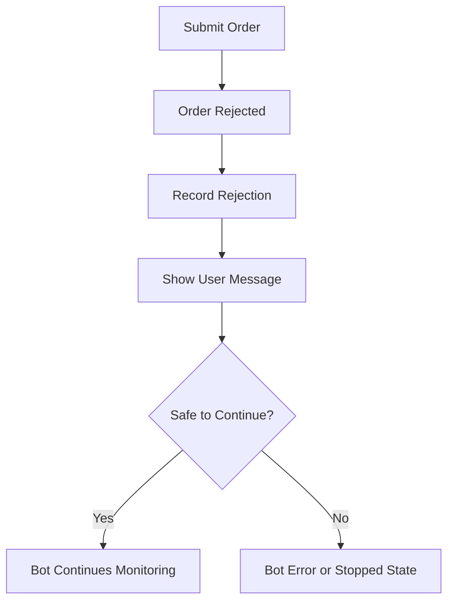
```mermaid
flowchart TD
    A["Submit Order"] --> B["Order Rejected"]
    B --> C["Record Rejection"]
    C --> D["Show User Message"]
    D --> E{"Safe to Continue?"}
    E -- "Yes" --> F["Bot Continues Monitoring"]
    E -- "No" --> G["Bot Error or Stopped State"]
```

### Alternative Flow

- Rejection is caused by insufficient balance: route to Insufficient Balance flow.
- Rejection is caused by unsupported pair or symbol rules: route to Trading Pair Not Supported flow.
- Rejection is temporary: allow retry according to product risk rules.

### Error Flow

- Rejection cannot be classified: show generic order rejected message and require user review.
- Multiple repeated rejections: stop or pause bot according to product policy.

### Success Outcome

- Rejected order is visible in Trade History.
- Bot state reflects whether trading continues or stops.
- User is not left guessing whether an order was placed.

## 21. Insufficient Balance Flow

### Flow Name

Insufficient Balance Flow

### Goal

Prevent or stop trading when available balance is lower than required capital or order amount.

### Preconditions

- User configures capital, starts bot, or bot attempts an order.
- Available balance is insufficient.

### Main Flow

```text
Balance Check Runs
↓
Available Balance Is Insufficient
↓
Show Insufficient Balance Message
↓
Block Setup Continue, Bot Start, or Order Action
↓
Guide User to Reduce Capital or Add Funds
↓
Retry Validation
```

### Alternative Flow

- During setup: user returns to Configure Capital.
- During bot start: bot remains stopped.
- During live trading: bot records blocked action and may pause or stop according to risk policy.

### Error Flow

- Balance cannot be checked due to Binance API failure: route to Binance API Failure flow.
- Balance changes during order submission: route to Order Rejected or Order Synchronization flow.

### Success Outcome

- User adjusts capital or account balance.
- Bot starts or continues only when balance is valid.

## 22. Invalid Configuration Flow

### Flow Name

Invalid Configuration Flow

### Goal

Prevent bot startup or unsafe operation when required settings are missing, inconsistent, or invalid.

### Preconditions

- User is setting up, editing settings, starting bot, or app is restoring state.
- One or more required configuration values fail validation.

### Main Flow

```text
Configuration Validation Runs
↓
Invalid Configuration Found
↓
Identify Affected Section
↓
Show Plain-Language Correction Message
↓
Route User to Relevant Screen
↓
User Fixes Configuration
↓
Validate Again
```

### Alternative Flow

- Missing account routes to Account Management or Connect Binance Account.
- Missing pair routes to Select Trading Pair.
- Invalid capital routes to Configure Capital.
- Invalid risk setting routes to Risk Settings.

### Error Flow

- User exits without fixing: app remains in `Setup Required` or `Stopped` state.
- Configuration becomes invalid while bot is running: bot stops, pauses, or enters error state according to product policy.

### Success Outcome

- Required configuration is valid.
- User can continue setup or start bot.

## 23. Trading Pair Not Supported Flow

### Flow Name

Trading Pair Not Supported Flow

### Goal

Prevent users from configuring or trading an unsupported pair for the selected Binance market mode.

### Preconditions

- User selects a pair, starts bot, or app restores prior configuration.
- Pair is unavailable, delisted, invalid, or unsupported for selected Spot or Futures mode.

### Main Flow

```text
Pair Validation Runs
↓
Pair Is Not Supported
↓
Show Pair Not Supported Message
↓
Block Continue or Bot Start
↓
Return User to Trading Pair Selection
↓
User Selects Supported Pair
↓
Continue Flow
```

### Alternative Flow

- Pair was previously supported but is no longer available: app marks configuration invalid and requires user review.
- Pair is supported in Spot but not Futures, or vice versa: explain market-specific availability.

### Error Flow

- Pair availability cannot be checked due to network or Binance API issue: route to the appropriate error flow.
- Order is rejected due to exchange symbol rules: route to Order Rejected flow.

### Success Outcome

- User selects a supported trading pair.
- Setup or bot start can continue.

## Recovery Flows

## 24. Application Restart Flow

### Flow Name

Application Restart Flow

### Goal

Restore the app to a safe, understandable state after the user closes and reopens it.

### Preconditions

- Application was previously used.
- Local state may include license, account, configuration, bot status, trade history, open position references, or pending synchronization.

### Main Flow

```text
Open Application
↓
Load Last Saved State
↓
Validate License
↓
Validate Configuration
↓
Check Last Bot Status
↓
If Trading State May Have Changed, Synchronize
↓
Open Dashboard With Restored Status
```

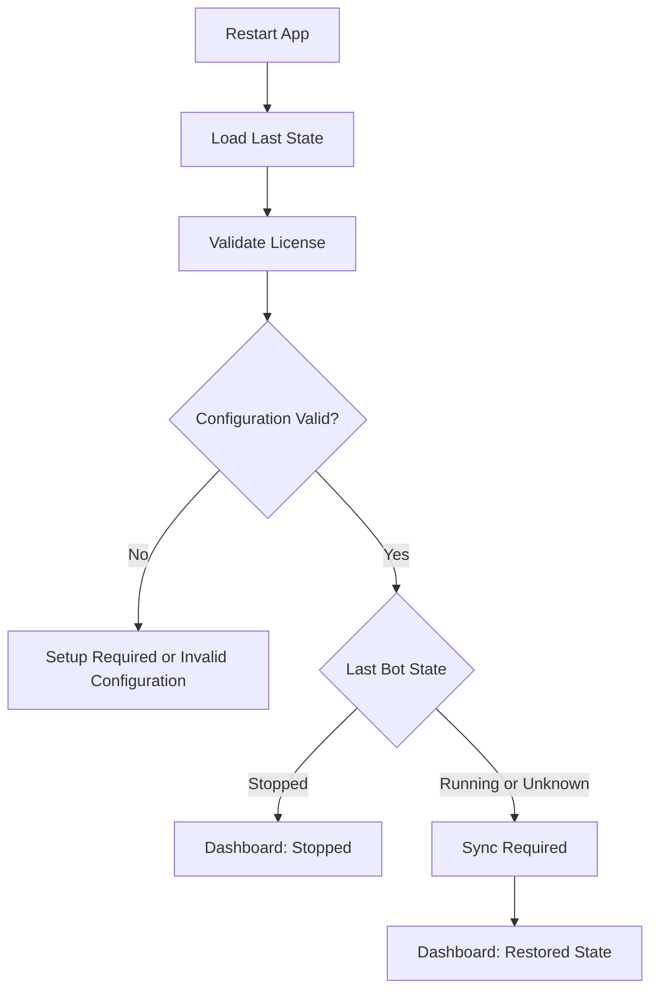
```mermaid
flowchart TD
    A["Restart App"] --> B["Load Last State"]
    B --> C["Validate License"]
    C --> D{"Configuration Valid?"}
    D -- "No" --> E["Setup Required or Invalid Configuration"]
    D -- "Yes" --> F{"Last Bot State"}
    F -- "Stopped" --> G["Dashboard: Stopped"]
    F -- "Running or Unknown" --> H["Sync Required"]
    H --> I["Dashboard: Restored State"]
```

### Alternative Flow

- Previous state was stopped: open Dashboard normally.
- Previous state was setup incomplete: resume setup.
- Previous state was error: show Error / Connection Issue Screen or Dashboard with recoverable state.

### Error Flow

- Local state cannot be read: show recovery message and require setup review.
- License invalid: route to License File Validation Screen.
- Exchange unavailable: show `Disconnected` or `Sync Required`.

### Success Outcome

- User sees a clear restored state.
- No bot activity resumes blindly without synchronization.

## 25. System Crash Recovery Flow

### Flow Name

System Crash Recovery Flow

### Goal

Recover safely after the application or operating system closes unexpectedly.

### Preconditions

- The application crashed, was force closed, or the device lost power.
- Bot may have been running before the crash.

### Main Flow

```text
Reopen Application
↓
Detect Unexpected Shutdown
↓
Load Last Known State
↓
Show Recovery Status
↓
Validate License and Configuration
↓
Synchronize Open Positions
↓
Synchronize Orders
↓
Show Restored Dashboard State
```

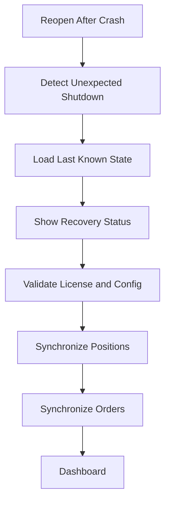
```mermaid
flowchart TD
    A["Reopen After Crash"] --> B["Detect Unexpected Shutdown"]
    B --> C["Load Last Known State"]
    C --> D["Show Recovery Status"]
    D --> E["Validate License and Config"]
    E --> F["Synchronize Positions"]
    F --> G["Synchronize Orders"]
    G --> H["Dashboard"]
```

### Alternative Flow

- No live trading was active: restore Dashboard with `Stopped` state.
- Setup was incomplete: return to the last safe setup step.
- User chooses not to continue recovery: app remains stopped or sync required.

### Error Flow

- Binance unavailable: keep `Sync Required` and offer Retry.
- Local state inconsistent: show Error / Connection Issue Screen and request user review.
- Open position is found but no matching local state exists: show Open Position Synchronization flow.

### Success Outcome

- User understands the app recovered from an unexpected shutdown.
- Positions and orders are reconciled before normal bot operation resumes.

## 26. Exchange Reconnection Flow

### Flow Name

Exchange Reconnection Flow

### Goal

Reconnect to Binance after temporary disconnection and resume safe app operation.

### Preconditions

- Binance connection was lost.
- User is on Dashboard, setup, or another primary screen.

### Main Flow

```text
Connection Lost
↓
Show Disconnected State
↓
Pause Affected Actions
↓
Retry Connection Automatically or by User Action
↓
Connection Restored
↓
Validate Account Permissions
↓
Synchronize Positions and Orders
↓
Return to Previous Screen or Dashboard
```

```mermaid
flowchart TD
    A["Connection Lost"] --> B["Show Disconnected State"]
    B --> C["Pause Affected Actions"]
    C --> D["Retry Connection"]
    D --> E{"Connected?"}
    E -- "No" --> B
    E -- "Yes" --> F["Validate Account"]
    F --> G["Sync Positions and Orders"]
    G --> H["Resume Safe State"]
```

### Alternative Flow

- User manually retries from Error / Connection Issue Screen.
- User remains on Dashboard while disconnected.
- User stops bot locally while disconnected; app completes exchange synchronization once reconnected.

### Error Flow

- Reconnection fails repeatedly: remain disconnected and show support guidance.
- Account credentials are no longer valid: route to Account Management.
- Position or order mismatch is found: route to synchronization flows.

### Success Outcome

- App reconnects to Binance.
- User sees updated account, position, order, and bot state.

## 27. Open Position Synchronization Flow

### Flow Name

Open Position Synchronization Flow

### Goal

Ensure the app accurately reflects any open position after restart, crash, reconnect, or bot start.

### Preconditions

- App detects possible open position state from Binance or local records.
- Bot status is starting, running, disconnected, or sync required.

### Main Flow

```text
Synchronization Starts
↓
Fetch Current Position State
↓
Compare With Last Known App State
↓
Position Matches
↓
Update Dashboard and Position Monitoring
↓
Resume Safe Bot State
```

```mermaid
flowchart TD
    A["Start Position Sync"] --> B["Fetch Current Position"]
    B --> C{"Matches Last Known State?"}
    C -- "Yes" --> D["Update App State"]
    C -- "No" --> E["Show Position Mismatch"]
    E --> F["Require User Review or Safe Policy"]
    D --> G["Dashboard"]
    F --> G
```

### Alternative Flow

- No open position exists: clear active position display and return to Dashboard.
- Position exists but bot is stopped: show position status without restarting bot.
- Position mismatch exists: show user-readable warning and apply product-defined safe behavior.

### Error Flow

- Position cannot be fetched: remain in `Sync Required` or `Disconnected`.
- Position data conflicts with order data: also run Order Synchronization flow.

### Success Outcome

- Position Monitoring reflects current exchange state.
- Bot does not continue based on stale position assumptions.

## 28. Order Synchronization Flow

### Flow Name

Order Synchronization Flow

### Goal

Reconcile submitted, filled, canceled, rejected, or unknown orders after a disruption.

### Preconditions

- App submitted or may have submitted orders.
- A restart, crash, API failure, disconnection, or rejection occurred.

### Main Flow

```text
Order Sync Starts
↓
Fetch Recent Orders for Selected Pair
↓
Compare With Last Known App Records
↓
Identify Filled, Open, Canceled, Rejected, or Unknown Orders
↓
Update Trade History
↓
Update Position State
↓
Return to Dashboard With Current Bot Status
```

```mermaid
flowchart TD
    A["Start Order Sync"] --> B["Fetch Recent Orders"]
    B --> C["Compare With Last Known Records"]
    C --> D{"Mismatch Found?"}
    D -- "No" --> E["Confirm Current State"]
    D -- "Yes" --> F["Update Trade History and Position"]
    F --> G["Show Sync Result"]
    E --> H["Dashboard"]
    G --> H
```

### Alternative Flow

- No recent orders exist: confirm no order activity and return to Dashboard.
- Unknown order status remains: show a warning and keep bot stopped or sync required until resolved.

### Error Flow

- Orders cannot be fetched: remain in `Sync Required`.
- Binance API failure: route to Binance API Failure flow.
- Order records conflict with position state: run Open Position Synchronization flow.

### Success Outcome

- Trade History and Position Monitoring match current exchange reality as closely as possible.
- User can see what happened during the disruption.

## Non-Functional Requirement Flows

## 29. Security-Related Flow

### Flow Name

Security-Related Flow

### Goal

Protect sensitive account and license information while keeping the user informed about safe Binance API setup.

### Preconditions

- User enters license or Binance API credentials.
- App displays account, error, or log information.

### Main Flow

```text
User Enters Sensitive Information
↓
App Masks Sensitive Fields
↓
App Validates Required Permissions
↓
App Warns Against Withdrawal Permissions
↓
App Stores Only Required Sensitive Data Securely
↓
App Displays Status Without Revealing Secrets
```

### Alternative Flow

- User pastes credentials incorrectly: validation fails and fields can be corrected.
- User removes account: sensitive account connection data is removed according to product policy.
- User changes license: previous license state is replaced or invalidated according to license rules.

### Error Flow

- Sensitive value appears in an error response: app must not display it to the user.
- Credential validation fails: route to Invalid API Key or Invalid Secret Key flow.
- Permission risk is detected: app warns clearly and blocks or discourages continuation according to product policy.

### Success Outcome

- Sensitive information is handled safely.
- Users understand safe Binance API permission expectations.
- Screens and errors do not reveal secrets.

## 30. Session Handling Flow

### Flow Name

Session Handling Flow

### Goal

Maintain a clear desktop app session state across launch, active use, inactivity, disconnection, and closing.

### Preconditions

- User has opened the desktop application.
- License and configuration may or may not exist.

### Main Flow

```text
Application Session Starts
↓
Load License and Configuration State
↓
Show Correct Screen
↓
User Navigates or Operates Bot
↓
Session State Updates
↓
Application Closes
↓
Save Last Safe State
```

### Alternative Flow

- User closes app while bot is stopped: save stopped state.
- User closes app while bot is running: save last known running state and require synchronization on next launch.
- User becomes disconnected: session remains open with `Disconnected` state.

### Error Flow

- App closes unexpectedly: use System Crash Recovery flow on next launch.
- License becomes invalid during session: block trading features and route to License File Validation Screen.

### Success Outcome

- User returns to a predictable state when the app is reopened.
- Bot state is not misrepresented after inactivity or app closure.

## 31. Configuration Persistence Flow

### Flow Name

Configuration Persistence Flow

### Goal

Persist user-approved setup and settings so the user does not need to reconfigure the bot every time the app opens.

### Preconditions

- User completes or updates a setup, account, license, capital, pair, or risk setting.

### Main Flow

```text
User Completes Configuration Step
↓
Validate Input
↓
Save Valid Configuration
↓
Confirm Saved State in UI
↓
Use Saved Configuration on Dashboard and Startup
```

```mermaid
flowchart TD
    A["User Updates Configuration"] --> B["Validate"]
    B --> C{"Valid?"}
    C -- "No" --> D["Show Correction Message"]
    C -- "Yes" --> E["Save Configuration"]
    E --> F["Reflect Saved State"]
```

### Alternative Flow

- User cancels edits: keep previous saved configuration.
- User partially completes wizard: save only safe progress if product policy allows, but do not enable bot start.
- User removes account: mark account-dependent configuration as incomplete.

### Error Flow

- Save fails: show error and do not pretend changes were saved.
- Saved configuration is invalid on restart: route to Invalid Configuration flow.

### Success Outcome

- Valid configuration survives application restart.
- Dashboard and setup review show the same saved values.

## 32. State Restoration Flow

### Flow Name

State Restoration Flow

### Goal

Restore license, setup, bot status, positions, orders, and trade history into a safe user-facing state after launch or recovery.

### Preconditions

- Application starts, restarts, reconnects, or recovers from crash.
- Some prior state exists locally or at Binance.

### Main Flow

```text
State Restoration Starts
↓
Load Local License State
↓
Load Local Configuration
↓
Load Last Known Bot State
↓
Validate Against Current Binance State if Needed
↓
Synchronize Positions
↓
Synchronize Orders
↓
Open Dashboard With Current State
```

```mermaid
flowchart TD
    A["Start Restoration"] --> B["Load Local State"]
    B --> C["Validate License"]
    C --> D["Validate Configuration"]
    D --> E{"Exchange Sync Needed?"}
    E -- "No" --> F["Open Dashboard"]
    E -- "Yes" --> G["Sync Positions"]
    G --> H["Sync Orders"]
    H --> F
```

### Alternative Flow

- No prior configuration exists: route to First-Run Welcome.
- Prior bot state was stopped: no exchange sync is required unless account or position state is uncertain.
- User is offline: show disconnected state and retry path.

### Error Flow

- License fails: route to License File Validation Screen.
- Configuration fails: route to Invalid Configuration flow.
- Position or order sync fails: remain in `Sync Required` or `Disconnected`.

### Success Outcome

- User sees accurate restored state.
- App avoids acting on stale assumptions.
- Bot can only run after required validation and synchronization complete.

## Cross-Flow Rules

## Bot Safety Rules

- Bot startup must be blocked unless license, account, market mode, pair, capital, and risk settings are valid.
- Bot startup must not continue when account permissions are missing.
- Futures mode must show additional risk acknowledgment before start.
- Account changes must require the bot to be stopped.
- Risk setting changes must require the bot to be stopped.
- Order rejection, unknown order state, or synchronization mismatch must be visible to the user.

## Non-Technical User Communication Rules

- Error messages should explain what happened, what it means, and what the user can do next.
- Screens should avoid raw exchange error codes as the primary message.
- Strategy internals should not be exposed beyond the approved high-level strategy description.
- The app must never imply guaranteed profit or risk-free trading.
- The user should always know whether the bot is running, stopped, disconnected, or in error.

## Open Product Decisions

- Offline License File validation is finalized and performed locally.
- Exact risk setting fields are not yet defined.
- Stop Bot behavior is finalized: it stops automated trading activity but does not close positions or force liquidation.
- Whether bot can continue after specific order rejections requires product and risk policy definition.
- Whether repeated Binance API failures pause, stop, or only disconnect the bot requires product policy definition.
- Whether partial setup progress is saved between launches requires product policy definition.
- Trade detail presentation may be inline, panel-based, or screen-based in later UX design.
